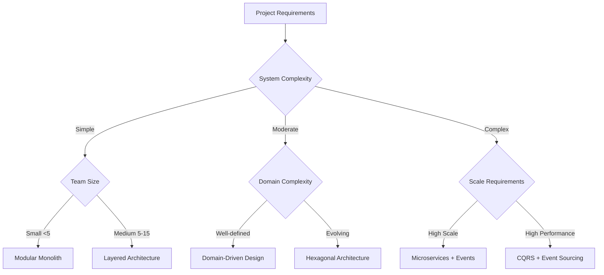

# Architecture

## 🎯 Scope

This section covers high-level architectural patterns, decisions, and design strategies:

#### In Scope:

- System architecture patterns and design principles
- Architectural decision frameworks and documentation
- Domain modeling and bounded context definition
- Integration patterns and system communication
- Technology constraints and project limitations
- LLM integration and AI-driven architecture
- Deployment architecture strategies

#### Out of Scope:

- Code-level implementation patterns (covered in Code Design)
- Infrastructure deployment specifics (covered in Infrastructure)
- Testing architecture (covered in Testing)

## 📋 Content Description

This folder provides comprehensive guidance for making architectural decisions at the system level. Each section includes theoretical background, practical frameworks, and decision support tools.

### Available Sections:

1. **Design Patterns** (`design-patterns/`)

   - Domain-driven design principles
   - Bounded context strategies
   - Integration patterns
   - System design methodologies
   - Repository and workspace organization
   - Monorepo management approaches

2. **Architectural Patterns** (`architectural-patterns/`)

   - CRUD and Transaction Script patterns
   - Hexagonal and Clean Architecture
   - Event Sourcing and CQRS
   - Layered and Continuous Architecture
   - Pattern selection and evolution

3. **Decision Frameworks** (`decision-frameworks/`)

   - Architecture Decision Record (ADR) processes
   - Decision tracking and governance
   - Technology selection frameworks
   - Evolution strategy planning

4. **Project Constraints** (`project-constraints/`)

   - Team size and skill constraints
   - Platform and technology limitations
   - Deployment and operational constraints
   - Budget and timeline considerations

5. **LLM Integration** (`llm-integration/`)

   - AI-driven architecture patterns
   - RAG (Retrieval Augmented Generation) systems
   - Vector database integration
   - MCP (Model Context Protocol) development
   - AI workflow optimization

6. **Deployment Architectures** (`deployment-architectures/`)
   - Monolith vs microservices decisions
   - Serverless and hybrid approaches
   - Desktop and self-hosted solutions
   - Scalability and distribution patterns

## 🔄 Decision Support

### Architecture Selection Decision Tree

### Architecture Complexity Matrix

| Pattern                | Implementation Complexity | Team Skill Required | Maintenance Overhead | Scalability | Best For                 |
| ---------------------- | ------------------------- | ------------------- | -------------------- | ----------- | ------------------------ |
| Modular Monolith       | Low                       | Junior-Mid          | Low                  | Medium      | Small-Medium teams       |
| Layered Architecture   | Medium                    | Mid                 | Medium               | Medium      | Traditional enterprises  |
| Hexagonal Architecture | Medium-High               | Mid-Senior          | Medium               | High        | Testing-critical apps    |
| Domain-Driven Design   | High                      | Senior              | High                 | High        | Complex business domains |
| Microservices          | Very High                 | Senior+             | Very High            | Very High   | Large-scale systems      |
| Event Sourcing         | Very High                 | Expert              | High                 | Very High   | Audit-heavy systems      |

### Selection Criteria Framework

#### Choose Simple Patterns when:

- Team has limited architectural experience
- Time-to-market is critical
- Domain is well-understood and stable
- Scale requirements are predictable

#### Choose Complex Patterns when:

- System scale requires distributed architecture
- Domain complexity justifies the overhead
- Team has strong architectural capabilities
- Long-term evolution is prioritized over speed

#### Choose Event-Driven Patterns when:

- System has many integration points
- Audit trails and temporal data are required
- Different parts scale independently
- Eventual consistency is acceptable

## 🛠️ Implementation Tools

### Design & Modeling:

- **C4 Model**: System architecture documentation
- **PlantUML**: Diagram as code for architecture
- **Mermaid**: Lightweight diagramming
- **EventStorming**: Domain modeling workshops

### Decision Support:

- **ADR Tools**: Architecture decision record automation
- **SWOT Analysis**: Architectural trade-off evaluation
- **Technology Radar**: Technology lifecycle tracking
- **Decision Trees**: Structured decision frameworks

### Validation Tools:

- **Architecture Tests**: Fitness function implementation
- **Dependency Analyzers**: Structure validation
- **Performance Benchmarks**: Architecture performance validation
- **Compliance Checkers**: Constraint validation

### Documentation Tools:

- **Arc42**: Architecture documentation template
- **Structurizr**: Software architecture model tools
- **Confluence/Notion**: Collaborative documentation
- **GitBook**: Version-controlled architecture docs

## 🔗 Related Guidelines

- **[Code Design Guidelines](../code-design/README.md)** - Code patterns implementing these architectural decisions
- **[Operations Guidelines](../observability/README.md)** - Infrastructure deployment strategies for these patterns
- **[Quality Guidelines](../quality-assurance/README.md)** - Quality criteria ensuring architectural integrity

## 🎯 Quick Start

1. **Architectural Patterns**: Start with [Architectural Patterns](architectural-patterns/README.md) for core patterns and DDD
2. **Document Decisions**: Use [Decision Frameworks](decision-frameworks/README.md) for ADR process and templates
3. **Validate Architecture**: Ensure alignment with Quality Standards

---

**Skill**: Use `/pair-capability-assess-architecture` to evaluate and adopt an architecture pattern from these guidelines via the resolution cascade.

_Assistant Context: Focus on system architecture, bounded contexts, and ADR processes when discussing architectural decisions._
