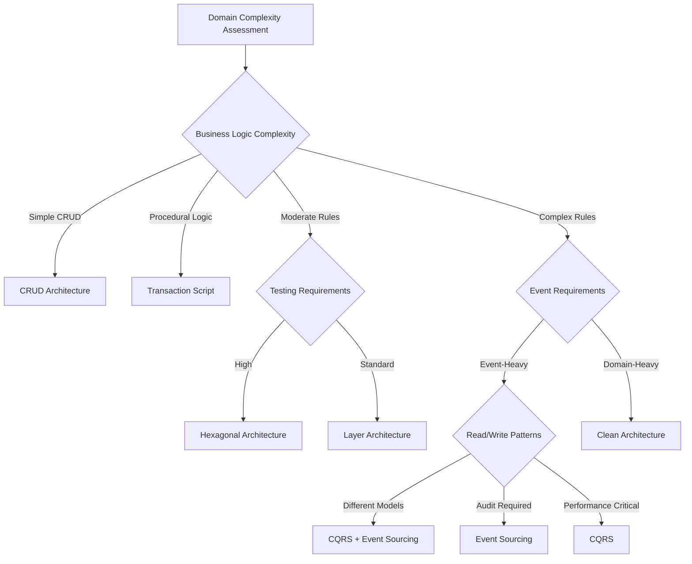

# Architectural Patterns

## 🎯 Scope

This section covers architectural patterns for application design and structure:

#### In Scope:

- Application architecture patterns and their implementation
- Pattern selection criteria based on domain complexity
- Integration approaches between different patterns
- Performance and maintainability trade-offs
- Pattern evolution and migration strategies

#### Out of Scope:

- Deployment architectures (covered in Deployment Architectures)
- Infrastructure patterns (covered in Infrastructure)
- Design patterns at code level (covered in Code Design)

## 📋 Content Description

This folder provides comprehensive guidance for selecting and implementing architectural patterns. Each pattern includes theoretical background, practical implementation guidance, decision criteria, and real-world examples with trade-off analysis.

### Available Patterns:

1. **CRUD Architecture** (`crud.md`)

   - Simple data operations and basic business logic
   - Direct database access patterns
   - Rapid development approaches

2. **Transaction Script** (`transaction-script.md`)

   - Procedural business logic organization
   - Simple transaction management
   - Legacy system integration

3. **Hexagonal Architecture** (`hexagonal.md`)

   - Ports and adapters for clean boundaries
   - Dependency inversion implementation
   - Testing and isolation strategies

4. **Clean Architecture** (`clean-architecture.md`)

   - Complete dependency inversion approach
   - Domain-centric design principles
   - Enterprise application patterns

5. **Event Sourcing** (`event-sourcing.md`)

   - Event-based persistence and state management
   - Audit trail and temporal data
   - Event stream processing

6. **CQRS Pattern** (`cqrs.md`)

   - Command Query Responsibility Segregation
   - Read/write model separation
   - Performance optimization strategies

7. **Layer Architecture** (`layer-architecture.md`)

   - Traditional layered approach
   - Separation of concerns through layers
   - Enterprise integration patterns

8. **Continuous Architecture** (`continuous-architecture.md`)
   - Evolutionary architecture principles
   - Fitness functions and architecture testing
   - Continuous integration with architecture

## 🔄 Decision Support

### Pattern Selection Decision Tree



### Complexity Matrix

| Pattern            | Implementation Complexity | Team Skill Required | Domain Complexity | Performance | Testability |
| ------------------ | ------------------------- | ------------------- | ----------------- | ----------- | ----------- |
| CRUD               | Low                       | Junior              | Simple            | Medium      | Low         |
| Transaction Script | Low                       | Junior              | Simple-Medium     | Medium      | Medium      |
| Layered            | Medium                    | Mid                 | Medium            | Medium      | Medium      |
| Hexagonal          | Medium                    | Mid-Senior          | Medium-High       | High        | High        |
| Clean Architecture | High                      | Senior              | High              | High        | High        |
| CQRS               | High                      | Senior              | Medium-High       | Very High   | High        |
| Event Sourcing     | Very High                 | Senior              | High              | Very High   | Medium      |

### Selection Criteria

#### Choose CRUD when:

- Simple data management requirements
- Rapid prototyping or MVP development
- Small team with limited architectural experience
- Direct database operations are sufficient

#### Choose Transaction Script when:

- Procedural business logic
- Legacy system integration requirements
- Simple workflow management
- Straightforward transaction management

#### Choose Hexagonal when:

- External system integration is critical
- High testability requirements
- Clear business logic boundaries
- Port and adapter pattern benefits

#### Choose Clean Architecture when:

- Complex business rules and policies
- Long-term maintainability is critical
- Enterprise-level applications
- Multiple user interfaces or delivery mechanisms

#### Choose CQRS when:

- Different read/write performance requirements
- Complex query patterns
- Separate scaling needs for reads and writes
- Multiple data projection needs

#### Choose Event Sourcing when:

- Audit trail requirements
- Temporal data analysis needs
- Event-driven business processes
- Complex state reconstruction scenarios

## 🛠️ Implementation Tools

### Pattern Analysis Tools:

- **Domain complexity assessment templates**
- **Architecture decision worksheets**
- **Pattern migration guides**
- **Performance benchmark frameworks**

### Development Tools:

- **Pattern-specific starter templates**
- **Code generation tools**
- **Testing framework configurations**
- **Migration automation scripts**

### Validation Tools:

- **Architecture fitness functions**
- **Pattern compliance checking**
- **Performance monitoring setups**
- **Quality gate definitions**

| Pattern            | Complexity | Learning Curve | Scalability | Flexibility | Use Case                |
| ------------------ | ---------- | -------------- | ----------- | ----------- | ----------------------- |
| **CRUD**           | Low        | Low            | Limited     | Low         | Simple apps, prototypes |
| **Layered**        | Medium     | Medium         | Good        | Medium      | Enterprise apps         |
| **Hexagonal**      | Medium     | Medium         | Good        | High        | Testable systems        |
| **Clean**          | High       | High           | Excellent   | High        | Complex domains         |
| **CQRS**           | High       | High           | Excellent   | Medium      | Read/write separation   |
| **Event Sourcing** | Very High  | Very High      | Excellent   | High        | Audit trails, replay    |

## Trade-offs Analysis

### Development Speed vs. Long-term Maintainability

```text
Fast Development     →     Long-term Maintainability
     CRUD    →    Layered    →    Hexagonal    →    Clean
```

### Complexity vs. Benefits

```text
Low Complexity/Benefits  →  High Complexity/Benefits
    CRUD → Layered → Hexagonal → Clean → CQRS → Event Sourcing
```

## Implementation Guidelines

### General Principles

1. **Start Simple**: Begin with the simplest pattern that meets requirements
2. **Evolve Gradually**: Refactor to more complex patterns as needs grow
3. **Test First**: All patterns must support the testing strategy
4. **Document Decisions**: Create ADRs for pattern choices

### Pattern Selection Criteria

#### Choose CRUD when:

- Simple CRUD operations dominate
- Minimal business logic
- Fast development required
- Small team or prototype

#### Choose Layered when:

- Traditional enterprise application
- Clear layer responsibilities
- Team familiar with pattern
- Moderate complexity

#### Choose Hexagonal when:

- High testability required
- Multiple adapters needed
- Dependency inversion important
- External integrations complex

#### Choose Clean when:

- Complex business rules
- Domain expertise critical
- Long-term maintainability
- Team experienced with DDD

#### Choose CQRS when:

- Different read/write models
- Performance optimization needed
- Separate query optimization
- Event-driven architecture

#### Choose Event Sourcing when:

- Audit trail required
- Event replay needed
- Temporal queries important
- High data integrity needs

## Anti-Patterns to Avoid

### Over-Engineering

- Using complex patterns for simple domains
- Premature optimization
- Architecture astronaut syndrome

### Under-Engineering

- Using CRUD for complex domains
- Ignoring future scalability needs
- No separation of concerns

### Pattern Mixing Without Strategy

- Combining patterns inconsistently
- No clear boundaries between patterns
- Inconsistent abstraction levels

## Related Patterns

- **[Domain-Driven Design](../design-patterns/README.md)** - Domain modeling approach
- **[Bounded Context Patterns](../design-patterns/README.md)** - Context boundaries
- **[Integration Patterns](../design-patterns/README.md)** - Service integration
- **[Scaling Patterns](../design-patterns/README.md)** - Performance and scaling
- **[Deployment Architectures](../deployment-architectures/README.md)** - Deployment strategies

## Implementation Guides

Each pattern has detailed implementation guidance with code examples:

- **[CRUD Architecture](crud.md)** - Simple data operations pattern
- **[Transaction Script](transaction-script.md)** - Procedural business logic pattern
- **[Layer Architecture](layer-architecture.md)** - Traditional enterprise pattern
- **[Hexagonal Architecture](hexagonal.md)** - Ports and adapters pattern
- **[Clean Architecture](clean-architecture.md)** - Dependency inversion pattern
- **[CQRS](cqrs.md)** - Command Query Responsibility Segregation
- **[Event Sourcing](event-sourcing.md)** - Event-based persistence pattern
- **[Continuous Architecture](continuous-architecture.md)** - Evolutionary architecture principles
