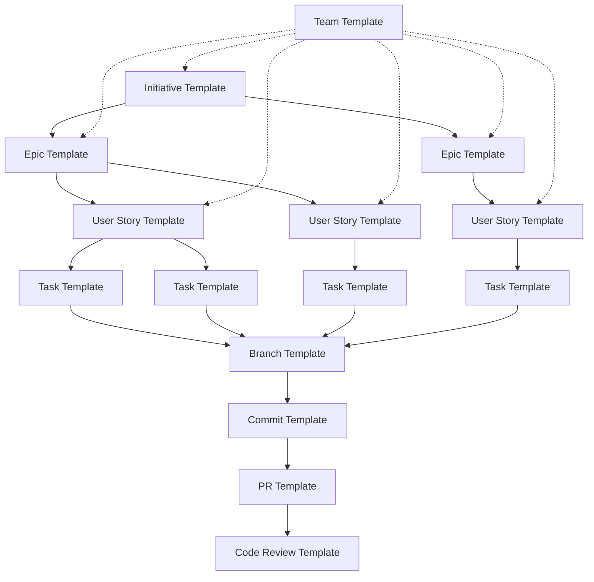

# Project Management Templates

This directory contains comprehensive templates for all major project management activities in software development projects. These templates provide standardized formats and checklists to ensure consistency and completeness across all project deliverables.

## Template Overview

Our template collection covers the complete software development lifecycle, from strategic planning to code delivery:

### Planning Templates

- **[Initiative Template](initiative-template.md)** - Strategic business initiatives and high-level planning
- **[Epic Template](epic-template.md)** - Large features spanning multiple sprints
- **[User Story Template](user-story-template.md)** - Individual user-focused requirements
- **[Task Template](task-template.md)** - Developer implementation tasks

### Development Templates

- **[Branch Template](branch-template.md)** - Git branch naming and workflow standards
- **[Commit Template](commit-template.md)** - Commit message formats and best practices
- **[Pull Request Template](pr-template.md)** - Comprehensive PR description and review guide
- **[Code Review Template](code-review-template.md)** - Structured code review checklists
- **[Team Template](user-story-template.md)** - Team formation and collaboration guidelines

## Template Categories

### 🎯 Strategic Templates

For high-level planning and business alignment:

| Template       | Purpose                  | When to Use               | Key Sections                                |
| -------------- | ------------------------ | ------------------------- | ------------------------------------------- |
| **Initiative** | Strategic business goals | Quarterly/annual planning | Business case, objectives, success metrics  |
| **Epic**       | Large feature sets       | Sprint planning, roadmap  | Business value, solution approach, timeline |

### 📋 Requirement Templates

For capturing and managing requirements:

| Template       | Purpose             | When to Use              | Key Sections                                   |
| -------------- | ------------------- | ------------------------ | ---------------------------------------------- |
| **User Story** | Individual features | Sprint planning, backlog | Acceptance criteria, tasks, design specs       |
| **Task**       | Implementation work | Daily development        | TDD workflow, quality standards, time tracking |

### 🔧 Development Templates

For code development and delivery:

| Template         | Purpose           | When to Use         | Key Sections                                 |
| ---------------- | ----------------- | ------------------- | -------------------------------------------- |
| **Branch**       | Git workflow      | Feature development | Naming standards, workflow steps             |
| **Commit**       | Code changes      | Every commit        | Message format, TDD patterns, atomic changes |
| **Pull Request** | Code review       | Feature completion  | Changes, testing, deployment info            |
| **Code Review**  | Quality assurance | PR review process   | Review criteria, feedback guidelines         |

### 👥 Team Templates

For team collaboration and communication:

| Template | Purpose        | When to Use    | Key Sections                           |
| -------- | -------------- | -------------- | -------------------------------------- |
| **Team** | Team structure | Team formation | Roles, responsibilities, collaboration |

## Template Usage Guidelines

### Getting Started

1. **Choose the Right Template:** Use the template overview table to identify which template fits your current activity
2. **Copy the Template:** Copy the template content as a starting point for your document
3. **Customize for Context:** Adapt sections and fields based on your specific project needs
4. **Complete All Sections:** Ensure all relevant sections are filled out completely
5. **Review and Validate:** Have stakeholders review the completed template

### Template Relationships

Templates are designed to work together in a hierarchical relationship:

```text
Initiative (Strategic Level)
├── Epic 1 (Feature Level)
│   ├── User Story 1.1
│   │   ├── Task 1.1.1
│   │   ├── Task 1.1.2
│   │   └── Task 1.1.3
│   └── User Story 1.2
│       ├── Task 1.2.1
│       └── Task 1.2.2
└── Epic 2 (Feature Level)
    └── User Story 2.1
        └── Task 2.1.1
```

Development Flow:

```text
Task → Branch → Commits → Pull Request → Code Review
```

### Quality Standards

#### Completeness Checklist

- [ ] All required sections filled out
- [ ] Acceptance criteria clearly defined
- [ ] Dependencies and risks identified
- [ ] Testing approach documented
- [ ] Review criteria established

#### Consistency Requirements

- [ ] Consistent terminology used across templates
- [ ] Traceability links maintained between levels
- [ ] Standard formatting and structure followed
- [ ] Team-specific customizations applied

## Template Customization

### Organization-Specific Adaptations

Each template can be customized for your organization:

1. **Add Company Branding:** Include logo, color schemes, standard headers
2. **Modify Sections:** Add, remove, or reorder sections based on your process
3. **Include Tool Integration:** Add fields for your specific tools (Jira, Azure DevOps, etc.)
4. **Update Terminology:** Use your organization's standard terminology
5. **Add Compliance Requirements:** Include regulatory or compliance sections if needed

### Process Integration

Templates integrate with common development processes:

- **Agile/Scrum:** User stories, tasks, and sprints
- **SAFe:** Initiatives, epics, and program increments
- **Kanban:** Continuous flow with user stories and tasks
- **DevOps:** Branch, commit, and PR templates for CI/CD

### Tool Integration

Templates work with popular project management tools:

- **GitHub:** Issues, PRs, and project boards
- **Jira:** Stories, epics, and tasks
- **Azure DevOps:** Work items and backlogs
- **Linear:** Issues and projects
- **Trello:** Cards and boards

## Best Practices

### Template Completion

1. **Start Early:** Begin with templates during planning phases
2. **Involve Stakeholders:** Get input from all relevant team members
3. **Iterate and Improve:** Refine templates based on team feedback
4. **Maintain Traceability:** Link related templates and work items
5. **Review Regularly:** Ensure templates stay current with completed work

### Quality Assurance

1. **Peer Review:** Have teammates review template completions
2. **Standard Validation:** Check against team standards and guidelines
3. **Completeness Check:** Verify all sections are appropriately filled
4. **Consistency Audit:** Ensure consistent information across related templates

### Continuous Improvement

1. **Collect Feedback:** Regularly gather team input on template effectiveness
2. **Update Templates:** Evolve templates based on lessons learned
3. **Share Best Practices:** Document successful template usage patterns
4. **Train Team Members:** Ensure everyone knows how to use templates effectively

## Template Maintenance

### Version Control

- Templates are versioned with the project documentation
- Changes are tracked through pull requests
- Historical versions maintained for reference

### Update Process

1. **Identify Improvement Needs:** Gather feedback from template users
2. **Propose Changes:** Create PR with template modifications
3. **Review and Approve:** Team reviews and approves changes
4. **Communicate Updates:** Notify team of template changes
5. **Update Training:** Ensure team knows about new template features

### Feedback Collection

- Regular retrospectives include template effectiveness discussion
- Anonymous feedback channels for template improvement suggestions
- Usage analytics to identify most/least effective templates

## Getting Help

### Template Support

- **Documentation:** Detailed guidance within each template
- **Examples:** Sample completions available for reference
- **Team Support:** Reach out to team leads for template assistance
- **Training Resources:** Regular training sessions on effective template use

### Common Issues

1. **Incomplete Templates:** Use the completeness checklist in each template
2. **Inconsistent Information:** Cross-reference with related templates
3. **Process Confusion:** Refer to the template relationship diagram
4. **Tool Integration:** Check tool-specific guidance in methodology documentation

---

## Template Index

### Quick Reference

| File                      | Type           | Use Case          | Complexity |
| ------------------------- | -------------- | ----------------- | ---------- |
| `initiative-template.md`  | Strategic      | Business planning | High       |
| `epic-template.md`        | Feature        | Feature planning  | Medium     |
| `user-story-template.md`  | Requirement    | Sprint planning   | Medium     |
| `task-template.md`        | Implementation | Daily development | Low        |
| `branch-template.md`      | Development    | Git workflow      | Low        |
| `commit-template.md`      | Development    | Code commits      | Low        |
| `pr-template.md`          | Development    | Code review       | Medium     |
| `code-review-template.md` | Quality        | Review process    | Medium     |
| `team-template.md`        | Collaboration  | Team formation    | Medium     |
| `manual-test-case-template.md`   | Quality | Manual test design   | Low     |
| `manual-test-report-template.md` | Quality | Test execution report | Low     |

### Template Relationships



This template collection provides a comprehensive foundation for professional software development project management. Each template includes detailed guidance, checklists, and examples to ensure consistent, high-quality deliverables across your entire development lifecycle.

The **TemplateOrchestrator** provides comprehensive template management through specialized engines:

- **TemplateEngine**: Template creation, version management, and automated application
- **StandardizationEngine**: Consistency enforcement, quality validation, and best practice integration
- **WorkflowEngine**: Process automation, template-driven workflows, and efficiency optimization
- **CustomizationEngine**: Context adaptation, personalization options, and flexible configuration
- **GovernanceEngine**: Template governance, approval processes, and compliance management
- **AnalyticsEngine**: Usage tracking, effectiveness measurement, and optimization insights

## Template Excellence Categories

### 1. **Development Workflow Templates**

#### Code Review Excellence

- Pull request templates with comprehensive review guidance and quality checklists
- Commit message standards with clear change description and context preservation
- Branch naming conventions with consistent patterns and traceability
- Issue templates with structured problem description and solution frameworks

#### Development Process Templates

- Task breakdown templates with systematic decomposition and estimation guidance
- Feature specification templates with comprehensive requirement documentation
- Bug report templates with detailed reproduction steps and environment information
- Technical decision templates with evaluation criteria and rationale documentation

### 2. **Project Management Templates**

#### Planning and Coordination

- Epic templates with strategic alignment and business value articulation
- User story templates with acceptance criteria and stakeholder perspective
- Sprint planning templates with capacity planning and goal alignment
- Retrospective templates with systematic reflection and improvement identification

#### Communication and Reporting

- Status update templates with consistent progress reporting and stakeholder communication
- Meeting agenda templates with structured discussion and effective time management
- Decision record templates with comprehensive evaluation and outcome documentation
- Escalation templates with clear issue presentation and resolution pathways

### 3. **Quality Assurance Templates**

#### Review and Validation

- Code review checklists with systematic evaluation and quality standards
- Testing templates with comprehensive coverage and validation frameworks
- Quality gate templates with consistent criteria and approval processes
- Documentation review templates with accuracy validation and completeness verification
- **[Manual Test Case Template](manual-test-case-template.md)** - Structured format for manual test case design with version-agnostic variables and priority classification
- **[Manual Test Report Template](manual-test-report-template.md)** - Standardized report for manual test execution results with sign-off criteria

#### Process Improvement

- Incident response templates with systematic investigation and resolution procedures
- Change management templates with impact assessment and communication planning
- Risk assessment templates with comprehensive evaluation and mitigation strategies
- Improvement proposal templates with structured enhancement and implementation planning

### 4. **Stakeholder Communication Templates**

#### External Communication

- Client update templates with professional communication and clear progress reporting
- Vendor coordination templates with service level management and relationship maintenance
- Partnership templates with collaboration framework and mutual benefit alignment
- Customer support templates with professional service and issue resolution

#### Internal Alignment

- Cross-team communication templates with effective coordination and information sharing
- Leadership reporting templates with strategic insight and decision support
- Knowledge transfer templates with comprehensive information exchange
- Training templates with effective skill development and knowledge distribution

## Implementation Excellence

### **Template Lifecycle Management**

#### Creation and Evolution

- Template development with user research and effectiveness validation
- Version control with change tracking and backward compatibility
- Approval processes with stakeholder review and quality assurance
- Maintenance schedules with regular updates and relevance validation

#### Adoption and Training

- Onboarding integration with new team member template familiarity
- Training programs with effective template usage and best practice sharing
- Change management with smooth template updates and adoption support
- Feedback collection with user experience improvement and template optimization

### **Automation and Integration**

#### Workflow Automation

- Template auto-application with context-aware selection and intelligent defaults
- Integration platforms with seamless tool connectivity and workflow optimization
- Validation automation with quality checking and compliance verification
- Metrics collection with usage tracking and effectiveness measurement

#### Customization Framework

- Context adaptation with environment-specific modifications and relevance optimization
- Team customization with group-specific needs and preference accommodation
- Role-based templates with responsibility-appropriate information and workflow design
- Dynamic templates with intelligent content adjustment and personalized guidance

## Quality Assurance Framework

### **Template Effectiveness**

#### Usage and Adoption Metrics

- Template utilization with frequency analysis and adoption rate tracking
- Quality improvement with outcome measurement and effectiveness validation
- User satisfaction with feedback collection and experience optimization
- Process efficiency with time savings and workflow improvement measurement

#### Continuous Improvement

- Template optimization with performance enhancement and user experience improvement
- Best practice integration with proven approach incorporation and knowledge sharing
- Feedback integration with user input incorporation and collaborative improvement
- Innovation adoption with new pattern integration and methodology advancement

### **Governance and Compliance**

#### Quality Standards

- Template quality with accuracy validation and completeness verification
- Consistency enforcement with standardization maintenance and pattern adherence
- Compliance verification with regulatory requirement satisfaction and audit preparation
- Access control with appropriate permissions and security management

This collaboration templates framework ensures systematic standardization excellence, workflow automation, and communication consistency that enables teams to operate with efficiency, quality, and alignment through proven template patterns and collaborative best practices.
