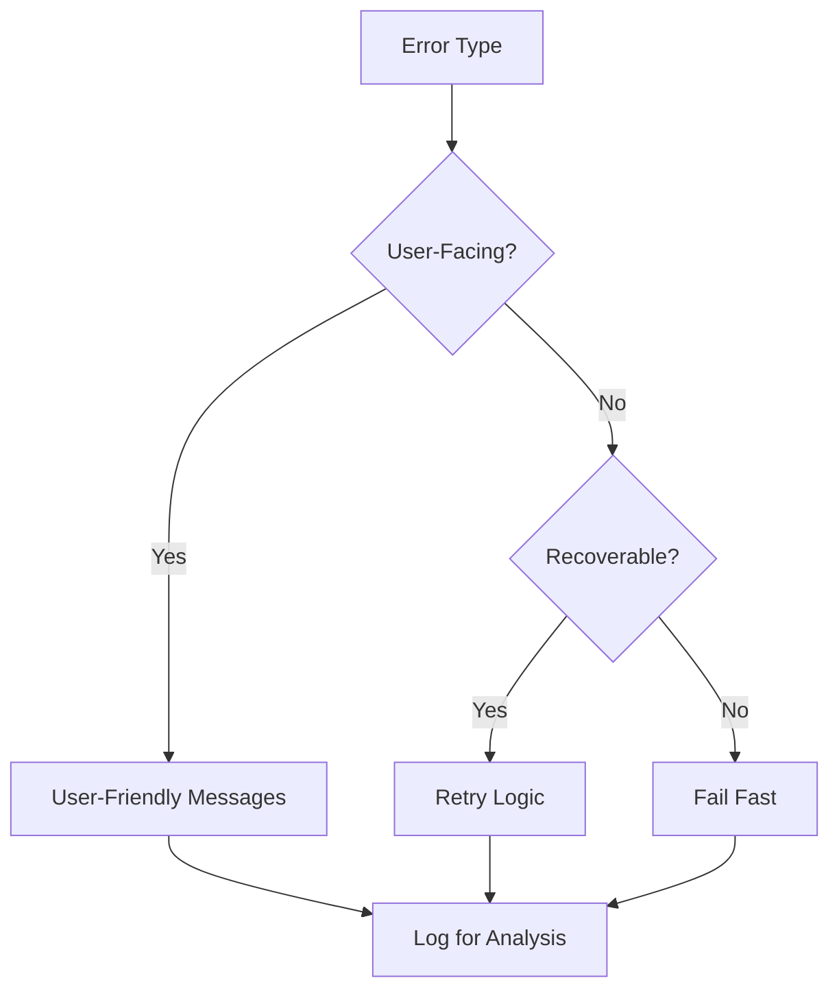

# Coding Standards

## 🎯 Scope

This section covers comprehensive coding conventions, quality standards, and development practices:

**In Scope:**

- Code formatting and style conventions across multiple languages
- Comprehensive error handling patterns and strategies
- Versioning strategies and semantic versioning implementation
- Technical debt identification, measurement, and management
- Internationalization and localization frameworks
- Code quality metrics, enforcement, and automation

**Out of Scope:**

- Framework-specific patterns (covered in Code Design)
- Testing strategies (covered in Testing)
- Architecture patterns (covered in Architecture)

## 📋 Content Description

This folder provides enterprise-grade coding standards with practical TypeScript examples, automation frameworks, and implementation guidelines to ensure consistency, maintainability, and quality across development teams.

### Available Standards:

1. **Coding Conventions** (`coding-conventions.md`)

   - Multi-language style guides (TypeScript, JavaScript, Python, Java)
   - Comprehensive naming conventions and patterns
   - File and project organization principles
   - Documentation standards with automated generation
   - Code review guidelines and automation

2. **Error Handling** (`error-handling.md`)

   - Enterprise error handling architecture and patterns
   - Custom error classes and hierarchies
   - Async/await error management strategies
   - Comprehensive logging and monitoring integration
   - User-facing error message frameworks
   - Error recovery and fallback mechanisms

3. **Versioning** (`versioning.md`)

   - Complete semantic versioning implementation
   - Advanced release branching strategies
   - Automated changelog generation
   - Multi-service versioning coordination
   - API versioning approaches with backward compatibility
   - Version conflict resolution strategies

4. **Technical Debt** (`technical-debt.md`)

   - Technical debt identification and classification framework
   - Automated debt measurement and tracking systems
   - Prioritization algorithms and decision matrices
   - Refactoring strategies and execution plans
   - ROI analysis for debt reduction initiatives
   - Integration with development workflows

5. **Internationalization & Localization** (`i18n-localization.md`)

   - Comprehensive i18n architecture and implementation
   - Multi-language content management systems
   - RTL (Right-to-Left) language support
   - Dynamic locale switching and state management
   - Translation workflow automation
   - Cultural adaptation and local compliance

   - Technical debt identification methods
   - Prioritization and management strategies
   - Refactoring guidelines
   - Measurement and tracking

6. **Internationalization** (`i18n-localization.md`)
   - Multi-language support patterns
   - Localization best practices
   - Cultural considerations
   - Translation management workflows

## 🔄 Decision Support

### Coding Standards Selection Matrix

| Standard Type | Team Size | Project Complexity | Enforcement Level | Tools Required     |
| ------------- | --------- | ------------------ | ----------------- | ------------------ |
| Basic         | 1-3       | Simple             | Manual            | Linting            |
| Standard      | 4-10      | Medium             | Automated         | CI/CD + Tools      |
| Strict        | 10+       | Complex            | Enforced          | Full Pipeline      |
| Enterprise    | 20+       | Very Complex       | Mandated          | Complete Toolchain |

### Error Handling Strategy Decision Tree

### Selection Criteria

**Choose Strict Standards when:**

- Large development teams
- Critical production systems
- Compliance requirements
- Long-term maintenance needs

**Choose Flexible Standards when:**

- Small teams or prototypes
- Rapid development cycles
- Innovation-focused projects
- Limited tooling resources

## 🛠️ Implementation Tools

### Code Quality Tools:

- **ESLint**: JavaScript/TypeScript linting
- **Prettier**: Code formatting automation
- **SonarQube**: Code quality analysis
- **CodeClimate**: Technical debt tracking

### Version Management:

- **Semantic Release**: Automated versioning
- **Conventional Commits**: Commit message standards
- **Changesets**: Monorepo version management
- **Release Please**: Automated release workflows

### Error Monitoring:

- **Sentry**: Error tracking and monitoring
- **Rollbar**: Real-time error detection
- **Bugsnag**: Application stability monitoring
- **LogRocket**: Session replay and debugging

### I18n Tools:

- **react-i18next**: React internationalization
- **Format.js**: JavaScript internationalization
- **Crowdin**: Translation management
- **Lokalise**: Localization automation
