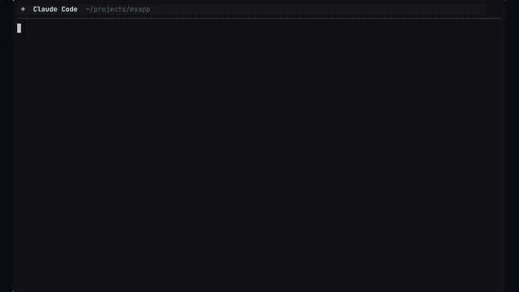

# pair

> Code is the easy part.

**AI-assisted software development** — structured Knowledge Base, Agent Skills, and adoption files that give AI coding assistants the context they need to ship quality software.

[](https://github.com/foomakers/pair/actions/workflows/ci.yml)
[](https://github.com/foomakers/pair/actions/workflows/release.yml)
[](LICENSE)

<a href="https://pair.foomakers.com">
  
</a>

## Quick Start

```bash
npx @foomakers/pair-cli install
```

This installs the pair Knowledge Base into your project. Your AI assistant reads `.pair/` and `.claude/skills/` to follow your team's standards, process, and architecture decisions.

## What You Get

- **Knowledge Base** — guidelines, how-to guides, and templates for every SDLC phase
- **Agent Skills** — 33 idempotent workflows following the [agentskills.io](https://agentskills.io) open standard
- **Adoption Files** — project-specific decisions (architecture, tech stack, way of working)
- **AI-friendly index** — `.pair/llms.txt` for machine-readable KB discovery ([llmstxt.org](https://llmstxt.org))

## Built with pair

pair is developed using pair itself. The entire SDLC — from PRD to code review — is driven by AI assistants reading the same Knowledge Base that ships to users.

Resources managed by pair in this repo:

| Directory | What it contains |
|-----------|-----------------|
| `.pair/knowledge/` | 11 how-to guides, 9 guideline areas (code design, testing, security, collaboration, ...), templates for commits, PRs, stories, ADRs |
| `.pair/adoption/tech/` | Architecture, tech stack, infrastructure, way of working, 7 ADRs |
| `.pair/adoption/product/` | PRD, subdomain model |
| `.pair/adoption/decision-log/` | Non-architectural decision records |
| `.claude/skills/` | 33 Agent Skills — process workflows (implement, review, refine) and capabilities (quality gates, estimation, manual testing, debt assessment) |
| `AGENTS.md` | Universal agent entry point linking to `.pair/` |

## Documentation

Visit the [pair documentation site](https://pair.foomakers.com/docs) for guides, reference, and tutorials.

## Links

- [Documentation Site](https://pair.foomakers.com/docs)
- [Development Guide](DEVELOPMENT.md) — local setup, scripts, testing, CI
- [Release Process](RELEASE.md)
- [Contributing](CONTRIBUTING.md)
- [GitHub Issues](https://github.com/foomakers/pair/issues) — bugs and feature requests
- [GitHub Discussions](https://github.com/foomakers/pair/discussions) — questions and community

## License

[MIT](LICENSE) — Foomakers
