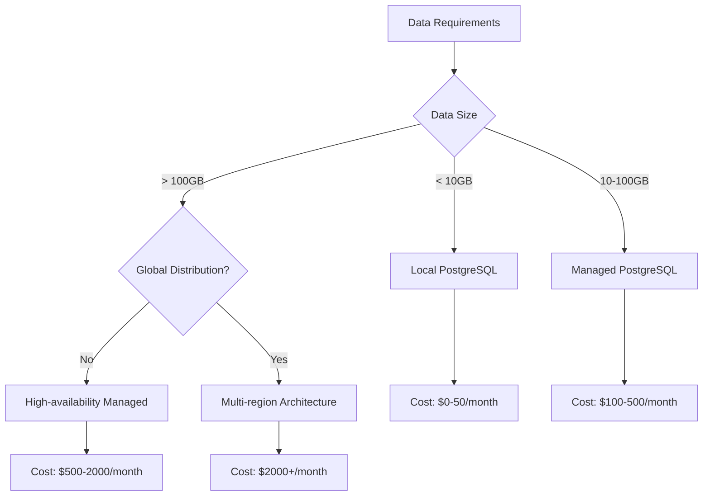
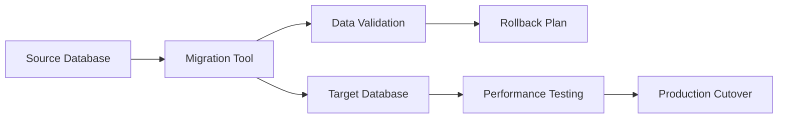
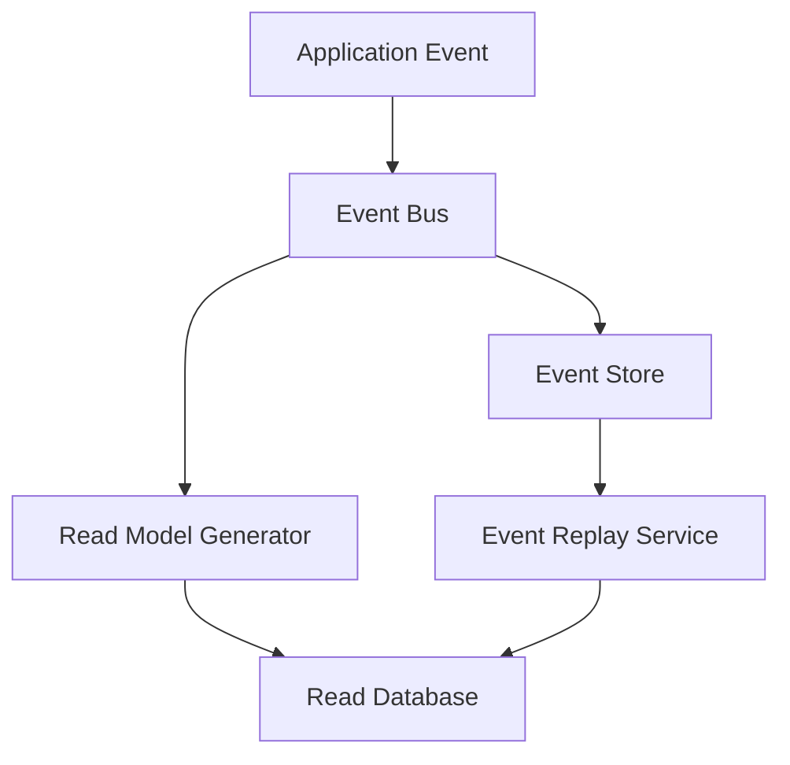
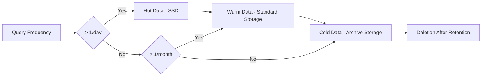

# Cloud Databases

Strategic guidance for database service selection, data architecture, and cloud-native data patterns.

## Purpose

Enables teams to make informed decisions about cloud database services, optimize for scalability and cost, and implement robust data architecture patterns that align with project constraints.

## Scope

### Cloud Database Services
- **Managed Relational Databases**: PostgreSQL/MySQL on AWS RDS, Azure Database, GCP CloudSQL
- **NoSQL Services**: DynamoDB, Cosmos DB, Firestore, MongoDB Atlas
- **Data Warehouses**: BigQuery, Redshift, Snowflake, Azure Synapse
- **Cache Services**: Redis Cloud, ElastiCache, Azure Cache
- **Search Services**: Elasticsearch Service, CloudSearch, Azure Search

### Data Architecture Patterns
- **Multi-tenant Data Isolation**: Schema separation, database per tenant, row-level security
- **CQRS and Event Sourcing**: Read/write separation, event stores, projection management
- **Data Mesh**: Distributed data ownership, data products, federated governance
- **Polyglot Persistence**: Service-specific database selection, data consistency patterns

## Strategic Principles

### 1. Local Control with Cloud Benefits
```
Priority Order:
1. Self-hosted databases with cloud infrastructure (EC2/VM + managed storage)
2. Managed database services with data portability
3. Proprietary cloud services with export capabilities
4. Vendor-specific services only when transformational
```

### 2. Cost-Conscious Data Strategy
- **Storage Tiering**: Hot/warm/cold data classification
- **Compute Separation**: Separate compute and storage scaling
- **Reserved Capacity**: Long-term commitment pricing for predictable workloads
- **Data Lifecycle Management**: Automated archiving and deletion policies

### 3. Multi-Cloud Data Resilience
- **Provider-Agnostic Tools**: Use databases available across providers
- **Data Portability**: Standard formats and export mechanisms
- **Disaster Recovery**: Cross-region and cross-provider backup strategies
- **Vendor Lock-in Avoidance**: Open-source first, standard APIs

## Database Selection Framework

### Relational Database Strategy

| Requirement | Self-Hosted | Managed Service | Cloud-Native |
|-------------|-------------|-----------------|--------------|
| **Development/Testing** | PostgreSQL on Docker | RDS/Azure Database free tier | Cloud SQL |
| **Production < 10GB** | PostgreSQL on VM | Managed PostgreSQL | Provider PostgreSQL |
| **Production > 100GB** | PostgreSQL cluster | High-availability managed | Multi-zone cloud |
| **Global Scale** | Distributed PostgreSQL | Global managed clusters | Planet-scale services |

**Decision Flow:**


### NoSQL Selection Matrix

| Use Case | Primary Option | Cloud Alternative | Hybrid Approach |
|----------|----------------|-------------------|-----------------|
| **Document Store** | MongoDB (self-hosted) | MongoDB Atlas | MongoDB + cloud storage |
| **Key-Value Cache** | Redis (self-hosted) | ElastiCache/Azure Cache | Redis cluster + backup |
| **Wide Column** | Cassandra (self-hosted) | DynamoDB/Cosmos DB | Cassandra + cloud compute |
| **Graph Database** | Neo4j (self-hosted) | Neptune/Cosmos Graph | Neo4j + managed infrastructure |
| **Time Series** | InfluxDB (self-hosted) | CloudWatch/Azure Monitor | InfluxDB + cloud metrics |

## Implementation Patterns

### 1. Database-per-Service Pattern
```yaml
# Service-specific database allocation
user-service:
  database: postgresql
  schema: users
  access: exclusive

order-service:
  database: postgresql  
  schema: orders
  access: exclusive

analytics-service:
  database: clickhouse
  schema: events
  access: read-only
```

### 2. Shared Database Anti-Pattern Mitigation
```sql
-- When shared database is unavoidable
-- Use schemas for logical separation
CREATE SCHEMA user_service;
CREATE SCHEMA order_service;

-- Implement row-level security
CREATE POLICY user_service_policy ON shared_table
  USING (service_id = 'user-service');
```

### 3. Data Migration Strategy


## Cloud Provider Integration

### AWS Data Services
```yaml
development:
  primary_db: RDS PostgreSQL (t3.micro)
  cache: ElastiCache Redis (t3.micro)
  backup: S3 + automated snapshots

production:
  primary_db: RDS PostgreSQL (Multi-AZ)
  read_replicas: 2x cross-region
  cache: ElastiCache Redis Cluster
  backup: S3 + point-in-time recovery
  monitoring: CloudWatch + RDS Insights
```

### Azure Data Services
```yaml
development:
  primary_db: Azure Database for PostgreSQL (Basic)
  cache: Azure Cache for Redis (Basic)
  backup: Azure Backup

production:
  primary_db: Azure Database for PostgreSQL (General Purpose)
  read_replicas: Cross-region read replicas
  cache: Azure Cache for Redis (Premium)
  backup: Geo-redundant backup
  monitoring: Azure Monitor + Query Performance Insight
```

### Multi-Cloud Data Strategy
```yaml
data_strategy:
  primary_provider: AWS (us-east-1)
  secondary_provider: Azure (eastus)
  backup_strategy:
    - Daily snapshots to both providers
    - Cross-provider data replication
    - Disaster recovery testing monthly
  
portability_requirements:
  - Standard SQL compatibility
  - Open-source database engines
  - Export capabilities to standard formats
  - Infrastructure as Code deployment
```

## Data Architecture Guidelines

### 1. Event-Driven Data Flow


### 2. CQRS Implementation
```typescript
// Command side - write operations
interface UserCommandHandler {
  createUser(command: CreateUserCommand): Promise<void>;
  updateUser(command: UpdateUserCommand): Promise<void>;
}

// Query side - read operations  
interface UserQueryHandler {
  getUserById(id: string): Promise<UserReadModel>;
  searchUsers(criteria: SearchCriteria): Promise<UserReadModel[]>;
}
```

### 3. Data Consistency Patterns
```yaml
consistency_levels:
  financial_data: ACID + strong consistency
  user_profiles: eventual consistency (5s)
  analytics_data: eventual consistency (1h)
  session_data: strong consistency
  
synchronization:
  pattern: event-driven
  retry_policy: exponential_backoff
  dead_letter_queue: enabled
  monitoring: consistency_lag_metrics
```

## Cost Optimization

### 1. Database Sizing Strategy
```yaml
rightsizing_approach:
  development: Smallest viable instances
  staging: 50% of production capacity
  production: Baseline + auto-scaling

cost_controls:
  - Reserved instances for baseline capacity
  - Spot instances for development/testing
  - Automated scaling policies
  - Storage optimization (compression, archiving)
  - Connection pooling to reduce instance count
```

### 2. Data Lifecycle Management


## Integration Points

### With Architecture
- **[Bounded Contexts](../../architecture/bounded-contexts/)** - Data ownership boundaries
- **[API Design](../../architecture/api-design/)** - Data access patterns and API contracts
- **[Security Architecture](../../architecture/security/)** - Data encryption and access control

### With Operations
- **[Infrastructure](../../operations/infrastructure/)** - Database deployment and management
- **[Monitoring](../../operations/monitoring/)** - Database performance and health metrics
- **[Backup & Recovery](../../operations/backup-recovery/)** - Data protection strategies

### With Quality
- **[Performance Testing](../../quality/performance-testing/)** - Database load testing and optimization
- **[Security Testing](../../quality/security-testing/)** - Data security validation
- **[Reliability Testing](../../quality/reliability-testing/)** - Database failover and recovery testing

## Metrics and KPIs

### Performance Metrics
- **Query Performance**: P95 response time < 100ms
- **Throughput**: Transactions per second capacity
- **Availability**: 99.9% uptime SLA
- **Scalability**: Linear performance scaling to 10x load

### Cost Metrics
- **Cost per Transaction**: Database cost per business transaction
- **Storage Efficiency**: Data compression and optimization ratios
- **Reserved vs On-demand**: Cost optimization through capacity planning
- **Cross-provider Comparison**: Regular pricing analysis and optimization

### Operational Metrics
- **Backup Success Rate**: 100% successful automated backups
- **Recovery Time**: RTO < 4 hours, RPO < 1 hour
- **Security Compliance**: Regular security audits and vulnerability assessments
- **Data Quality**: Consistency checks and validation metrics

---

*This cloud database strategy balances control, cost-efficiency, and scalability while maintaining data portability and avoiding vendor lock-in.*