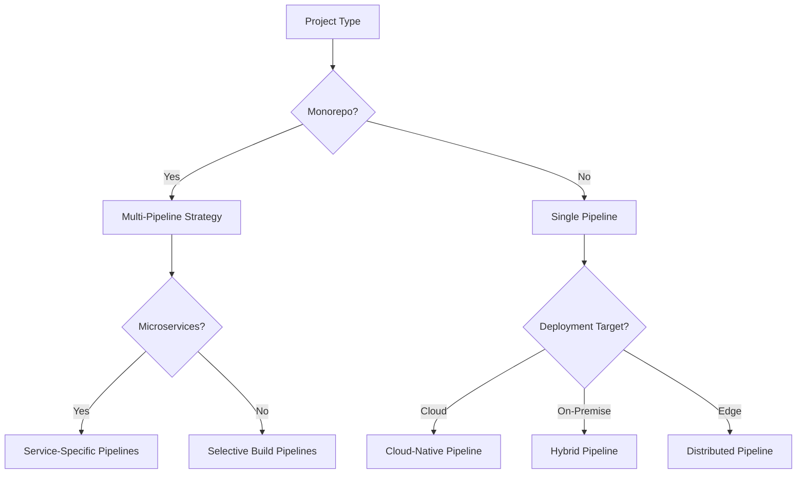

# Deployment Guidelines

## 🎯 Scope

This section covers deployment strategies, CI/CD pipelines, and release management:

**In Scope:**

- Deployment strategies and patterns
- CI/CD pipeline design and implementation
- Container orchestration and management
- Environment management and configuration
- Release processes and rollback procedures
- Infrastructure as Code (IaC) practices

**Out of Scope:**

- Cloud provider-specific configurations (covered in Cloud Infrastructure)
- Monitoring and observability (covered in Observability)
- Security configurations (covered in Security Guidelines)

## 📋 Content Description

This folder provides comprehensive deployment guidance to ensure reliable, automated, and scalable application delivery.

### Available Guidelines:

1. **Deployment Strategies** (`deployment-strategies.md`)

   - Blue-green deployments
   - Canary releases
   - Rolling updates
   - Feature flags integration

2. **CI/CD Pipelines** (`ci-cd-pipelines.md`)

   - Pipeline design patterns
   - Build optimization strategies
   - Testing integration
   - Artifact management

3. **Container Deployment** (`container-deployment.md`)

   - Docker best practices
   - Kubernetes deployment patterns
   - Container orchestration
   - Service mesh integration

4. **Environment Management** (`environment-management.md`)

   - Environment separation strategies
   - Configuration management
   - Secrets handling
   - Environment promotion

5. **Release Management** (`release-management.md`)
   - Release planning processes
   - Version control strategies
   - Rollback procedures
   - Release communication

## 🔄 Decision Support

### Deployment Strategy Selection Matrix

| Strategy   | Risk Level | Rollback Speed | Resource Usage | Complexity | Best For             |
| ---------- | ---------- | -------------- | -------------- | ---------- | -------------------- |
| Blue-Green | Low        | Instant        | High (2x)      | Medium     | Critical systems     |
| Canary     | Low        | Fast           | Medium         | High       | User-facing apps     |
| Rolling    | Medium     | Medium         | Low            | Low        | Standard deployments |
| Recreate   | High       | Slow           | Low            | Low        | Development/testing  |

### CI/CD Pipeline Decision Tree

### Selection Criteria

**Choose Blue-Green when:**

- Zero-downtime requirements
- Critical production systems
- Complex rollback scenarios
- Adequate infrastructure resources

**Choose Canary when:**

- User-facing applications
- Need for gradual rollout
- A/B testing requirements
- Performance validation needs

**Choose Rolling when:**

- Standard web applications
- Resource constraints
- Simple deployment requirements
- Acceptable brief downtime

## 🛠️ Implementation Tools

### CI/CD Platforms:

- **GitHub Actions**: Git-integrated workflows
- **GitLab CI**: Integrated DevOps platform
- **Jenkins**: Self-hosted automation
- **Azure DevOps**: Microsoft ecosystem integration

### Container Orchestration:

- **Kubernetes**: Production container orchestration
- **Docker Swarm**: Simplified container clustering
- **Amazon ECS**: AWS-managed containers
- **Google Cloud Run**: Serverless containers

### Infrastructure as Code:

- **Terraform**: Multi-cloud infrastructure
- **AWS CloudFormation**: AWS-specific IaC
- **Pulumi**: Programming language-based IaC
- **Ansible**: Configuration management

### Deployment Tools:

- **ArgoCD**: GitOps for Kubernetes
- **Flux**: Kubernetes GitOps operator
- **Spinnaker**: Multi-cloud deployment
- **Octopus Deploy**: Enterprise deployment automation
