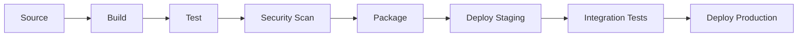
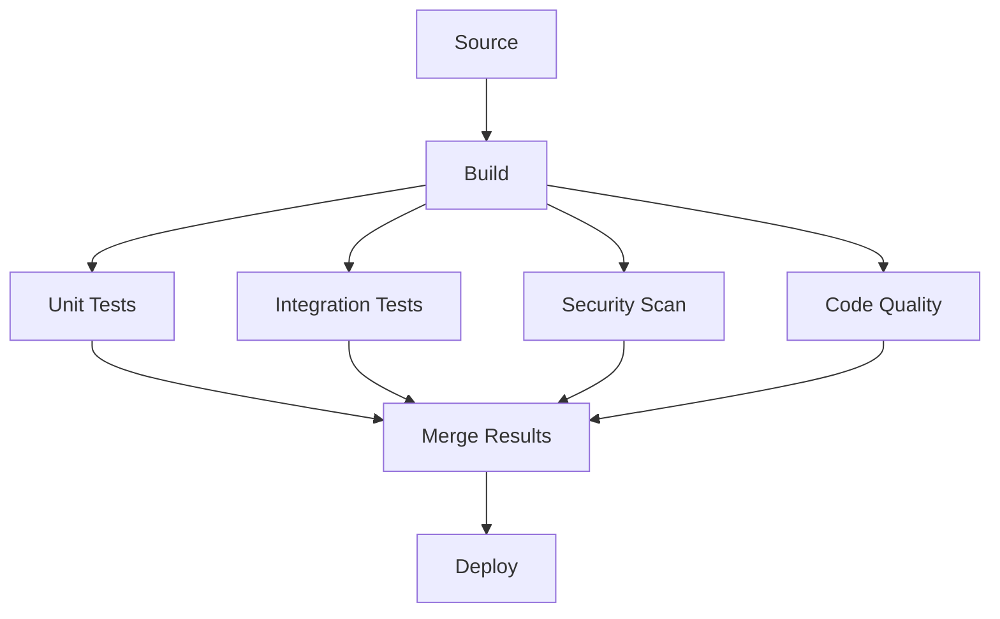
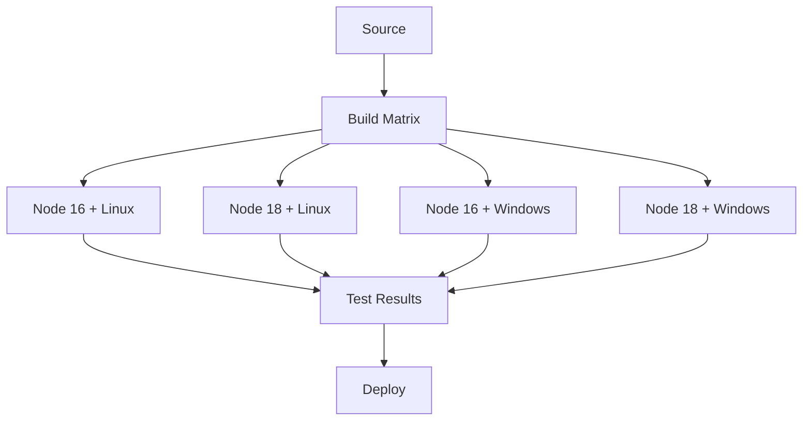
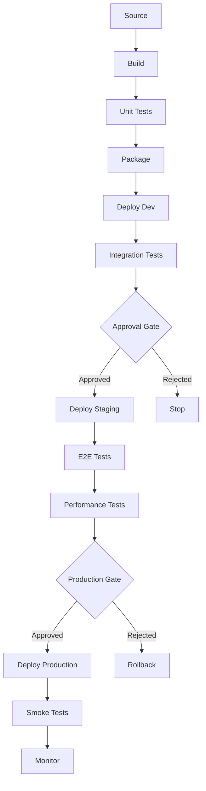

# CI/CD Pipeline Guidelines

## Purpose

Establish comprehensive CI/CD pipeline strategies that enable reliable, fast, and secure software delivery while maintaining high quality standards and developer productivity.

## Pipeline Architecture Patterns

### Linear Pipeline



**Best for**: Simple applications, straightforward deployment requirements

### Fan-out Pipeline



**Best for**: Complex applications requiring parallel validation steps

### Matrix Pipeline



**Best for**: Multi-platform applications, various environment support

## Pipeline Stages

### 1. Source Control Integration

```yaml
# GitHub Actions trigger configuration
name: CI/CD Pipeline
on:
  push:
    branches: [main, develop]
    paths-ignore:
      - 'docs/**'
      - '*.md'
  pull_request:
    branches: [main]
    types: [opened, synchronize, reopened]
  release:
    types: [published]
  workflow_dispatch:
    inputs:
      environment:
        description: 'Environment to deploy'
        required: true
        default: 'staging'
        type: choice
        options:
          - staging
          - production

env:
  NODE_VERSION: '18'
  REGISTRY: ghcr.io
  IMAGE_NAME: ${{ github.repository }}
```

### 2. Build Stage

```typescript
interface BuildConfiguration {
  language: string
  runtime: string
  buildTool: string
  artifacts: string[]
  caching: CacheStrategy
  parallelization: boolean
}

// Multi-language build configuration
const buildConfigs: Record<string, BuildConfiguration> = {
  nodejs: {
    language: 'JavaScript/TypeScript',
    runtime: 'Node.js 18',
    buildTool: 'npm/pnpm',
    artifacts: ['dist/', 'node_modules/.cache'],
    caching: { dependencies: true, build: true },
    parallelization: true,
  },
  java: {
    language: 'Java',
    runtime: 'OpenJDK 17',
    buildTool: 'Maven/Gradle',
    artifacts: ['target/', '.m2/repository'],
    caching: { dependencies: true, build: true },
    parallelization: true,
  },
  python: {
    language: 'Python',
    runtime: 'Python 3.11',
    buildTool: 'pip/poetry',
    artifacts: ['dist/', '__pycache__'],
    caching: { dependencies: true, build: false },
    parallelization: false,
  },
}
```

```yaml
# Build stage example (Node.js)
build:
  runs-on: ubuntu-latest
  outputs:
    version: ${{ steps.version.outputs.version }}
    image-digest: ${{ steps.build.outputs.digest }}

  steps:
    - name: Checkout code
      uses: actions/checkout@v4
      with:
        fetch-depth: 0

    - name: Setup Node.js
      uses: actions/setup-node@v4
      with:
        node-version: ${{ env.NODE_VERSION }}
        cache: 'npm'

    - name: Install dependencies
      run: |
        npm ci --prefer-offline --no-audit

    - name: Build application
      run: |
        npm run build
        npm run build:docs

    - name: Generate version
      id: version
      run: |
        VERSION=$(npm run version --silent)
        echo "version=$VERSION" >> $GITHUB_OUTPUT

    - name: Cache build artifacts
      uses: actions/cache@v3
      with:
        path: |
          dist/
          docs/
        key: build-${{ github.sha }}-${{ hashFiles('package-lock.json') }}

    - name: Upload build artifacts
      uses: actions/upload-artifact@v3
      with:
        name: build-artifacts
        path: |
          dist/
          package.json
        retention-days: 30
```

### 3. Testing Stage

```yaml
# Comprehensive testing strategy
test:
  needs: build
  strategy:
    matrix:
      test-type: [unit, integration, e2e]
      os: [ubuntu-latest, windows-latest]
      node-version: [16, 18, 20]
      exclude:
        - test-type: e2e
          os: windows-latest

  runs-on: ${{ matrix.os }}

  steps:
    - name: Checkout code
      uses: actions/checkout@v4

    - name: Setup Node.js ${{ matrix.node-version }}
      uses: actions/setup-node@v4
      with:
        node-version: ${{ matrix.node-version }}
        cache: 'npm'

    - name: Download build artifacts
      uses: actions/download-artifact@v3
      with:
        name: build-artifacts

    - name: Install dependencies
      run: npm ci --prefer-offline --no-audit

    - name: Run unit tests
      if: matrix.test-type == 'unit'
      run: |
        npm run test:unit -- --coverage --reporter=json

    - name: Run integration tests
      if: matrix.test-type == 'integration'
      run: |
        npm run test:integration

    - name: Run E2E tests
      if: matrix.test-type == 'e2e'
      run: |
        npm run test:e2e:headless

    - name: Upload test results
      uses: actions/upload-artifact@v3
      if: always()
      with:
        name: test-results-${{ matrix.test-type }}-${{ matrix.os }}-${{ matrix.node-version }}
        path: |
          coverage/
          test-results/
          screenshots/
```

### 4. Security and Quality Gates

```yaml
# Security and quality scanning
security-quality:
  needs: build
  runs-on: ubuntu-latest

  steps:
    - name: Checkout code
      uses: actions/checkout@v4
      with:
        fetch-depth: 0

    - name: Download build artifacts
      uses: actions/download-artifact@v3
      with:
        name: build-artifacts

    # Dependency vulnerability scanning
    - name: Run Snyk security scan
      uses: snyk/actions/node@master
      env:
        SNYK_TOKEN: ${{ secrets.SNYK_TOKEN }}
      with:
        args: --severity-threshold=medium

    # Static Application Security Testing (SAST)
    - name: Run CodeQL analysis
      uses: github/codeql-action/init@v2
      with:
        languages: typescript, javascript

    - name: Autobuild
      uses: github/codeql-action/autobuild@v2

    - name: Perform CodeQL analysis
      uses: github/codeql-action/analyze@v2

    # Code quality analysis
    - name: SonarCloud scan
      uses: SonarSource/sonarcloud-github-action@master
      env:
        GITHUB_TOKEN: ${{ secrets.GITHUB_TOKEN }}
        SONAR_TOKEN: ${{ secrets.SONAR_TOKEN }}

    # License compliance
    - name: FOSSA scan
      uses: fossas/fossa-action@main
      with:
        api-key: ${{ secrets.FOSSA_API_KEY }}

    # Container security scanning
    - name: Build Docker image for scanning
      run: |
        docker build -t temp-scan-image .

    - name: Run Trivy vulnerability scanner
      uses: aquasecurity/trivy-action@master
      with:
        image-ref: 'temp-scan-image'
        format: 'sarif'
        output: 'trivy-results.sarif'

    - name: Upload Trivy scan results
      uses: github/codeql-action/upload-sarif@v2
      with:
        sarif_file: 'trivy-results.sarif'
```

### 5. Packaging and Artifact Management

```yaml
# Package and containerize
package:
  needs: [test, security-quality]
  runs-on: ubuntu-latest
  outputs:
    image-url: ${{ steps.meta.outputs.tags }}
    image-digest: ${{ steps.build.outputs.digest }}

  steps:
    - name: Checkout code
      uses: actions/checkout@v4

    - name: Download build artifacts
      uses: actions/download-artifact@v3
      with:
        name: build-artifacts

    - name: Set up Docker Buildx
      uses: docker/setup-buildx-action@v3

    - name: Log in to Container Registry
      uses: docker/login-action@v3
      with:
        registry: ${{ env.REGISTRY }}
        username: ${{ github.actor }}
        password: ${{ secrets.GITHUB_TOKEN }}

    - name: Extract metadata
      id: meta
      uses: docker/metadata-action@v5
      with:
        images: ${{ env.REGISTRY }}/${{ env.IMAGE_NAME }}
        tags: |
          type=ref,event=branch
          type=ref,event=pr
          type=semver,pattern={{version}}
          type=semver,pattern={{major}}.{{minor}}
          type=sha,prefix={{branch}}-

    - name: Build and push Docker image
      id: build
      uses: docker/build-push-action@v5
      with:
        context: .
        push: true
        tags: ${{ steps.meta.outputs.tags }}
        labels: ${{ steps.meta.outputs.labels }}
        cache-from: type=gha
        cache-to: type=gha,mode=max
        platforms: linux/amd64,linux/arm64

    # Sign container image
    - name: Install Cosign
      uses: sigstore/cosign-installer@v3

    - name: Sign container image
      run: |
        cosign sign --yes ${{ env.REGISTRY }}/${{ env.IMAGE_NAME }}@${{ steps.build.outputs.digest }}

    # Generate SBOM
    - name: Generate SBOM
      uses: anchore/sbom-action@v0
      with:
        image: ${{ env.REGISTRY }}/${{ env.IMAGE_NAME }}@${{ steps.build.outputs.digest }}
        format: spdx-json
        output-file: sbom.spdx.json

    - name: Upload SBOM
      uses: actions/upload-artifact@v3
      with:
        name: sbom
        path: sbom.spdx.json
```

### 6. Deployment Stages

```yaml
# Multi-environment deployment
deploy:
  needs: package
  strategy:
    matrix:
      environment: [staging, production]

  runs-on: ubuntu-latest
  environment:
    name: ${{ matrix.environment }}
    url: ${{ steps.deploy.outputs.url }}

  steps:
    - name: Checkout deployment manifests
      uses: actions/checkout@v4
      with:
        repository: company/k8s-manifests
        token: ${{ secrets.DEPLOY_TOKEN }}
        path: manifests

    - name: Setup kubectl
      uses: azure/setup-kubectl@v3
      with:
        version: '1.28.0'

    - name: Configure AWS credentials
      uses: aws-actions/configure-aws-credentials@v4
      with:
        aws-access-key-id: ${{ secrets.AWS_ACCESS_KEY_ID }}
        aws-secret-access-key: ${{ secrets.AWS_SECRET_ACCESS_KEY }}
        aws-region: us-east-1

    - name: Update kubeconfig
      run: |
        aws eks update-kubeconfig --name ${{ matrix.environment }}-cluster

    - name: Deploy to Kubernetes
      id: deploy
      run: |
        # Update image tag in manifests
        sed -i 's|IMAGE_TAG|${{ needs.package.outputs.image-url }}|g' manifests/${{ matrix.environment }}/deployment.yaml

        # Apply manifests
        kubectl apply -f manifests/${{ matrix.environment }}/

        # Wait for rollout
        kubectl rollout status deployment/app -n ${{ matrix.environment }}

        # Get service URL
        SERVICE_URL=$(kubectl get svc app -n ${{ matrix.environment }} -o jsonpath='{.status.loadBalancer.ingress[0].hostname}')
        echo "url=https://$SERVICE_URL" >> $GITHUB_OUTPUT

    - name: Run deployment verification
      run: |
        # Health check
        curl -f ${{ steps.deploy.outputs.url }}/health || exit 1

        # Smoke tests
        npm run test:smoke -- --baseUrl=${{ steps.deploy.outputs.url }}

    - name: Notify deployment
      uses: 8398a7/action-slack@v3
      with:
        status: ${{ job.status }}
        channel: '#deployments'
        text: |
          Deployment to ${{ matrix.environment }} completed
          URL: ${{ steps.deploy.outputs.url }}
          Image: ${{ needs.package.outputs.image-url }}
      env:
        SLACK_WEBHOOK_URL: ${{ secrets.SLACK_WEBHOOK }}
```

## Pipeline Optimization

### Build Performance

```typescript
interface BuildOptimization {
  caching: {
    dependencies: boolean
    buildArtifacts: boolean
    dockerLayers: boolean
    testResults: boolean
  }
  parallelization: {
    matrixBuilds: boolean
    parallelJobs: number
    testSharding: boolean
  }
  resourceAllocation: {
    cpuCores: number
    memoryGB: number
    diskSpace: string
  }
}

// Build performance metrics
const buildMetrics = {
  targets: {
    totalPipelineTime: '< 10 minutes',
    buildTime: '< 3 minutes',
    testTime: '< 5 minutes',
    deploymentTime: '< 2 minutes',
  },

  optimizations: [
    'Use build caching for dependencies',
    'Implement test result caching',
    'Parallel test execution',
    'Docker layer caching',
    'Incremental builds',
    'Smart test selection',
    'Resource pre-allocation',
  ],
}
```

### Advanced Caching Strategies

```yaml
# Multi-level caching configuration
cache-strategy:
  dependency-cache:
    - name: Cache Node.js dependencies
      uses: actions/cache@v3
      with:
        path: |
          ~/.npm
          node_modules
          */node_modules
        key: ${{ runner.os }}-node-${{ hashFiles('**/package-lock.json') }}
        restore-keys: |
          ${{ runner.os }}-node-

  build-cache:
    - name: Cache build outputs
      uses: actions/cache@v3
      with:
        path: |
          dist/
          .next/cache
          .nuxt/
        key: ${{ runner.os }}-build-${{ github.sha }}
        restore-keys: |
          ${{ runner.os }}-build-

  test-cache:
    - name: Cache test results
      uses: actions/cache@v3
      with:
        path: |
          coverage/
          .jest-cache/
          cypress/screenshots/
          cypress/videos/
        key: ${{ runner.os }}-test-${{ hashFiles('**/*.test.*') }}

  docker-cache:
    - name: Set up Docker Buildx
      uses: docker/setup-buildx-action@v3
      with:
        driver-opts: |
          network=host

    - name: Build with cache
      uses: docker/build-push-action@v5
      with:
        cache-from: |
          type=gha,scope=build
          type=registry,ref=ghcr.io/company/app:cache
        cache-to: |
          type=gha,scope=build,mode=max
          type=registry,ref=ghcr.io/company/app:cache,mode=max
```

## Security Integration

### Security Scanning Pipeline

```typescript
interface SecurityScanConfiguration {
  sast: {
    // Static Application Security Testing
    tools: ['CodeQL', 'Semgrep', 'SonarQube']
    severity: 'medium' | 'high' | 'critical'
    failBuild: boolean
  }

  dast: {
    // Dynamic Application Security Testing
    tools: ['OWASP ZAP', 'Burp Suite']
    environments: ['staging']
    frequency: 'nightly' | 'release'
  }

  dependencyScanning: {
    tools: ['Snyk', 'npm audit', 'GitHub Dependabot']
    autoFix: boolean
    severity: 'medium' | 'high' | 'critical'
  }

  containerScanning: {
    tools: ['Trivy', 'Clair', 'Anchore']
    baseImageScanning: boolean
    policyEnforcement: boolean
  }

  secretsScanning: {
    tools: ['GitLeaks', 'TruffleHog']
    preventCommit: boolean
    scanHistory: boolean
  }
}

// Security gate implementation
class SecurityGate {
  async evaluateSecurityScan(scanResults: SecurityScanResults): Promise<GateDecision> {
    const criticalIssues = scanResults.filter(issue => issue.severity === 'critical')
    const highIssues = scanResults.filter(issue => issue.severity === 'high')

    if (criticalIssues.length > 0) {
      return {
        decision: 'BLOCK',
        reason: `${criticalIssues.length} critical security issues found`,
        requiredActions: ['Fix all critical issues', 'Re-run security scan'],
      }
    }

    if (highIssues.length > 5) {
      return {
        decision: 'WARN',
        reason: `${highIssues.length} high severity issues found`,
        recommendations: ['Review and prioritize fixes', 'Consider delaying release'],
      }
    }

    return {
      decision: 'PASS',
      reason: 'No blocking security issues found',
    }
  }
}
```

## Monitoring and Observability

### Pipeline Monitoring

```typescript
interface PipelineMetrics {
  performance: {
    averageDuration: number
    successRate: number
    failureRate: number
    queueTime: number
    executionTime: number
  }

  quality: {
    testCoverage: number
    securityScore: number
    codeQualityScore: number
    deploymentSuccess: number
  }

  business: {
    deploymentFrequency: number
    leadTimeForChanges: number
    meanTimeToRecovery: number
    changeFailureRate: number
  }
}

// Pipeline observability dashboard
const pipelineObservability = {
  metrics: [
    'Build duration trends',
    'Test execution time',
    'Security scan results',
    'Deployment success rates',
    'Infrastructure costs',
    'Developer productivity',
  ],

  alerts: [
    'Pipeline failure rate > 10%',
    'Build time > 15 minutes',
    'Security scan failures',
    'Deployment rollback triggered',
    'Test coverage drop > 5%',
  ],

  dashboards: [
    'Pipeline Performance Overview',
    'Security and Quality Metrics',
    'Deployment Success Tracking',
    'Cost and Resource Usage',
    'Team Productivity Metrics',
  ],
}
```

### Pipeline Analytics

```yaml
# Pipeline analytics and reporting
analytics:
  runs-on: ubuntu-latest
  if: always()
  needs: [build, test, security-quality, deploy]

  steps:
    - name: Collect pipeline metrics
      run: |
        # Collect timing data
        BUILD_TIME=${{ needs.build.outputs.duration }}
        TEST_TIME=${{ needs.test.outputs.duration }}
        DEPLOY_TIME=${{ needs.deploy.outputs.duration }}

        # Calculate total pipeline time
        TOTAL_TIME=$((BUILD_TIME + TEST_TIME + DEPLOY_TIME))

        echo "Pipeline completed in ${TOTAL_TIME} seconds"

    - name: Send metrics to monitoring
      run: |
        curl -X POST https://metrics.company.com/api/pipelines \
          -H "Authorization: Bearer ${{ secrets.METRICS_TOKEN }}" \
          -d '{
            "repository": "${{ github.repository }}",
            "pipeline_id": "${{ github.run_id }}",
            "commit_sha": "${{ github.sha }}",
            "build_time": ${{ needs.build.outputs.duration }},
            "test_time": ${{ needs.test.outputs.duration }},
            "deploy_time": ${{ needs.deploy.outputs.duration }},
            "success": ${{ job.status == 'success' }}
          }'

    - name: Update pipeline status
      uses: actions/github-script@v6
      with:
        script: |
          const { owner, repo } = context.repo;
          const { sha } = context;

          await github.rest.repos.createCommitStatus({
            owner,
            repo,
            sha,
            state: '${{ job.status }}',
            target_url: `https://github.com/${owner}/${repo}/actions/runs/${{ github.run_id }}`,
            description: 'CI/CD Pipeline completed',
            context: 'ci/pipeline'
          });
```

## Advanced Pipeline Patterns

### Multi-Environment Pipeline



### Progressive Deployment Pipeline

```typescript
interface ProgressiveDeploymentConfig {
  strategy: 'blue-green' | 'canary' | 'rolling'
  phases: DeploymentPhase[]
  rollbackTriggers: RollbackTrigger[]
  monitoringPeriod: number // minutes
}

interface DeploymentPhase {
  name: string
  trafficPercentage: number
  duration: number // minutes
  successCriteria: SuccessCriteria[]
  autoPromote: boolean
}

const canaryDeploymentConfig: ProgressiveDeploymentConfig = {
  strategy: 'canary',
  phases: [
    {
      name: 'Initial Canary',
      trafficPercentage: 5,
      duration: 10,
      successCriteria: [
        { metric: 'error_rate', threshold: 0.01, operator: '<' },
        { metric: 'response_time_p95', threshold: 500, operator: '<' },
      ],
      autoPromote: true,
    },
    {
      name: 'Expanded Canary',
      trafficPercentage: 25,
      duration: 20,
      successCriteria: [
        { metric: 'error_rate', threshold: 0.01, operator: '<' },
        { metric: 'response_time_p95', threshold: 500, operator: '<' },
        { metric: 'user_satisfaction', threshold: 4.5, operator: '>' },
      ],
      autoPromote: false,
    },
    {
      name: 'Full Rollout',
      trafficPercentage: 100,
      duration: 0,
      successCriteria: [],
      autoPromote: true,
    },
  ],
  rollbackTriggers: [
    { metric: 'error_rate', threshold: 0.05, action: 'immediate_rollback' },
    { metric: 'response_time_p99', threshold: 2000, action: 'immediate_rollback' },
    { metric: 'availability', threshold: 99.0, action: 'gradual_rollback' },
  ],
  monitoringPeriod: 60,
}
```

## Implementation Best Practices

### Pipeline as Code

```yaml
# Reusable workflow templates
name: Reusable CI/CD Pipeline
on:
  workflow_call:
    inputs:
      environment:
        required: true
        type: string
      app-name:
        required: true
        type: string
      docker-registry:
        required: false
        type: string
        default: 'ghcr.io'
    secrets:
      registry-token:
        required: true
      deploy-key:
        required: true

jobs:
  call-build:
    uses: ./.github/workflows/build.yml
    with:
      app-name: ${{ inputs.app-name }}
      registry: ${{ inputs.docker-registry }}
    secrets:
      token: ${{ secrets.registry-token }}

  call-deploy:
    needs: call-build
    uses: ./.github/workflows/deploy.yml
    with:
      environment: ${{ inputs.environment }}
      image: ${{ needs.call-build.outputs.image }}
    secrets:
      deploy-key: ${{ secrets.deploy-key }}
```

### Error Handling and Recovery

```typescript
interface PipelineErrorHandling {
  retryStrategy: {
    maxAttempts: number
    backoffStrategy: 'linear' | 'exponential'
    retryableErrors: string[]
  }

  fallbackStrategy: {
    enabled: boolean
    fallbackBranch: string
    fallbackImage: string
  }

  notificationStrategy: {
    channels: string[]
    escalation: EscalationRule[]
  }
}

// Pipeline recovery mechanisms
class PipelineRecovery {
  async handleFailure(failure: PipelineFailure): Promise<RecoveryAction> {
    if (this.isRetryable(failure)) {
      return this.retryWithBackoff(failure)
    }

    if (this.hasFallback(failure)) {
      return this.executeFallback(failure)
    }

    return this.escalateFailure(failure)
  }

  private async retryWithBackoff(failure: PipelineFailure): Promise<RecoveryAction> {
    const delay = this.calculateBackoff(failure.attemptNumber)
    await this.wait(delay)
    return { action: 'retry', delay }
  }

  private async executeFallback(failure: PipelineFailure): Promise<RecoveryAction> {
    // Deploy previous known-good version
    await this.deployFallback()
    return { action: 'fallback', version: 'previous' }
  }
}
```

## Implementation Checklist

### Pipeline Setup

- [ ] Define pipeline architecture pattern
- [ ] Configure source control integration
- [ ] Set up build and test stages
- [ ] Implement security scanning
- [ ] Configure artifact management
- [ ] Set up deployment automation
- [ ] Implement monitoring and alerting

### Security and Quality

- [ ] Integrate security scanning tools
- [ ] Configure quality gates
- [ ] Set up dependency scanning
- [ ] Implement container security
- [ ] Configure secrets management
- [ ] Set up compliance reporting

### Performance and Reliability

- [ ] Implement caching strategies
- [ ] Configure parallel execution
- [ ] Set up error handling and recovery
- [ ] Configure monitoring and metrics
- [ ] Implement rollback mechanisms
- [ ] Set up performance testing

### Team and Process

- [ ] Train team on pipeline usage
- [ ] Document pipeline procedures
- [ ] Set up notification systems
- [ ] Establish incident response
- [ ] Define maintenance procedures
- [ ] Create troubleshooting guides
