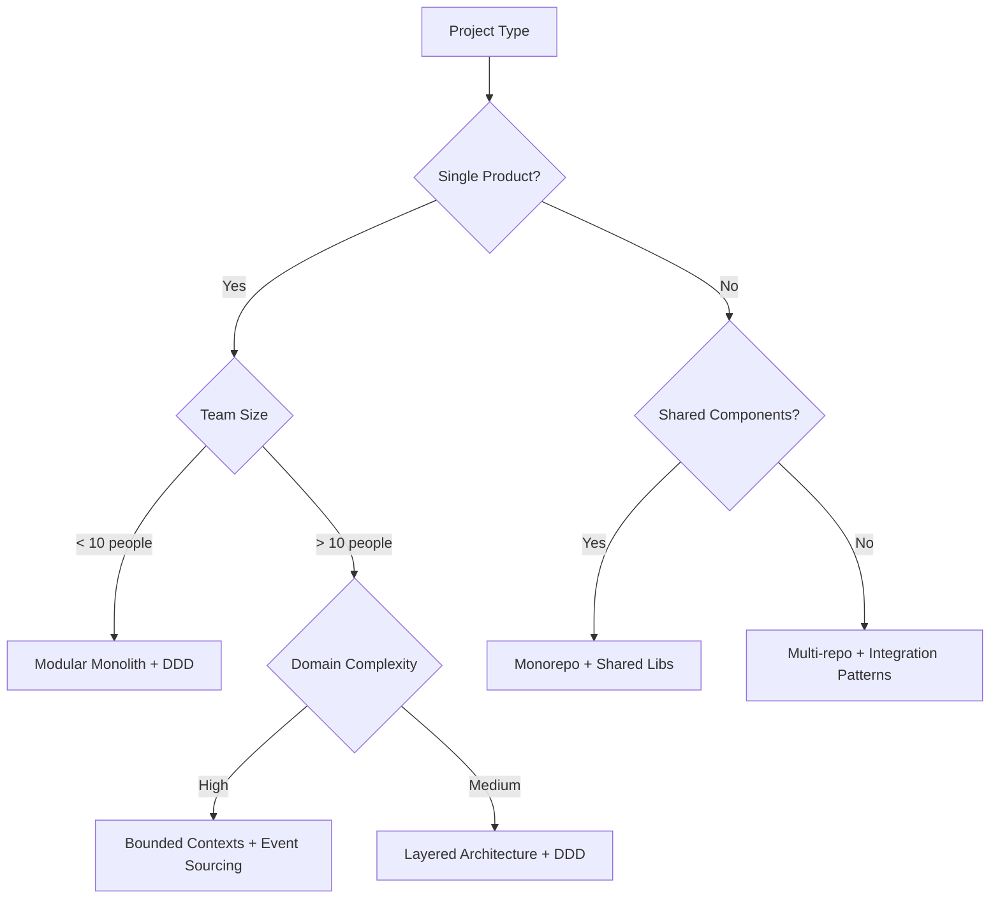

# Design Patterns

## 🎯 Scope

This section covers fundamental design patterns for software architecture:

#### In Scope:

- Domain-driven design principles and practices
- Bounded context definition and management
- Integration patterns between system components
- System design methodologies
- Repository structure organization
- Workspace organization strategies
- Monorepo management patterns

#### Out of Scope:

- Implementation-specific code patterns (covered in Code Design)
- Deployment patterns (covered in Deployment Architectures)
- Infrastructure patterns (covered in Infrastructure)

## 📋 Content Description

This folder contains guidelines for establishing solid architectural foundations through proven design patterns. Each pattern includes theoretical background, practical implementation guidance, and real-world examples.

### Available Patterns:

1. **Domain-Driven Design** (`domain-driven-design.md`)

   - Strategic and tactical DDD patterns
   - Ubiquitous language development
   - Context mapping techniques

2. **Strategic Subdomain Definition** (`strategic-subdomain-definition.md`)

   - Subdomain identification methodology
   - Core/Supporting/Generic classification framework
   - Business value-driven prioritization strategies

3. **Bounded Contexts** (`bounded-contexts.md`)

   - Context boundary identification
   - Service decomposition strategies
   - Communication patterns between contexts

4. **Integration Patterns** (`integration-patterns.md`)

   - Inter-service communication
   - Data consistency patterns
   - Event-driven architecture

5. **System Design** (`system-design.md`)

   - High-level system architecture
   - Scalability considerations
   - Performance optimization

6. **Repository Structure** (`repository-structure.md`)

   - Code organization strategies
   - Dependency management
   - Modularization approaches

7. **Workspace Organization** (`workspace-organization.md`)

   - Multi-project workspace setup
   - Shared configuration management
   - Development workflow optimization

8. **Monorepo Patterns** (`monorepo.md`)
   - Monorepo vs multi-repo decisions
   - Build optimization strategies
   - Dependency isolation techniques

## 🔄 Decision Support

### Pattern Selection Decision Tree

### Complexity Matrix

| Pattern              | Implementation Complexity | Team Size | Domain Complexity | Recommended For              |
| -------------------- | ------------------------- | --------- | ----------------- | ---------------------------- |
| Domain-Driven Design | Medium                    | Any       | High              | Complex business domains     |
| Bounded Contexts     | High                      | >5        | High              | Microservices, large systems |
| Integration Patterns | Medium                    | Any       | Medium+           | Distributed systems          |
| Monorepo             | Low                       | <20       | Any               | Shared components            |
| Repository Structure | Low                       | Any       | Any               | All projects                 |

### Selection Criteria

#### Choose Domain-Driven Design when:

- Complex business logic and rules
- Multiple stakeholders with different vocabularies
- Long-term project evolution expected
- Need for business-technology alignment

#### Choose Strategic Subdomain Definition when:

- Starting new DDD implementation
- Need to prioritize development efforts
- Multiple business capabilities to organize
- Resource allocation decisions required

#### Choose Bounded Contexts when:

- Multiple teams working on same system
- Different data models for same entities
- Independent deployment requirements
- Scaling different parts independently

#### Choose Integration Patterns when:

- Microservices architecture
- Legacy system integration
- External API dependencies
- Event-driven requirements

## 🛠️ Implementation Tools

### Design Tools:

- **C4 Model**: System architecture documentation
- **EventStorming**: Domain modeling workshops
- **Context Mapping**: DDD context relationships
- **ADR Tools**: Architecture decision records

### Analysis Tools:

- **Domain modeling workshops**
- **Stakeholder interviews**
- **System landscape analysis**
- **Dependency mapping tools**

### Validation Tools:

- **Architecture fitness functions**
- **Dependency analysis tools**
- **Code structure validation**
- **Documentation reviews**
