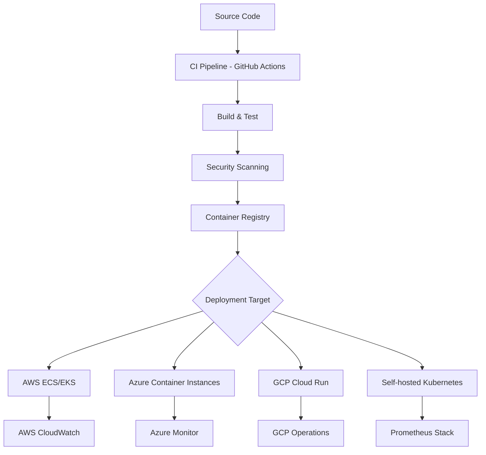
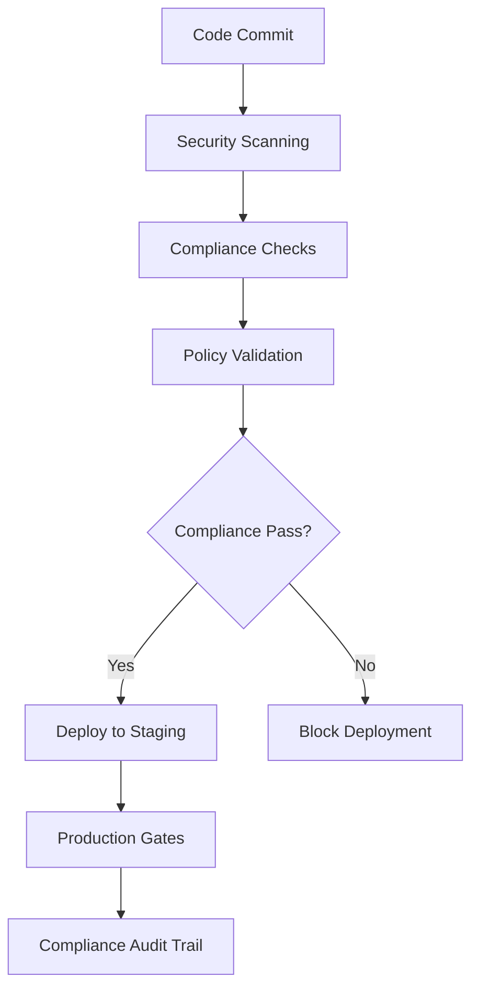

# Cloud DevOps

Strategic guidance for cloud-native development operations, CI/CD pipelines, and deployment automation that maintains control while leveraging cloud benefits.

## Purpose

Enables teams to implement efficient, secure, and cost-effective DevOps practices using cloud services while maintaining deployment flexibility and avoiding vendor lock-in.

## Scope

### CI/CD Pipeline Services

- **Build Services**: GitHub Actions, GitLab CI, Azure DevOps, AWS CodeBuild
- **Deployment Automation**: AWS CodeDeploy, Azure DevOps, Terraform Cloud, Ansible Tower
- **Container Registries**: Docker Hub, ECR, ACR, GCR, GitLab Registry
- **Artifact Management**: Nexus, Artifactory, AWS CodeArtifact, Azure Artifacts

### Infrastructure Automation

- **Infrastructure as Code**: Terraform, Pulumi, CloudFormation, ARM Templates
- **Configuration Management**: Ansible, Chef, Puppet, AWS Systems Manager
- **Secret Management**: HashiCorp Vault, AWS Secrets Manager, Azure Key Vault
- **Environment Provisioning**: Terraform Cloud, Pulumi Service, custom automation

### Observability and Operations

- **Monitoring**: Prometheus + Grafana, DataDog, New Relic, CloudWatch
- **Logging**: ELK Stack, Fluentd, CloudWatch Logs, Azure Monitor
- **Tracing**: Jaeger, Zipkin, AWS X-Ray, Azure Application Insights
- **Alerting**: PagerDuty, OpsGenie, custom webhook integrations

## Strategic Principles

### 1. Portable DevOps Practices

```
Priority Order:
1. Open-source tools on cloud infrastructure
2. Cloud-agnostic CI/CD with provider-specific deployment
3. Multi-cloud deployment automation
4. Provider-native tools with abstraction layers
```

### 2. Cost-Conscious Automation

- **Resource Optimization**: Auto-scaling, scheduled shutdowns, spot instances
- **Build Efficiency**: Parallel builds, caching, incremental compilation
- **Environment Management**: Ephemeral environments, resource quotas
- **Monitoring Costs**: Budget alerts, resource tagging, cost allocation

### 3. Security-First DevOps

- **Least Privilege Access**: RBAC, temporary credentials, audit trails
- **Secret Management**: Encrypted storage, rotation policies, access logging
- **Compliance Automation**: Policy as code, security scanning, compliance reports
- **Zero Trust**: Network segmentation, identity verification, encrypted communication

## CI/CD Pipeline Architecture

### Multi-Cloud CI/CD Strategy



### Pipeline Configuration Matrix

| Environment     | CI Platform    | Deployment       | Registry        | Monitoring         |
| --------------- | -------------- | ---------------- | --------------- | ------------------ |
| **Development** | GitHub Actions | Docker Compose   | GitHub Registry | Local logs         |
| **Staging**     | GitHub Actions | Cloud Run/ACI    | ECR/ACR         | Cloud native       |
| **Production**  | GitHub Actions | EKS/AKS          | ECR/ACR         | Prometheus + Cloud |
| **Multi-cloud** | GitHub Actions | Terraform Deploy | Multi-registry  | Unified dashboard  |

## Implementation Patterns

### 1. Environment-Agnostic Deployment

```yaml
# .github/workflows/deploy.yml
name: Multi-Cloud Deployment
on:
  push:
    branches: [main]

jobs:
  build:
    runs-on: ubuntu-latest
    steps:
      - uses: actions/checkout@v4
      - name: Build Container
        run: docker build -t ${{ github.sha }} .
      - name: Push to Multiple Registries
        run: |
          docker tag ${{ github.sha }} aws-ecr/app:${{ github.sha }}
          docker tag ${{ github.sha }} azure-acr/app:${{ github.sha }}
          docker push aws-ecr/app:${{ github.sha }}
          docker push azure-acr/app:${{ github.sha }}

  deploy:
    needs: build
    strategy:
      matrix:
        environment: [aws-prod, azure-prod]
    runs-on: ubuntu-latest
    steps:
      - name: Deploy with Terraform
        run: |
          terraform workspace select ${{ matrix.environment }}
          terraform apply -var="image_tag=${{ github.sha }}"
```

### 2. Infrastructure as Code with Multiple Providers

```hcl
# terraform/main.tf
terraform {
  required_providers {
    aws = {
      source = "hashicorp/aws"
      version = "~> 5.0"
    }
    azurerm = {
      source = "hashicorp/azurerm"
      version = "~> 3.0"
    }
  }
}

# Conditional deployment based on workspace
locals {
  is_aws = contains(["aws-dev", "aws-prod"], terraform.workspace)
  is_azure = contains(["azure-dev", "azure-prod"], terraform.workspace)
}

# AWS deployment
resource "aws_ecs_service" "app" {
  count = local.is_aws ? 1 : 0
  # AWS-specific configuration
}

# Azure deployment
resource "azurerm_container_group" "app" {
  count = local.is_azure ? 1 : 0
  # Azure-specific configuration
}
```

### 3. Unified Monitoring Across Providers

```yaml
# monitoring/docker-compose.yml
version: '3.8'
services:
  prometheus:
    image: prom/prometheus
    volumes:
      - ./prometheus.yml:/etc/prometheus/prometheus.yml
    ports:
      - '9090:9090'

  grafana:
    image: grafana/grafana
    environment:
      - GF_SECURITY_ADMIN_PASSWORD=admin
    ports:
      - '3000:3000'
    volumes:
      - ./grafana/dashboards:/var/lib/grafana/dashboards

# Collect metrics from multiple cloud providers
scrape_configs:
  - job_name: 'aws-cloudwatch'
    ec2_sd_configs:
      - region: us-east-1
  - job_name: 'azure-monitor'
    azure_sd_configs:
      - subscription_id: 'azure-subscription'
  - job_name: 'gcp-monitoring'
    gce_sd_configs:
      - project: 'gcp-project'
```

## Cloud Provider Integration

### AWS DevOps Services

```yaml
aws_devops_stack:
  ci_cd:
    primary: GitHub Actions
    backup: AWS CodePipeline

  build:
    service: AWS CodeBuild
    compute: EC2 spot instances
    caching: S3 + CloudFront

  deployment:
    container: ECS Fargate
    kubernetes: EKS
    serverless: Lambda

  monitoring:
    metrics: CloudWatch
    logs: CloudWatch Logs
    tracing: X-Ray
    alerting: SNS + PagerDuty

  cost_optimization:
    - Spot instances for builds
    - Scheduled scaling policies
    - S3 lifecycle management
    - Reserved capacity for predictable loads
```

### Azure DevOps Services

```yaml
azure_devops_stack:
  ci_cd:
    primary: GitHub Actions
    backup: Azure DevOps Pipelines

  build:
    service: Azure DevOps
    compute: Azure Container Instances
    caching: Azure Storage + CDN

  deployment:
    container: Azure Container Instances
    kubernetes: AKS
    serverless: Azure Functions

  monitoring:
    metrics: Azure Monitor
    logs: Log Analytics
    tracing: Application Insights
    alerting: Azure Alerts + OpsGenie

  cost_optimization:
    - Auto-scaling policies
    - Consumption-based pricing
    - Resource scheduling
    - Cost management alerts
```

### Multi-Cloud DevOps Strategy

```yaml
multi_cloud_approach:
  ci_platform: GitHub Actions (cloud-agnostic)

  deployment_strategy:
    primary: AWS (us-east-1)
    secondary: Azure (East US)
    disaster_recovery: GCP (us-central1)

  data_strategy:
    configuration: Git repositories
    secrets: HashiCorp Vault (self-hosted)
    artifacts: Multiple registries with replication
    monitoring: Prometheus federation

  automation:
    infrastructure: Terraform with multiple providers
    configuration: Ansible playbooks
    deployment: Custom scripts with provider abstraction
    rollback: Automated rollback on health check failure
```

## Security and Compliance

### 1. Secret Management Strategy

```yaml
# Secret hierarchy and management
secret_management:
  development:
    storage: Local .env files
    rotation: Manual
    access: Developer workstations

  staging:
    storage: HashiCorp Vault
    rotation: Weekly
    access: CI/CD pipelines only

  production:
    storage: Cloud provider secrets + Vault
    rotation: Daily
    access: RBAC with audit logging

  cross_cloud:
    strategy: Vault as primary source
    replication: Encrypted sync to cloud providers
    disaster_recovery: Multi-region Vault cluster
```

### 2. Compliance Automation



### 3. Access Control Matrix

```yaml
access_control:
  developers:
    ci_cd: Read pipeline status
    infrastructure: View resources only
    secrets: Development environment only
    deployment: Development environment only

  devops_engineers:
    ci_cd: Full pipeline management
    infrastructure: Staging + production view
    secrets: Staging access with approval
    deployment: Staging with approval gates

  platform_team:
    ci_cd: Full administration
    infrastructure: Full access all environments
    secrets: Full access with logging
    deployment: Emergency production access

  audit_requirements:
    - All access logged with timestamps
    - Regular access reviews quarterly
    - Automated compliance reporting
    - Break-glass procedures documented
```

## Cost Optimization Strategies

### 1. Build and Deployment Efficiency

```yaml
cost_optimization:
  build_optimization:
    - Docker layer caching
    - Parallel build stages
    - Incremental builds
    - Spot instance usage

  resource_management:
    - Auto-scaling based on workload
    - Scheduled environment shutdown
    - Resource tagging for cost allocation
    - Regular rightsizing reviews

  deployment_efficiency:
    - Blue-green deployments to minimize downtime
    - Canary releases to reduce risk
    - Automated rollback to prevent extended issues
    - Environment-specific resource allocation
```

### 2. Multi-Cloud Cost Comparison

```yaml
cost_comparison:
  ci_cd_builds:
    github_actions: $0.008/minute
    aws_codebuild: $0.005/minute
    azure_devops: $0.01/minute
    gitlab_ci: $0.005/minute (self-hosted)

  container_hosting:
    aws_fargate: $0.04048/vCPU/hour
    azure_aci: $0.04/vCPU/hour
    gcp_cloud_run: $0.0368/vCPU/hour
    self_hosted_k8s: $0.02/vCPU/hour (estimated)

  optimization_targets:
    - 30% cost reduction through spot instances
    - 20% savings through reserved capacity
    - 15% efficiency gains through automation
    - 10% reduction through rightsizing
```

## Integration Points

### With Cloud Infrastructure

- **[Cloud Providers](cloud-providers.md)** - Provider-specific DevOps service selection
- **[Infrastructure as Code](infrastructure-as-code.md)** - Automated infrastructure deployment
- **[Container Orchestration](container-orchestration.md)** - Container deployment automation

### With Operations

- **[Monitoring](../../operations/monitoring/)** - Observability integration and alerting
- **[Infrastructure](../../operations/infrastructure/)** - Infrastructure management automation
- **[Deployment Workflow](../../operations/deployment-workflow/)** - Deployment pipeline integration

### With Quality

- **[Performance Testing](../../quality/performance-testing/)** - Automated performance validation
- **[Security Testing](../../quality/security-testing/)** - Security scanning integration
- **[Reliability Testing](../../quality/reliability-testing/)** - Automated resilience testing

## Metrics and KPIs

### Pipeline Performance

- **Build Time**: < 10 minutes for typical changes
- **Deployment Frequency**: Multiple deployments per day
- **Lead Time**: < 2 hours from commit to production
- **Recovery Time**: < 30 minutes for automated rollback

### Cost Efficiency

- **Cost per Deployment**: Trending downward monthly
- **Resource Utilization**: > 70% average utilization
- **Automation Rate**: > 90% of operations automated
- **Multi-cloud Cost Optimization**: 20% savings through provider arbitrage

### Security and Compliance

- **Security Scan Pass Rate**: 100% for production deployments
- **Secret Rotation Compliance**: 100% compliance with rotation policies
- **Access Audit Pass Rate**: 100% compliance with access reviews
- **Incident Response Time**: < 15 minutes for security incidents

---

_This cloud DevOps strategy enables efficient, secure, and cost-effective development operations while maintaining deployment flexibility and avoiding vendor lock-in._
