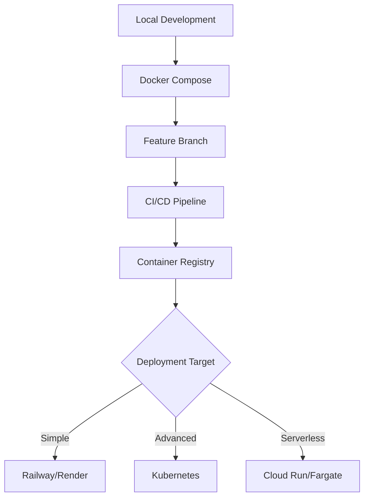

# 🐳 Container Orchestration

Container strategy, orchestration platforms, and cloud-native deployment patterns for scalable and portable application deployment.

## Purpose

Define container orchestration strategies, platform selection criteria, and deployment patterns that enable scalable, portable, and efficient application deployment across development and production environments.

## Scope

**In Scope:**

- Container strategy and platform selection
- Docker best practices and optimization
- Kubernetes deployment patterns and management
- Cloud-native container services and orchestration
- Container security and resource management
- Local development and production alignment

**Out of Scope:**

- Application architecture (see [Architecture](../../architecture/))
- Infrastructure provisioning (see [Infrastructure as Code](infrastructure-as-code.md))
- Monitoring and observability (see [Operations](../../operations/))

## Container Strategy Framework

### Platform Selection Matrix

| Platform           | Complexity | Project Fit | Local Dev | Production Ready  |
| ------------------ | ---------- | ----------- | --------- | ----------------- |
| **Docker Compose** | Low        | ⭐⭐⭐⭐    | Excellent | Development/Small |
| **Kubernetes**     | High       | ⭐⭐        | Good      | Enterprise        |
| **Cloud Run**      | Low        | ⭐⭐⭐      | Limited   | Serverless        |
| **ECS/Fargate**    | Medium     | ⭐⭐⭐      | Limited   | AWS Native        |
| **Railway/Render** | Very Low   | ⭐⭐⭐⭐    | Good      | Startup-friendly  |

### Recommended Approach

**Progressive Container Adoption:**

1. **Local Development**: Docker + Docker Compose
2. **Simple Deployment**: Railway/Render with Docker
3. **Advanced Orchestration**: Managed Kubernetes (EKS, GKE)
4. **Enterprise Scale**: Self-managed Kubernetes

## Implementation Areas

### Core Container Practices

- **[Docker Standards](docker-standards.md)** - Docker best practices, optimization, and security
- **[Docker Compose](docker-compose.md)** - Local development and simple orchestration
- **[Kubernetes Patterns](kubernetes-patterns.md)** - K8s deployment patterns and management

### Cloud-Native Services

- **[Managed Kubernetes](managed-kubernetes.md)** - EKS, GKE, AKS deployment patterns
- **[Serverless Containers](serverless-containers.md)** - Cloud Run, Fargate, and serverless patterns
- **[Container Registries](container-registries.md)** - Image management and distribution

## Strategic Implementation

### 1. **Local Development Setup**

```yaml
# docker-compose.yml
version: '3.8'
services:
  app:
    build:
      context: .
      target: development
    volumes:
      - .:/app
      - /app/node_modules
    environment:
      - NODE_ENV=development
    ports:
      - '3000:3000'
    depends_on:
      - database

  database:
    image: postgres:15-alpine
    environment:
      - POSTGRES_DB=app_dev
      - POSTGRES_USER=dev
      - POSTGRES_PASSWORD=dev
    volumes:
      - postgres_data:/var/lib/postgresql/data
    ports:
      - '5432:5432'

volumes:
  postgres_data:
```

### 2. **Production Dockerfile**

```dockerfile
# Multi-stage build for optimization
FROM node:18-alpine AS builder
WORKDIR /app
COPY package*.json ./
RUN npm ci --only=production

FROM node:18-alpine AS production
WORKDIR /app
COPY --from=builder /app/node_modules ./node_modules
COPY . .
RUN npm run build

EXPOSE 3000
USER node
CMD ["npm", "start"]
```

### 3. **Kubernetes Deployment** (when needed)

```yaml
# k8s/deployment.yaml
apiVersion: apps/v1
kind: Deployment
metadata:
  name: app
spec:
  replicas: 3
  selector:
    matchLabels:
      app: app
  template:
    metadata:
      labels:
        app: app
    spec:
      containers:
        - name: app
          image: app:latest
          ports:
            - containerPort: 3000
          env:
            - name: DATABASE_URL
              valueFrom:
                secretKeyRef:
                  name: app-secrets
                  key: database-url
```

## Best Practices

### Container Security

- **Non-root Users**: Run containers as non-root users
- **Minimal Images**: Use Alpine or distroless base images
- **Image Scanning**: Implement vulnerability scanning in CI/CD
- **Secret Management**: Use external secret management systems

### Resource Management

- **Resource Limits**: Define CPU and memory limits
- **Health Checks**: Implement readiness and liveness probes
- **Graceful Shutdown**: Handle SIGTERM signals properly
- **Horizontal Scaling**: Design for stateless, scalable containers

### Development Workflow



## 🔗 Integration Points

### Architecture Integration

- **[Deployment Architectures](../../architecture/deployment-architectures/)** → Container deployment patterns
- **[Scaling Patterns](../../architecture/scaling-patterns/)** → Container-based scaling strategies

### Technical Standards Integration

- **[Tech Stack](../../technical-standards/tech-stack/)** → Container runtime and orchestration selection
- **[Development Tools](../../technical-standards/development-tools/)** → Container development tooling

### Operations Integration

- **[Infrastructure](../../operations/infrastructure.md)** → Container infrastructure management
- **[Observability](../../operations/observability/)** → Container monitoring and logging

### Quality Integration

- **[Security](../../quality/security/)** → Container security practices
- **[Performance](../../quality/performance/)** → Container performance optimization

---

_Strategic container orchestration for scalable and portable applications._
