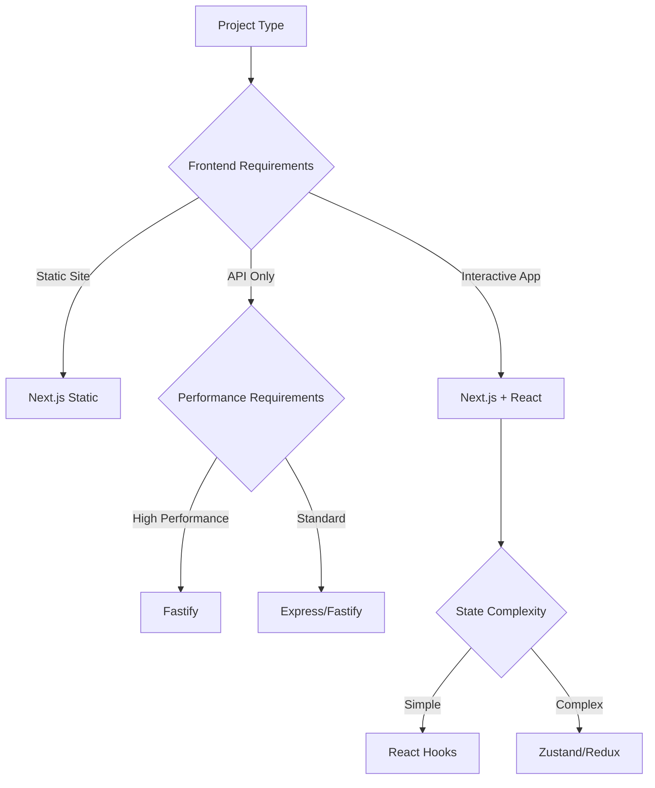

# Code Design

## 🎯 Scope

This section covers code-level design patterns, principles, and organization strategies:

**In Scope:**

- Framework-specific patterns and implementations
- Design principles and coding standards
- Code organization and structure strategies
- Quality standards and automation tools
- Package management and dependency strategies

**Out of Scope:**

- System architecture patterns (covered in Architecture)
- Infrastructure code organization (covered in Infrastructure)
- Test code organization (covered in Testing)

## 📋 Content Description

This folder provides comprehensive guidance for writing maintainable, scalable, and high-quality code. Each section includes theoretical background, practical implementation patterns, and tool configurations.

### Available Sections:

1. **Framework Patterns** (`framework-patterns/`)

   - React and Next.js patterns
   - Fastify server patterns
   - TypeScript implementation strategies
   - Component design and hooks patterns
   - State management approaches

2. **Design Principles** (`design-principles/`)

   - SOLID principles implementation
   - Functional programming patterns
   - Error handling strategies
   - Service abstraction patterns
   - Mocking strategies for testing

3. **Code Organization** (`code-organization/`)

   - Workspace structure guidelines
   - File organization strategies
   - Naming conventions
   - Feature-based architecture
   - Module organization patterns

4. **Quality Standards** (`quality-standards/`)

   - Linting tools and configurations
   - ESLint rules and customization
   - Prettier formatting standards
   - Code metrics and coverage
   - Technical debt management

5. **Package Management** (`package-management/`)
   - PNPM workspace configuration
   - Dependency management strategies
   - Version catalog approaches
   - Shared dependency patterns

## � Decision Support

### Framework Selection Decision Tree

### Code Organization Matrix

| Project Size              | Team Size | Recommended Structure | Complexity |
| ------------------------- | --------- | --------------------- | ---------- |
| Small (<10 components)    | 1-2       | Feature folders       | Low        |
| Medium (10-50 components) | 3-5       | Domain-based modules  | Medium     |
| Large (50+ components)    | 5+        | Bounded contexts      | High       |
| Enterprise                | 10+       | Micro-frontends       | Very High  |

### Quality Standards Selection

**Choose ESLint + Prettier when:**

- TypeScript/JavaScript projects
- Team collaboration requirements
- Consistent code formatting needs
- CI/CD integration requirements

**Choose Advanced Tooling when:**

- Large team coordination
- Complex quality gates
- Performance optimization critical
- Enterprise compliance needs

## 🛠️ Implementation Tools

### Development Tools:

- **ESLint**: Code quality and consistency
- **Prettier**: Code formatting automation
- **TypeScript**: Type safety and documentation
- **Husky**: Git hooks for quality gates

### Framework Tools:

- **React DevTools**: Component debugging
- **Next.js DevTools**: Performance analysis
- **Fastify CLI**: Server development tools
- **Testing Libraries**: Component and API testing

### Quality Tools:

- **SonarQube**: Code quality analysis
- **CodeClimate**: Technical debt tracking
- **Lighthouse**: Performance auditing
- **Bundle Analyzer**: Bundle optimization

1. **Design Foundation**: Start with [Design Principles](design-principles/README.md) for fundamental code quality concepts
2. **Framework Implementation**: Apply [Framework Patterns](framework-patterns/README.md) for your tech stack
3. **Development Setup**: Configure [Implementation Standards](implementation-standards/README.md) for your environment
4. **Code Organization**: Structure your code using [Organization Patterns](organization-patterns/README.md)
5. **Quality Gates**: Implement [Quality Standards](quality-standards/README.md) for continuous validation

---

_Code Design focuses on the "how" of writing quality software - the patterns, principles, and practices that make code maintainable, readable, and robust._
