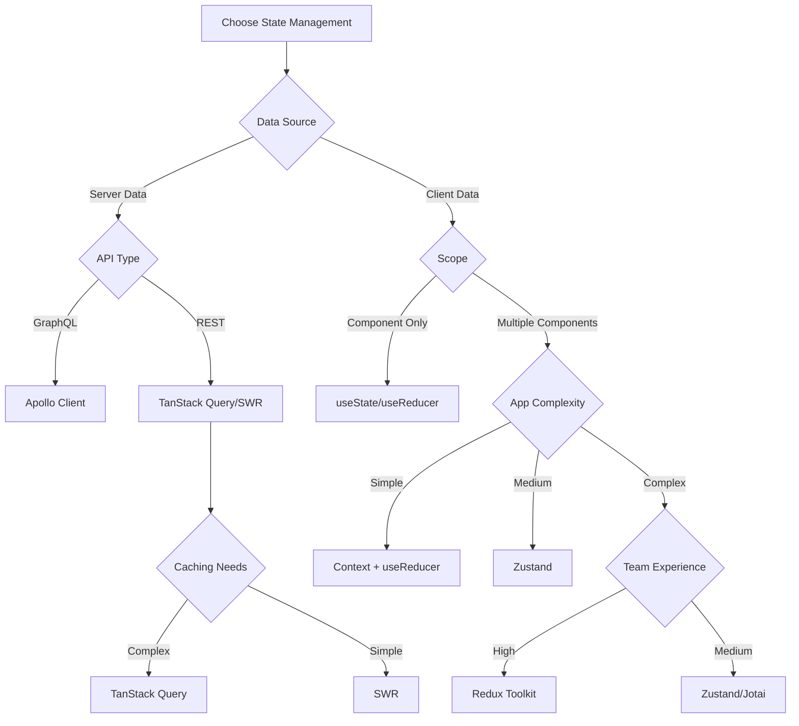

# State Management

## Overview

State management is fundamental to building maintainable React applications. This guide explores strategies for managing different types of state, from local component state to complex global application state, with emphasis on choosing the right tool for each use case.

## State Management Philosophy

### State Classification Strategy

Understanding different types of state helps choose appropriate management approaches:

**UI State**: Component-specific state like form inputs, toggles, modal visibility
**Application State**: Shared state across components like user session, theme preferences  
**Server State**: Data from external sources like API responses, cached data
**Router State**: URL-based state like current page, query parameters

### State Locality Principle

Keep state as local as possible, promoting it only when necessary:

**Component Level**: Start with local state for component-specific needs
**Parent Level**: Lift state up when multiple children need access
**Context Level**: Use context for state shared across component trees
**Global Level**: Reserve for truly application-wide state

## Local State Patterns

### Component State Strategy

Use React's built-in state management for component-specific needs:

```typescript
// Simple state with useState
function UserProfile() {
  const [editing, setEditing] = useState(false)
  const [userData, setUserData] = useState(initialUserData)

  const handleEdit = () => setEditing(true)
  const handleSave = async () => {
    await saveUserData(userData)
    setEditing(false)
  }

  return (
    <div>
      {editing ? (
        <EditForm data={userData} onChange={setUserData} onSave={handleSave} />
      ) : (
        <DisplayProfile data={userData} onEdit={handleEdit} />
      )}
    </div>
  )
}
```

**Benefits**: Simple, predictable, no external dependencies
**Use Cases**: Form state, UI toggles, component-specific temporary state

### Complex State with useReducer

Handle complex state logic with reducer patterns:

```typescript
interface FormState {
  values: Record<string, any>
  errors: Record<string, string>
  touched: Record<string, boolean>
  isSubmitting: boolean
}

type FormAction =
  | { type: 'SET_FIELD'; field: string; value: any }
  | { type: 'SET_ERROR'; field: string; error: string }
  | { type: 'SET_TOUCHED'; field: string }
  | { type: 'SET_SUBMITTING'; submitting: boolean }
  | { type: 'RESET_FORM' }

function formReducer(state: FormState, action: FormAction): FormState {
  switch (action.type) {
    case 'SET_FIELD':
      return {
        ...state,
        values: { ...state.values, [action.field]: action.value },
        errors: { ...state.errors, [action.field]: '' },
      }
    case 'SET_ERROR':
      return {
        ...state,
        errors: { ...state.errors, [action.field]: action.error },
      }
    // ... other cases
    default:
      return state
  }
}

function ComplexForm() {
  const [state, dispatch] = useReducer(formReducer, initialFormState)

  const updateField = (field: string, value: any) => {
    dispatch({ type: 'SET_FIELD', field, value })
  }

  return <form>{/* Form fields using state and dispatch */}</form>
}
```

**Benefits**: Predictable state updates, complex logic encapsulation, easy testing
**Use Cases**: Complex forms, multi-step workflows, component state machines

## Global State Strategies

### Context-Based State Management

Use React Context for moderate global state needs:

```typescript
interface AppState {
  user: User | null
  theme: 'light' | 'dark'
  notifications: Notification[]
}

interface AppContextValue {
  state: AppState
  actions: {
    setUser: (user: User | null) => void
    toggleTheme: () => void
    addNotification: (notification: Notification) => void
  }
}

const AppContext = createContext<AppContextValue | null>(null)

export function AppProvider({ children }: { children: ReactNode }) {
  const [state, dispatch] = useReducer(appReducer, initialAppState)

  const actions = useMemo(
    () => ({
      setUser: (user: User | null) => dispatch({ type: 'SET_USER', user }),
      toggleTheme: () => dispatch({ type: 'TOGGLE_THEME' }),
      addNotification: (notification: Notification) =>
        dispatch({ type: 'ADD_NOTIFICATION', notification }),
    }),
    [],
  )

  const value = useMemo(() => ({ state, actions }), [state, actions])

  return <AppContext.Provider value={value}>{children}</AppContext.Provider>
}

export function useApp() {
  const context = useContext(AppContext)
  if (!context) {
    throw new Error('useApp must be used within AppProvider')
  }
  return context
}
```

**Benefits**: No external dependencies, full TypeScript support, React-native approach
**Use Cases**: Medium applications, theme management, user session state

### State Library Selection Criteria

Choose external state libraries based on specific requirements:

**Redux Toolkit**: Best for large applications with complex state interactions

- Excellent DevTools and debugging capabilities
- Predictable state updates with time-travel debugging
- Large ecosystem and community support
- Higher learning curve but excellent for team consistency

**Zustand**: Ideal for simple to medium complexity global state

- Minimal boilerplate and simple API
- Excellent TypeScript support
- Small bundle size and good performance
- Easy migration path from useState/useContext

**Jotai**: Perfect for atomic state management approach

- Bottom-up state composition
- Excellent for derived state and subscriptions
- Good performance with fine-grained reactivity
- Suitable for complex state relationships

## Server State Management

### Data Fetching Strategy

Separate server state from client state for better architecture:

```typescript
// Using TanStack Query for server state
function useUser(userId: string) {
  return useQuery({
    queryKey: ['user', userId],
    queryFn: () => fetchUser(userId),
    staleTime: 5 * 60 * 1000, // 5 minutes
    cacheTime: 10 * 60 * 1000, // 10 minutes
  })
}

function useUsers(filters: UserFilters) {
  return useQuery({
    queryKey: ['users', filters],
    queryFn: () => fetchUsers(filters),
    keepPreviousData: true, // For pagination
  })
}

function useCreateUser() {
  const queryClient = useQueryClient()

  return useMutation({
    mutationFn: createUser,
    onSuccess: newUser => {
      // Optimistic update
      queryClient.setQueryData(['user', newUser.id], newUser)

      // Invalidate related queries
      queryClient.invalidateQueries(['users'])
    },
  })
}

// Usage in components
function UserProfile({ userId }: { userId: string }) {
  const { data: user, isLoading, error } = useUser(userId)
  const createUserMutation = useCreateUser()

  if (isLoading) return <LoadingSpinner />
  if (error) return <ErrorDisplay error={error} />
  if (!user) return <NotFoundMessage />

  return <UserDisplay user={user} />
}
```

**Benefits**: Automatic caching, background updates, optimistic updates, error handling
**Use Cases**: API data, caching strategies, real-time data synchronization

### Cache Management Strategy

Implement intelligent caching strategies for server state:

**Stale-While-Revalidate**: Show cached data immediately, update in background
**Optimistic Updates**: Update UI immediately, revert on failure
**Cache Invalidation**: Smart invalidation based on data relationships
**Background Refetching**: Keep data fresh without user intervention

## State Architecture Patterns

### Layered State Architecture

Organize state management in logical layers:

```typescript
// Layer 1: Local component state
function SearchInput() {
  const [query, setQuery] = useState('')
  const [focused, setFocused] = useState(false)
  // ... component-specific UI state
}

// Layer 2: Feature-level state (Context or custom hook)
function useSearchState() {
  const [filters, setFilters] = useState(defaultFilters)
  const [results, setResults] = useState([])
  // ... feature-specific state logic
}

// Layer 3: Application-level state (Global store)
function useAppState() {
  // User session, theme, global settings
  return useContext(AppContext)
}

// Layer 4: Server state (Data fetching library)
function useSearchResults(query: string, filters: SearchFilters) {
  return useQuery(['search', query, filters], () => searchAPI(query, filters))
}
```

### State Composition Pattern

Compose complex state from simpler pieces:

```typescript
// Compose multiple state sources
function useOrderManagement(orderId: string) {
  // Server state
  const { data: order, isLoading } = useOrder(orderId)

  // Local state
  const [editing, setEditing] = useState(false)
  const [localChanges, setLocalChanges] = useState({})

  // Global state
  const { user } = useApp()

  // Computed state
  const canEdit = useMemo(() => user?.role === 'admin' || order?.userId === user?.id, [user, order])

  const hasChanges = useMemo(() => Object.keys(localChanges).length > 0, [localChanges])

  return {
    order,
    isLoading,
    editing,
    localChanges,
    canEdit,
    hasChanges,
    startEditing: () => setEditing(true),
    cancelEditing: () => {
      setEditing(false)
      setLocalChanges({})
    },
    updateField: (field: string, value: any) =>
      setLocalChanges(prev => ({ ...prev, [field]: value })),
  }
}
```

## Testing State Management

### Testing Strategy by State Type

Different types of state require different testing approaches:

**Local State Testing**: Test component behavior with different state values
**Global State Testing**: Test state transitions and side effects
**Server State Testing**: Mock API responses and test loading/error states

```typescript
// Testing local state
describe('UserProfile', () => {
  it('toggles between view and edit modes', () => {
    render(<UserProfile user={mockUser} />)

    expect(screen.getByText('View Mode')).toBeInTheDocument()

    fireEvent.click(screen.getByText('Edit'))
    expect(screen.getByText('Edit Mode')).toBeInTheDocument()
  })
})

// Testing global state
describe('AppProvider', () => {
  it('updates user state correctly', () => {
    const TestComponent = () => {
      const { state, actions } = useApp()
      return (
        <div>
          <span data-testid='user'>{state.user?.name || 'No user'}</span>
          <button onClick={() => actions.setUser(mockUser)}>Set User</button>
        </div>
      )
    }

    render(
      <AppProvider>
        <TestComponent />
      </AppProvider>,
    )

    expect(screen.getByTestId('user')).toHaveTextContent('No user')

    fireEvent.click(screen.getByText('Set User'))
    expect(screen.getByTestId('user')).toHaveTextContent('John Doe')
  })
})

// Testing server state
describe('useUser hook', () => {
  it('handles loading and success states', async () => {
    const mockUser = { id: '1', name: 'John Doe' }
    server.use(
      rest.get('/api/users/1', (req, res, ctx) => {
        return res(ctx.json(mockUser))
      }),
    )

    const { result, waitFor } = renderHook(() => useUser('1'), {
      wrapper: QueryWrapper,
    })

    expect(result.current.isLoading).toBe(true)

    await waitFor(() => result.current.isSuccess)
    expect(result.current.data).toEqual(mockUser)
  })
})
```

## Best Practices Summary

### State Selection Strategy

- **Start Local**: Begin with local state and promote only when necessary
- **Right Tool for the Job**: Choose state management tools based on complexity needs
- **Separate Concerns**: Keep server state separate from client state

### Performance Considerations

- **Minimize Re-renders**: Use memoization and state structure to reduce unnecessary renders
- **State Normalization**: Structure state to avoid deep nesting and duplication
- **Selective Subscriptions**: Subscribe only to the state pieces components actually need

### Architecture Guidelines

- **Clear Boundaries**: Define clear boundaries between different state layers
- **Predictable Updates**: Use consistent patterns for state updates across the application
- **Error Handling**: Implement comprehensive error handling for all state operations

### Testing Strategy

- **Test State Logic**: Focus on testing state logic separately from UI components
- **Mock External Dependencies**: Mock APIs and external services in state tests
- **Integration Testing**: Test state integration with components in realistic scenarios

Effective state management creates predictable, maintainable applications by choosing appropriate tools for different types of state and organizing them in clear, logical layers.
| **Offline Support** | Good   | Limited | Good  |
| **Bundle Size**     | Medium | Small   | Large |
| **Learning Curve**  | Medium | Low     | High  |

## Decision Tree



## Implementation Examples

### Local State (useState)

```typescript
interface UserFormProps {
  onSubmit: (user: CreateUserRequest) => Promise<void>
}

const UserForm: React.FC<UserFormProps> = ({ onSubmit }) => {
  const [formData, setFormData] = useState<CreateUserRequest>({
    email: '',
    firstName: '',
    lastName: '',
  })

  const [isSubmitting, setIsSubmitting] = useState(false)

  const handleSubmit = async (e: React.FormEvent) => {
    e.preventDefault()
    setIsSubmitting(true)

    try {
      await onSubmit(formData)
    } finally {
      setIsSubmitting(false)
    }
  }

  return <form onSubmit={handleSubmit}>{/* Form fields */}</form>
}
```

### Global State (Zustand)

```typescript
// Store definition
interface UserStore {
  users: User[]
  currentUser: User | null
  isLoading: boolean
  fetchUsers: () => Promise<void>
  setCurrentUser: (user: User) => void
}

const useUserStore = create<UserStore>((set, get) => ({
  users: [],
  currentUser: null,
  isLoading: false,

  fetchUsers: async () => {
    set({ isLoading: true })
    try {
      const users = await userApi.getUsers()
      set({ users, isLoading: false })
    } catch (error) {
      set({ isLoading: false })
      throw error
    }
  },

  setCurrentUser: user => set({ currentUser: user }),
}))

// Component usage
const UserList: React.FC = () => {
  const { users, isLoading, fetchUsers } = useUserStore()

  useEffect(() => {
    fetchUsers()
  }, [fetchUsers])

  if (isLoading) return <div>Loading...</div>

  return (
    <div>
      {users.map(user => (
        <UserCard key={user.id} user={user} />
      ))}
    </div>
  )
}
```

### Redux Toolkit

```typescript
// Slice definition
interface UserState {
  users: User[]
  currentUser: User | null
  status: 'idle' | 'loading' | 'succeeded' | 'failed'
  error: string | null
}

const initialState: UserState = {
  users: [],
  currentUser: null,
  status: 'idle',
  error: null,
}

const userSlice = createSlice({
  name: 'users',
  initialState,
  reducers: {
    setCurrentUser: (state, action: PayloadAction<User>) => {
      state.currentUser = action.payload
    },
    clearError: state => {
      state.error = null
    },
  },
  extraReducers: builder => {
    builder
      .addCase(fetchUsers.pending, state => {
        state.status = 'loading'
      })
      .addCase(fetchUsers.fulfilled, (state, action) => {
        state.status = 'succeeded'
        state.users = action.payload
      })
      .addCase(fetchUsers.rejected, (state, action) => {
        state.status = 'failed'
        state.error = action.error.message || 'Failed to fetch users'
      })
  },
})

// Async thunk
export const fetchUsers = createAsyncThunk('users/fetchUsers', async () => {
  const response = await userApi.getUsers()
  return response
})

export const { setCurrentUser, clearError } = userSlice.actions
export default userSlice.reducer

// Component usage
const UserList: React.FC = () => {
  const { users, status, error } = useAppSelector(state => state.users)
  const dispatch = useAppDispatch()

  useEffect(() => {
    if (status === 'idle') {
      dispatch(fetchUsers())
    }
  }, [status, dispatch])

  if (status === 'loading') return <div>Loading...</div>
  if (status === 'failed') return <div>Error: {error}</div>

  return (
    <div>
      {users.map(user => (
        <UserCard key={user.id} user={user} />
      ))}
    </div>
  )
}
```

### Server State (TanStack Query)

```typescript
// Query hooks
const useUsers = () => {
  return useQuery({
    queryKey: ['users'],
    queryFn: () => userApi.getUsers(),
    staleTime: 5 * 60 * 1000, // 5 minutes
    cacheTime: 10 * 60 * 1000, // 10 minutes
  })
}

const useUser = (id: string) => {
  return useQuery({
    queryKey: ['users', id],
    queryFn: () => userApi.getUserById(id),
    enabled: !!id,
  })
}

const useCreateUser = () => {
  const queryClient = useQueryClient()

  return useMutation({
    mutationFn: (userData: CreateUserRequest) => userApi.createUser(userData),
    onSuccess: () => {
      // Invalidate and refetch users list
      queryClient.invalidateQueries({ queryKey: ['users'] })
    },
  })
}

// Component usage
const UserList: React.FC = () => {
  const { data: users, isLoading, error } = useUsers()
  const createUserMutation = useCreateUser()

  const handleCreateUser = async (userData: CreateUserRequest) => {
    try {
      await createUserMutation.mutateAsync(userData)
    } catch (error) {
      console.error('Failed to create user:', error)
    }
  }

  if (isLoading) return <div>Loading...</div>
  if (error) return <div>Error: {error.message}</div>

  return (
    <div>
      <UserForm onSubmit={handleCreateUser} />
      {users?.map(user => (
        <UserCard key={user.id} user={user} />
      ))}
    </div>
  )
}
```

## Cost-Benefit Analysis

### Redux Toolkit

#### Benefits:

- Predictable state updates
- Excellent DevTools (Redux DevTools)
- Large ecosystem and community
- Time-travel debugging
- Strong TypeScript support
- Scales well for large applications

#### Costs:

- Steeper learning curve
- More boilerplate than alternatives
- Larger bundle size
- Can be overkill for simple applications

**Best For:** Large, complex applications with multiple developers

### Zustand

#### Benefits:

- Minimal boilerplate
- Excellent developer experience
- Small bundle size
- Great TypeScript support
- Easy to learn and adopt
- No providers needed

#### Costs:

- Limited DevTools
- Smaller ecosystem
- Less structured than Redux

**Best For:** Small to medium applications, teams wanting simplicity

### Jotai

#### Benefits:

- Atomic approach prevents unnecessary re-renders
- Excellent performance
- Good TypeScript support
- Composable atoms
- Small bundle size

#### Costs:

- Different mental model (atoms vs stores)
- Limited DevTools
- Smaller community

**Best For:** Applications with complex state interdependencies

### TanStack Query

#### Benefits:

- Excellent caching and synchronization
- Background updates
- Optimistic updates
- Offline support
- Reduces boilerplate for server state

#### Costs:

- Learning curve for advanced features
- Additional dependency
- Client state still needs separate solution

**Best For:** Applications with heavy server state requirements

## Selection Guidelines

### Choose **useState/useReducer** when:

- State is component-specific
- Simple state requirements
- No sharing between components needed

### Choose **Context + useReducer** when:

- Simple global state needs
- Small application
- Want to avoid external dependencies

### Choose **Redux Toolkit** when:

- Large, complex application
- Multiple developers
- Need for debugging tools
- Complex state interactions
- Team familiar with Redux patterns

### Choose **Zustand** when:

- Want simplicity over features
- Small to medium application
- Need global state without complexity
- TypeScript-first approach

### Choose **Jotai** when:

- Performance is critical
- Complex state dependencies
- Want atomic state management

### Choose **TanStack Query** for:

- Server state management
- Caching requirements
- Real-time data synchronization
- Background updates

### Choose **Apollo Client** when:

- GraphQL API
- Complex caching needs
- Optimistic updates required

## Hybrid Approaches

### Server + Client State

```typescript
// Combine TanStack Query for server state with Zustand for client state
const useAppStore = create<AppStore>(set => ({
  theme: 'light',
  sidebarOpen: false,
  currentPage: 'dashboard',
  setTheme: theme => set({ theme }),
  toggleSidebar: () => set(state => ({ sidebarOpen: !state.sidebarOpen })),
  setCurrentPage: page => set({ currentPage: page }),
}))

// Server state with TanStack Query
const useUsers = () => {
  return useQuery({
    queryKey: ['users'],
    queryFn: userApi.getUsers,
  })
}

// Component using both
const Dashboard: React.FC = () => {
  const { theme, sidebarOpen } = useAppStore()
  const { data: users, isLoading } = useUsers()

  return (
    <div className={`dashboard ${theme} ${sidebarOpen ? 'sidebar-open' : ''}`}>
      {/* Dashboard content */}
    </div>
  )
}
```

## Best Practices

1. **Separate Concerns**: Use different tools for server state vs client state
2. **Start Simple**: Begin with local state, upgrade when needed
3. **Performance**: Consider re-render implications
4. **TypeScript**: Ensure strong typing throughout state management
5. **Testing**: Choose solutions that are easy to test
6. **Team Skills**: Consider team experience and learning curve
7. **Bundle Size**: Monitor impact on application size

The right state management solution depends on your specific use case, team experience, and application requirements.
