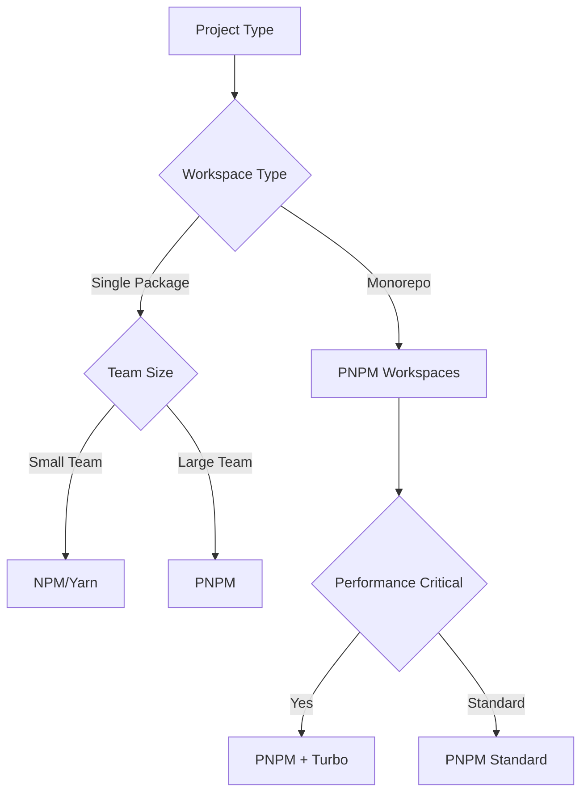

# Package Management

## 🎯 Scope

This section covers package and dependency management strategies:

**In Scope:**

- PNPM workspace configuration and optimization
- Dependency management strategies and best practices
- Version catalog and shared dependency approaches
- Monorepo package organization and coordination
- Build optimization and caching strategies

**Out of Scope:**

- Infrastructure deployment package management (covered in Infrastructure)
- Application runtime dependency management (covered in Technical Standards)
- Container package management (covered in Infrastructure)

## 📋 Content Description

This folder provides comprehensive guidance for managing packages and dependencies in modern JavaScript/TypeScript projects, with focus on monorepo setups and team collaboration.

### Available Strategies:

1. **PNPM Management** (`pnpm.md`)

   - PNPM configuration and optimization
   - Workspace setup and management
   - Performance tuning and caching
   - CI/CD integration strategies

2. **Workspace Configuration** (`workspace-config.md`)

   - Multi-package workspace setup
   - Shared configuration management
   - Build coordination and optimization
   - Development workflow integration

3. **Version Catalog** (`version-catalog.md`)

   - Centralized version management
   - Dependency update strategies
   - Version consistency enforcement
   - Security update workflows

4. **Shared Dependencies** (`shared-dependencies.md`)
   - Common dependency patterns
   - Shared library strategies
   - Peer dependency management
   - Bundle optimization approaches

## 🔄 Decision Support

### Package Manager Selection Decision Tree

### Workspace Strategy Matrix

| Project Size | Package Count | Strategy             | Complexity | Performance |
| ------------ | ------------- | -------------------- | ---------- | ----------- |
| Small        | 1-3           | Simple workspace     | Low        | Standard    |
| Medium       | 4-10          | Domain workspaces    | Medium     | Good        |
| Large        | 10+           | Layered workspaces   | High       | Optimized   |
| Enterprise   | 20+           | Federated workspaces | Very High  | Critical    |

### Selection Criteria

**Choose PNPM when:**

- Monorepo requirements
- Performance optimization needed
- Disk space efficiency important
- Team coordination benefits desired

**Choose Version Catalog when:**

- Multiple packages with shared dependencies
- Version consistency requirements
- Security update coordination needed
- Enterprise governance requirements

**Choose Shared Dependencies when:**

- Common utility functions across packages
- UI component libraries
- Configuration sharing needs
- Build tool coordination

## 🛠️ Implementation Tools

### Package Management Tools:

- **PNPM**: Fast, disk space efficient package manager
- **Turbo**: Build system optimization for monorepos
- **Lerna**: Legacy monorepo management (migration guidance)
- **Rush**: Microsoft's scalable monorepo manager

### Workspace Tools:

- **Workspace configs**: Package.json workspace definitions
- **TypeScript Project References**: Cross-package type checking
- **ESLint configs**: Shared linting across packages
- **Build orchestration**: Coordinated build processes

### Dependency Tools:

- **Renovate**: Automated dependency updates
- **Depcheck**: Unused dependency detection
- **npm-check-updates**: Version update assistance
- **Bundle analyzers**: Dependency impact analysis

### Quality Tools:

- **Dependency cruiser**: Dependency validation
- **Madge**: Module dependency analysis
- **License checker**: License compliance validation
- **Security scanners**: Vulnerability detection
