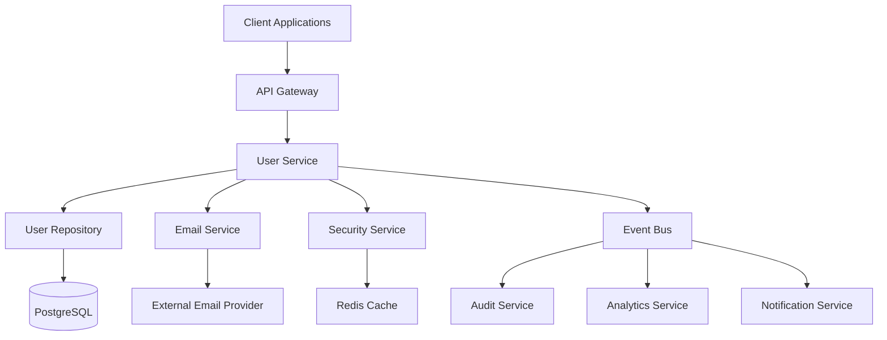

# 📚 Documentation Standards

**Focus**: Comprehensive documentation practices, API documentation, and knowledge management

Guidelines for creating clear, maintainable, and valuable documentation that supports development teams, end users, and stakeholders throughout the software lifecycle.

## 🎯 Documentation Principles

### Code Documentation Standards

````typescript
// ✅ Comprehensive function documentation
/**
 * Creates a new user account with email verification and welcome flow.
 *
 * This function handles the complete user registration process including:
 * - Input validation and sanitization
 * - Duplicate email checking
 * - Password hashing with bcrypt
 * - Database persistence
 * - Email verification token generation
 * - Welcome email dispatch
 *
 * @param userData - The user registration data
 * @param userData.email - Valid email address (will be normalized to lowercase)
 * @param userData.name - Display name (2-50 characters, trimmed)
 * @param userData.password - Plain text password (minimum 8 characters)
 * @param userData.preferences - Optional user preferences
 * @param options - Additional creation options
 * @param options.sendWelcomeEmail - Whether to send welcome email (default: true)
 * @param options.requireEmailVerification - Whether email verification is required (default: true)
 * @param options.correlationId - Request correlation ID for tracking
 *
 * @returns Promise resolving to Result containing:
 *   - Success: Created user object with sanitized data
 *   - Failure: Specific error (ValidationError, ConflictError, DatabaseError)
 *
 * @throws Never throws - returns Result type for explicit error handling
 *
 * @example
 * ```typescript
 * const result = await userService.createUser({
 *   email: 'user@example.com',
 *   name: 'John Doe',
 *   password: 'securePassword123',
 *   preferences: { newsletter: true }
 * }, {
 *   sendWelcomeEmail: true,
 *   correlationId: 'req-123'
 * });
 *
 * if (result.success) {
 *   console.log('User created:', result.data.id);
 * } else {
 *   console.error('Creation failed:', result.error.message);
 * }
 * ```
 *
 * @see {@link UserRepository.save} for persistence details
 * @see {@link EmailService.sendWelcomeEmail} for welcome email format
 *
 * @since 1.0.0
 * @author User Service Team
 * @version 2.1.0 - Added preferences support
 */
async function createUser(
  userData: CreateUserData,
  options: CreateUserOptions = {},
): Promise<Result<User, UserCreationError>> {
  // Implementation details...
}

// ✅ Interface documentation with examples
/**
 * Configuration options for user creation process.
 *
 * Controls various aspects of the user registration flow including
 * email verification requirements and welcome communication.
 */
interface CreateUserOptions {
  /**
   * Whether to send a welcome email to the newly created user.
   *
   * When enabled, triggers an asynchronous welcome email containing:
   * - Account activation link (if email verification required)
   * - Getting started guide
   * - Platform overview
   *
   * @default true
   */
  readonly sendWelcomeEmail?: boolean

  /**
   * Whether the user must verify their email before account activation.
   *
   * When enabled:
   * - User account starts in 'pending_verification' status
   * - Email verification token is generated and sent
   * - User cannot access protected resources until verified
   *
   * When disabled:
   * - User account is immediately active
   * - No verification email is sent
   * - User can immediately access all authorized resources
   *
   * @default true
   * @see {@link EmailVerificationService} for verification flow details
   */
  readonly requireEmailVerification?: boolean

  /**
   * Correlation ID for request tracking and logging.
   *
   * Used for:
   * - Linking related log entries across services
   * - Tracking user creation flow in monitoring
   * - Debugging distributed operations
   *
   * @example 'req-uuid-v4' | 'user-creation-batch-001'
   */
  readonly correlationId?: string

  /**
   * Optional metadata to attach to the user record.
   *
   * Useful for:
   * - A/B testing cohort assignment
   * - Registration source tracking
   * - Custom onboarding flows
   *
   * @example
   * ```typescript
   * {
   *   registrationSource: 'mobile-app',
   *   campaign: 'summer-2024',
   *   cohort: 'test-group-a'
   * }
   * ```
   */
  readonly metadata?: Record<string, string>
}

// ✅ Class documentation with architectural context
/**
 * Service for managing user accounts and authentication operations.
 *
 * This service implements the user management bounded context and provides
 * a clean interface for all user-related operations. It follows the repository
 * pattern for data access and implements comprehensive error handling.
 *
 * ## Architecture
 *
 * ```
 * UserController -> UserService -> UserRepository -> Database
 *                              \-> EmailService -> External Email Provider
 *                              \-> SecurityService -> Password Hashing
 * ```
 *
 * ## Key Features
 *
 * - **Email-based authentication**: Primary login mechanism
 * - **Secure password handling**: bcrypt hashing with configurable rounds
 * - **Email verification**: Optional verification flow with tokens
 * - **Audit logging**: Comprehensive logging for security events
 * - **Result-based error handling**: No exceptions for business logic errors
 *
 * ## Usage Patterns
 *
 * ### Basic user creation:
 * ```typescript
 * const result = await userService.createUser({
 *   email: 'user@example.com',
 *   name: 'John Doe',
 *   password: 'securePassword'
 * });
 * ```
 *
 * ### With custom options:
 * ```typescript
 * const result = await userService.createUser(userData, {
 *   requireEmailVerification: false,
 *   metadata: { source: 'admin-created' }
 * });
 * ```
 *
 * ## Error Handling
 *
 * All methods return Result<T, E> types for explicit error handling:
 * - `ValidationError`: Invalid input data
 * - `ConflictError`: Duplicate email or username
 * - `DatabaseError`: Data persistence failures
 * - `ExternalServiceError`: Email service failures
 *
 * ## Security Considerations
 *
 * - Passwords are never stored in plain text
 * - Email addresses are normalized and validated
 * - Sensitive operations are logged for audit
 * - Rate limiting should be applied at the controller level
 *
 * @see {@link UserRepository} for data access implementation
 * @see {@link EmailService} for communication details
 * @see {@link SecurityService} for authentication logic
 *
 * @example
 * ```typescript
 * // Dependency injection setup
 * const userService = new UserService(
 *   userRepository,
 *   emailService,
 *   securityService,
 *   logger
 * );
 *
 * // Service usage
 * const createResult = await userService.createUser(userData);
 * const loginResult = await userService.authenticateUser(email, password);
 * const updateResult = await userService.updateProfile(userId, profileData);
 * ```
 *
 * @since 1.0.0
 * @version 2.1.0
 */
class UserService {
  constructor(
    private readonly userRepository: UserRepository,
    private readonly emailService: EmailService,
    private readonly securityService: SecurityService,
    private readonly logger: Logger,
  ) {}

  // Methods implementation...
}

// ✅ Complex type documentation
/**
 * Represents a user entity in the system with complete profile information.
 *
 * This is the primary user model used throughout the application. It contains
 * both authentication data and profile information, with careful consideration
 * for data privacy and security.
 *
 * ## Data Privacy
 *
 * - Email addresses are stored in normalized form (lowercase, trimmed)
 * - Passwords are never included in this type (stored separately as hashes)
 * - Sensitive fields should be filtered when serializing for API responses
 *
 * ## Lifecycle States
 *
 * - `pending_verification`: User registered but email not verified
 * - `active`: Fully verified and active user
 * - `suspended`: Temporarily suspended account
 * - `deleted`: Soft-deleted account (anonymized data)
 *
 * @example
 * ```typescript
 * const user: User = {
 *   id: 'usr_123' as UserId,
 *   email: 'john.doe@example.com' as Email,
 *   name: 'John Doe',
 *   role: 'user',
 *   status: 'active',
 *   preferences: {
 *     newsletter: true,
 *     notifications: 'immediate'
 *   },
 *   createdAt: new Date('2024-01-15'),
 *   updatedAt: new Date('2024-01-15'),
 *   lastLoginAt: new Date('2024-01-20')
 * };
 * ```
 */
interface User {
  /** Unique identifier for the user (branded type for type safety) */
  readonly id: UserId

  /**
   * User's email address (primary identifier for authentication)
   * Stored in normalized form: lowercase and trimmed
   * Must be unique across the system
   */
  readonly email: Email

  /**
   * User's display name
   * Used in UI and communications
   * Length: 2-50 characters after trimming
   */
  readonly name: string

  /**
   * User's role in the system
   * Determines access permissions and available features
   * @see {@link UserRole} for available roles and permissions
   */
  readonly role: UserRole

  /**
   * Current account status
   * Controls whether user can access the system
   * @see Lifecycle States documentation above
   */
  readonly status: UserStatus

  /**
   * User's preference settings
   * Optional configuration for personalization
   */
  readonly preferences?: UserPreferences

  /**
   * Account creation timestamp
   * Used for analytics and user lifecycle tracking
   */
  readonly createdAt: Date

  /**
   * Last profile update timestamp
   * Updated whenever user data changes
   */
  readonly updatedAt: Date

  /**
   * Last successful login timestamp
   * Used for security monitoring and user engagement tracking
   * Null for users who have never logged in
   */
  readonly lastLoginAt?: Date
}

// ✅ Enum documentation with usage guidelines
/**
 * Available user roles with their corresponding permissions.
 *
 * The role system follows a hierarchical permission model where higher-level
 * roles inherit permissions from lower-level roles.
 *
 * ## Permission Hierarchy
 *
 * ```
 * admin (all permissions)
 *   └── moderator (user management + content moderation)
 *       └── user (basic application access)
 *           └── guest (read-only access)
 * ```
 *
 * ## Role Responsibilities
 *
 * - **admin**: System administration, configuration, user management
 * - **moderator**: Content moderation, user support, community management
 * - **user**: Standard application features, content creation
 * - **guest**: Limited read-only access for trial users
 *
 * @example
 * ```typescript
 * // Role checking in authorization
 * function hasPermission(user: User, permission: Permission): boolean {
 *   return getRolePermissions(user.role).includes(permission);
 * }
 *
 * // Role-based UI rendering
 * if (user.role === UserRole.ADMIN) {
 *   renderAdminPanel();
 * }
 * ```
 *
 * @see {@link Permission} for detailed permission definitions
 * @see {@link AuthorizationService} for permission checking logic
 */
enum UserRole {
  /**
   * Guest user with limited read-only access.
   *
   * Permissions:
   * - View public content
   * - Basic navigation
   *
   * Restrictions:
   * - Cannot create content
   * - Cannot access user-specific features
   * - Session-based (no persistent account)
   */
  GUEST = 'guest',

  /**
   * Standard authenticated user.
   *
   * Permissions:
   * - All guest permissions
   * - Create and edit own content
   * - Access personal dashboard
   * - Customize preferences
   *
   * This is the default role for new registrations.
   */
  USER = 'user',

  /**
   * Moderator with content management capabilities.
   *
   * Permissions:
   * - All user permissions
   * - Moderate user-generated content
   * - Manage user reports
   * - Access moderation tools
   *
   * Typically assigned to trusted community members.
   */
  MODERATOR = 'moderator',

  /**
   * Administrator with full system access.
   *
   * Permissions:
   * - All moderator permissions
   * - User account management
   * - System configuration
   * - Access to admin panels
   * - View system analytics
   *
   * Should be limited to technical staff only.
   */
  ADMIN = 'admin',
}
````

### API Documentation Standards

````typescript
// ✅ Comprehensive API endpoint documentation
/**
 * @openapi
 * /api/v1/users:
 *   post:
 *     summary: Create a new user account
 *     description: |
 *       Registers a new user account with email verification flow.
 *
 *       This endpoint handles the complete user registration process including:
 *       - Input validation and sanitization
 *       - Duplicate email detection
 *       - Secure password hashing
 *       - Email verification token generation
 *       - Welcome email dispatch (optional)
 *
 *       ## Business Rules
 *
 *       - Email addresses must be unique across the system
 *       - Passwords must meet security requirements (8+ characters)
 *       - User names must be 2-50 characters after trimming
 *       - Email verification is required by default but can be disabled
 *
 *       ## Rate Limiting
 *
 *       This endpoint is rate-limited to 5 requests per minute per IP address
 *       to prevent abuse and spam registrations.
 *
 *     tags:
 *       - Users
 *       - Authentication
 *     operationId: createUser
 *     requestBody:
 *       required: true
 *       content:
 *         application/json:
 *           schema:
 *             $ref: '#/components/schemas/CreateUserRequest'
 *           examples:
 *             basic:
 *               summary: Basic user registration
 *               value:
 *                 email: "john.doe@example.com"
 *                 name: "John Doe"
 *                 password: "securePassword123"
 *             withPreferences:
 *               summary: Registration with preferences
 *               value:
 *                 email: "jane.smith@example.com"
 *                 name: "Jane Smith"
 *                 password: "anotherSecurePassword456"
 *                 preferences:
 *                   newsletter: true
 *                   notifications: "daily"
 *     responses:
 *       '201':
 *         description: User created successfully
 *         headers:
 *           X-Correlation-ID:
 *             description: Request correlation ID for tracking
 *             schema:
 *               type: string
 *               format: uuid
 *         content:
 *           application/json:
 *             schema:
 *               $ref: '#/components/schemas/UserResponse'
 *             examples:
 *               created:
 *                 summary: Successful user creation
 *                 value:
 *                   id: "usr_1234567890"
 *                   email: "john.doe@example.com"
 *                   name: "John Doe"
 *                   role: "user"
 *                   status: "pending_verification"
 *                   createdAt: "2024-01-15T10:30:00Z"
 *                   updatedAt: "2024-01-15T10:30:00Z"
 *       '400':
 *         description: Invalid request data
 *         content:
 *           application/json:
 *             schema:
 *               $ref: '#/components/schemas/ValidationErrorResponse'
 *             examples:
 *               invalidEmail:
 *                 summary: Invalid email format
 *                 value:
 *                   error:
 *                     code: "VALIDATION_ERROR"
 *                     message: "Invalid email format"
 *                     details:
 *                       field: "email"
 *                       provided: "invalid-email"
 *                       expected: "Valid email address"
 *               weakPassword:
 *                 summary: Password too weak
 *                 value:
 *                   error:
 *                     code: "VALIDATION_ERROR"
 *                     message: "Password does not meet security requirements"
 *                     details:
 *                       field: "password"
 *                       requirements:
 *                         - "Minimum 8 characters"
 *                         - "At least one uppercase letter"
 *                         - "At least one number"
 *       '409':
 *         description: Email already registered
 *         content:
 *           application/json:
 *             schema:
 *               $ref: '#/components/schemas/ConflictErrorResponse'
 *             examples:
 *               emailExists:
 *                 summary: Email already in use
 *                 value:
 *                   error:
 *                     code: "EMAIL_ALREADY_EXISTS"
 *                     message: "An account with this email already exists"
 *                     details:
 *                       email: "john.doe@example.com"
 *                       suggestion: "Try logging in or use password reset"
 *       '429':
 *         description: Rate limit exceeded
 *         headers:
 *           Retry-After:
 *             description: Seconds to wait before retrying
 *             schema:
 *               type: integer
 *         content:
 *           application/json:
 *             schema:
 *               $ref: '#/components/schemas/RateLimitErrorResponse'
 *       '500':
 *         description: Internal server error
 *         content:
 *           application/json:
 *             schema:
 *               $ref: '#/components/schemas/InternalErrorResponse'
 *     security: []  # No authentication required for registration
 *
 * components:
 *   schemas:
 *     CreateUserRequest:
 *       type: object
 *       required:
 *         - email
 *         - name
 *         - password
 *       properties:
 *         email:
 *           type: string
 *           format: email
 *           description: User's email address (will be normalized to lowercase)
 *           example: "john.doe@example.com"
 *           maxLength: 255
 *         name:
 *           type: string
 *           description: User's display name (will be trimmed)
 *           example: "John Doe"
 *           minLength: 2
 *           maxLength: 50
 *         password:
 *           type: string
 *           format: password
 *           description: User's password (minimum 8 characters)
 *           example: "securePassword123"
 *           minLength: 8
 *           maxLength: 100
 *         preferences:
 *           $ref: '#/components/schemas/UserPreferences'
 *
 *     UserPreferences:
 *       type: object
 *       description: Optional user preference settings
 *       properties:
 *         newsletter:
 *           type: boolean
 *           description: Whether to receive newsletter emails
 *           default: false
 *         notifications:
 *           type: string
 *           enum: [immediate, daily, weekly, none]
 *           description: Email notification frequency
 *           default: "daily"
 *         theme:
 *           type: string
 *           enum: [light, dark, auto]
 *           description: UI theme preference
 *           default: "auto"
 *
 *     UserResponse:
 *       type: object
 *       description: User information returned by the API
 *       properties:
 *         id:
 *           type: string
 *           description: Unique user identifier
 *           example: "usr_1234567890"
 *         email:
 *           type: string
 *           format: email
 *           description: User's email address
 *           example: "john.doe@example.com"
 *         name:
 *           type: string
 *           description: User's display name
 *           example: "John Doe"
 *         role:
 *           type: string
 *           enum: [guest, user, moderator, admin]
 *           description: User's role in the system
 *           example: "user"
 *         status:
 *           type: string
 *           enum: [pending_verification, active, suspended, deleted]
 *           description: Current account status
 *           example: "pending_verification"
 *         preferences:
 *           $ref: '#/components/schemas/UserPreferences'
 *         createdAt:
 *           type: string
 *           format: date-time
 *           description: Account creation timestamp
 *           example: "2024-01-15T10:30:00Z"
 *         updatedAt:
 *           type: string
 *           format: date-time
 *           description: Last update timestamp
 *           example: "2024-01-15T10:30:00Z"
 *         lastLoginAt:
 *           type: string
 *           format: date-time
 *           description: Last login timestamp (null for new users)
 *           example: "2024-01-20T14:22:00Z"
 *           nullable: true
 */

// ✅ SDK/Client library documentation
/**
 * TypeScript SDK for the User Management API.
 *
 * This SDK provides a type-safe interface for interacting with the user
 * management system, including authentication, user management, and
 * profile operations.
 *
 * ## Installation
 *
 * ```bash
 * npm install @yourapp/user-sdk
 * # or
 * yarn add @yourapp/user-sdk
 * ```
 *
 * ## Basic Setup
 *
 * ```typescript
 * import { UserSDK } from '@yourapp/user-sdk';
 *
 * const userSDK = new UserSDK({
 *   baseURL: 'https://api.yourapp.com',
 *   apiKey: 'your-api-key', // For server-side usage
 *   timeout: 30000, // 30 seconds
 *   retryAttempts: 3
 * });
 * ```
 *
 * ## Authentication
 *
 * ### For client-side applications:
 * ```typescript
 * // Set user authentication token
 * userSDK.setAuthToken(userAuthToken);
 *
 * // Or use the authentication methods
 * const loginResult = await userSDK.auth.login('user@example.com', 'password');
 * if (loginResult.success) {
 *   // Token is automatically set for subsequent requests
 *   console.log('Logged in as:', loginResult.data.user.name);
 * }
 * ```
 *
 * ### For server-side applications:
 * ```typescript
 * // Use API key (set in constructor)
 * const users = await userSDK.users.list({ limit: 10 });
 * ```
 *
 * ## Error Handling
 *
 * All SDK methods return Result<T, E> types for explicit error handling:
 *
 * ```typescript
 * const result = await userSDK.users.create({
 *   email: 'user@example.com',
 *   name: 'John Doe',
 *   password: 'secure123'
 * });
 *
 * if (result.success) {
 *   console.log('User created:', result.data.id);
 * } else {
 *   switch (result.error.type) {
 *     case 'ValidationError':
 *       console.error('Invalid data:', result.error.details);
 *       break;
 *     case 'ConflictError':
 *       console.error('Email already exists');
 *       break;
 *     case 'NetworkError':
 *       console.error('Network issue:', result.error.message);
 *       break;
 *     default:
 *       console.error('Unexpected error:', result.error);
 *   }
 * }
 * ```
 *
 * ## Advanced Usage
 *
 * ### Custom request configuration:
 * ```typescript
 * const result = await userSDK.users.create(userData, {
 *   timeout: 60000, // Override default timeout
 *   retryAttempts: 5, // Override retry attempts
 *   correlationId: 'custom-tracking-id'
 * });
 * ```
 *
 * ### Batch operations:
 * ```typescript
 * const batchResult = await userSDK.users.createBatch([
 *   { email: 'user1@example.com', name: 'User 1', password: 'pass1' },
 *   { email: 'user2@example.com', name: 'User 2', password: 'pass2' }
 * ]);
 * ```
 *
 * ### Streaming updates:
 * ```typescript
 * // Subscribe to user updates
 * const subscription = userSDK.users.subscribe(userId, (update) => {
 *   console.log('User updated:', update);
 * });
 *
 * // Unsubscribe when done
 * subscription.unsubscribe();
 * ```
 *
 * @example
 * ```typescript
 * // Complete user management flow
 * async function userManagementExample() {
 *   const sdk = new UserSDK({ baseURL: 'https://api.example.com' });
 *
 *   // Create user
 *   const createResult = await sdk.users.create({
 *     email: 'john@example.com',
 *     name: 'John Doe',
 *     password: 'securePassword123'
 *   });
 *
 *   if (!createResult.success) {
 *     throw new Error(`Failed to create user: ${createResult.error.message}`);
 *   }
 *
 *   const userId = createResult.data.id;
 *
 *   // Update profile
 *   const updateResult = await sdk.users.updateProfile(userId, {
 *     name: 'John Smith',
 *     preferences: { newsletter: true }
 *   });
 *
 *   // Get user details
 *   const userResult = await sdk.users.get(userId);
 *
 *   return userResult.success ? userResult.data : null;
 * }
 * ```
 */
class UserSDK {
  constructor(config: SDKConfig) {
    // Implementation
  }

  // SDK methods...
}
````

### Technical Documentation Standards

````markdown
# User Management Service Architecture

## Overview

The User Management Service is a core microservice responsible for handling user authentication, authorization, and profile management within our distributed system. It follows Domain-Driven Design principles and implements event-driven architecture for scalability and maintainability.

## Architecture Diagram


````

## Key Components

### 1. UserService (Application Layer)

**Responsibility**: Orchestrates user-related operations and enforces business rules.

**Key Features**:

- User registration and authentication
- Profile management
- Email verification flow
- Password reset functionality
- Audit logging

**Dependencies**:

- `UserRepository` for data persistence
- `EmailService` for communication
- `SecurityService` for authentication
- Event bus for domain events

### 2. UserRepository (Infrastructure Layer)

**Responsibility**: Data access and persistence for user entities.

**Implementation**: Repository pattern with PostgreSQL backend.

**Key Operations**:

```typescript
interface UserRepository {
  save(user: User): Promise<User>
  findById(id: UserId): Promise<User | null>
  findByEmail(email: Email): Promise<User | null>
  update(id: UserId, updates: Partial<User>): Promise<User>
  delete(id: UserId): Promise<void>
}
```

### 3. SecurityService (Domain Service)

**Responsibility**: Handles authentication, password hashing, and token management.

**Security Features**:

- bcrypt password hashing (12 rounds)
- JWT token generation and validation
- Rate limiting for authentication attempts
- Password strength validation

## Data Model

### User Entity

```typescript
interface User {
  readonly id: UserId
  readonly email: Email
  readonly name: string
  readonly role: UserRole
  readonly status: UserStatus
  readonly passwordHash?: string // Excluded from API responses
  readonly preferences?: UserPreferences
  readonly createdAt: Date
  readonly updatedAt: Date
  readonly lastLoginAt?: Date
}
```

### Database Schema

```sql
CREATE TABLE users (
    id UUID PRIMARY KEY DEFAULT gen_random_uuid(),
    email VARCHAR(255) UNIQUE NOT NULL,
    name VARCHAR(100) NOT NULL,
    role VARCHAR(20) NOT NULL DEFAULT 'user',
    status VARCHAR(20) NOT NULL DEFAULT 'pending_verification',
    password_hash VARCHAR(255) NOT NULL,
    preferences JSONB,
    created_at TIMESTAMP WITH TIME ZONE DEFAULT NOW(),
    updated_at TIMESTAMP WITH TIME ZONE DEFAULT NOW(),
    last_login_at TIMESTAMP WITH TIME ZONE
);

CREATE INDEX idx_users_email ON users(email);
CREATE INDEX idx_users_status ON users(status);
CREATE INDEX idx_users_created_at ON users(created_at);
```

## API Endpoints

### Authentication

- `POST /auth/login` - User authentication
- `POST /auth/logout` - User logout
- `POST /auth/refresh` - Token refresh
- `POST /auth/forgot-password` - Password reset request
- `POST /auth/reset-password` - Password reset confirmation

### User Management

- `POST /users` - Create new user
- `GET /users/:id` - Get user details
- `PUT /users/:id` - Update user profile
- `DELETE /users/:id` - Soft delete user
- `POST /users/:id/verify-email` - Email verification

## Business Rules

### User Registration

1. **Email Uniqueness**: Email addresses must be unique across the system
2. **Password Security**: Passwords must meet minimum security requirements
3. **Email Verification**: New users must verify their email address (configurable)
4. **Default Role**: New users are assigned 'user' role by default

### Authentication

1. **Rate Limiting**: Maximum 5 login attempts per minute per IP
2. **Account Lockout**: Account locked after 5 failed attempts within 15 minutes
3. **Session Management**: JWT tokens expire after 24 hours
4. **Password Reset**: Reset tokens expire after 1 hour

## Event-Driven Architecture

### Domain Events

The service publishes the following domain events:

```typescript
interface UserCreatedEvent {
  readonly type: 'user.created'
  readonly userId: UserId
  readonly email: Email
  readonly timestamp: Date
  readonly metadata: {
    registrationSource?: string
    requiresVerification: boolean
  }
}

interface UserVerifiedEvent {
  readonly type: 'user.verified'
  readonly userId: UserId
  readonly email: Email
  readonly timestamp: Date
}

interface UserLoginEvent {
  readonly type: 'user.login'
  readonly userId: UserId
  readonly timestamp: Date
  readonly metadata: {
    ipAddress: string
    userAgent: string
    method: 'password' | 'oauth' | 'sso'
  }
}
```

### Event Handlers

Other services can subscribe to these events for:

- **Audit Service**: Security logging and compliance
- **Analytics Service**: User behavior tracking
- **Notification Service**: Welcome emails and alerts
- **Billing Service**: Account setup and trial management

## Deployment

### Environment Configuration

```yaml
# Production environment
DATABASE_URL: postgresql://user:pass@db:5432/userdb
REDIS_URL: redis://cache:6379
EMAIL_SERVICE_URL: https://email-api.example.com
JWT_SECRET: <secure-random-key>
BCRYPT_ROUNDS: 12
RATE_LIMIT_WINDOW: 60 # seconds
RATE_LIMIT_MAX_REQUESTS: 5
```

### Docker Configuration

```dockerfile
FROM node:18-alpine
WORKDIR /app
COPY package*.json ./
RUN npm ci --only=production
COPY . .
EXPOSE 3000
CMD ["npm", "start"]
```

### Health Checks

The service provides health check endpoints:

- `GET /health` - Basic health check
- `GET /health/detailed` - Detailed health including dependencies

```typescript
interface HealthCheckResponse {
  status: 'healthy' | 'unhealthy'
  timestamp: string
  version: string
  dependencies: {
    database: 'healthy' | 'unhealthy'
    cache: 'healthy' | 'unhealthy'
    emailService: 'healthy' | 'unhealthy'
  }
  metrics: {
    uptime: number
    memoryUsage: number
    activeConnections: number
  }
}
```

## Monitoring and Observability

### Metrics

Key metrics to monitor:

- **User Registration Rate**: New registrations per hour/day
- **Authentication Success Rate**: Successful vs failed login attempts
- **API Response Times**: P50, P95, P99 latencies
- **Error Rates**: 4xx and 5xx response percentages
- **Database Connection Pool**: Active/idle connections

### Logging

Structured logging with correlation IDs:

```json
{
  "timestamp": "2024-01-15T10:30:00Z",
  "level": "INFO",
  "message": "User created successfully",
  "correlationId": "req-12345",
  "userId": "usr-67890",
  "operation": "create_user",
  "duration": 150
}
```

### Alerting Rules

- **High Error Rate**: >5% 5xx responses in 5 minutes
- **Slow Response Time**: P95 latency >1000ms for 2 minutes
- **Failed Database Connections**: >3 failed connections in 1 minute
- **Authentication Failures**: >10 failed logins from single IP in 1 minute

## Security Considerations

### Data Protection

- **Encryption at Rest**: Database encryption enabled
- **Encryption in Transit**: TLS 1.3 for all communications
- **PII Handling**: Email addresses stored in normalized form only
- **Password Security**: Never logged or transmitted in plain text

### Access Control

- **API Authentication**: JWT tokens with proper validation
- **Role-Based Access**: RBAC implementation for different user types
- **Rate Limiting**: Protection against brute force attacks
- **Input Validation**: Comprehensive input sanitization

### Compliance

- **GDPR**: Right to be forgotten implementation
- **SOC 2**: Audit logging and access controls
- **CCPA**: Data privacy and user control features

## Performance Considerations

### Scalability

- **Horizontal Scaling**: Stateless service design
- **Database Optimization**: Proper indexing and query optimization
- **Caching Strategy**: Redis for session storage and frequent queries
- **Connection Pooling**: Efficient database connection management

### Load Testing Results

```
Concurrent Users: 1000
Test Duration: 10 minutes
Average Response Time: 120ms
95th Percentile: 280ms
99th Percentile: 450ms
Error Rate: 0.02%
Throughput: 850 requests/second
```

## Future Enhancements

### Planned Features

1. **OAuth Integration**: Social login with Google, GitHub, etc.
2. **Multi-Factor Authentication**: TOTP and SMS verification
3. **Advanced Password Policies**: Configurable complexity requirements
4. **User Analytics**: Detailed user behavior tracking
5. **Bulk Operations**: Admin tools for bulk user management

### Technical Debt

1. **Migration to Event Sourcing**: For better audit trails
2. **GraphQL API**: Alternative to REST for better client flexibility
3. **Microservice Decomposition**: Split into smaller, focused services
4. **Advanced Caching**: Multi-level caching strategy

---

_This documentation is maintained by the User Service team and is updated with each major release._

```

## 🔗 Related Concepts

- **[Code Review](code-review.md)** - Documentation review practices
- **[Error Handling](error-handling.md)** - Error documentation standards
- **[API Design](../design-principles/api-design.md)** - API documentation alignment
- **[Testing Strategy](../../testing/README.md)** - Test documentation practices

## 🎯 Implementation Guidelines

1. **Comprehensive Coverage**: Document all public APIs, interfaces, and complex business logic
2. **Living Documentation**: Keep documentation updated with code changes
3. **Multiple Audiences**: Tailor documentation for developers, users, and stakeholders
4. **Examples and Samples**: Provide practical examples for all documented features
5. **Visual Aids**: Use diagrams, flowcharts, and architecture visuals
6. **Searchable Format**: Structure documentation for easy searching and navigation
7. **Version Control**: Track documentation changes alongside code changes
8. **Review Process**: Include documentation in code review workflows

## 📏 Benefits

- **Developer Productivity**: Clear documentation accelerates development and onboarding
- **Code Maintainability**: Well-documented code is easier to maintain and extend
- **API Adoption**: Comprehensive API documentation improves adoption and integration
- **Knowledge Sharing**: Documentation preserves knowledge and reduces bus factor
- **Quality Assurance**: Documentation review catches design issues early
- **Compliance**: Proper documentation supports audit and regulatory requirements
- **User Experience**: Good documentation improves developer and end-user experience

---

_Comprehensive documentation is essential for maintainable, scalable software that can be effectively used, maintained, and extended by development teams and stakeholders._
```
