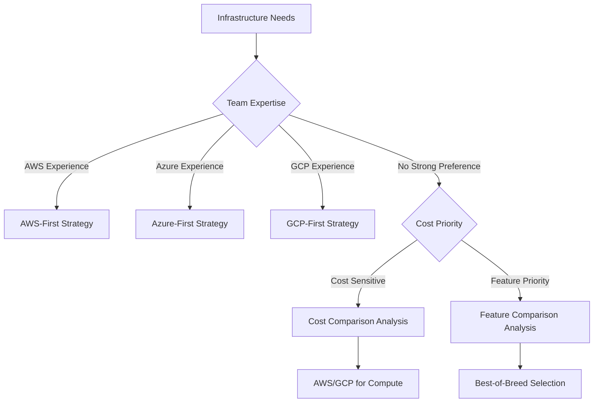

# Infrastructure

## 🎯 Scope

This section covers infrastructure management, deployment, and cloud operations:

**In Scope:**

- Cloud provider selection and multi-cloud strategies
- Infrastructure as Code (IaC) implementation and best practices
- Container orchestration and deployment patterns
- Environment management and configuration
- CI/CD strategy and automation
- Testing infrastructure and performance validation

**Out of Scope:**

- Application code deployment (covered in Technical Standards)
- Application monitoring (covered in Observability)
- Security implementation details (covered in Quality Assurance)

## 📋 Content Description

This folder provides comprehensive guidance for building, managing, and scaling infrastructure across different environments and cloud platforms.

### Available Sections:

1. **Cloud Providers** (`cloud-providers/`)

   - Provider evaluation and selection criteria
   - Multi-cloud and hybrid strategies
   - Cost optimization approaches
   - Platform-specific deployment guides

2. **Cloud Services** (`cloud-services/`)

   - Database service selection and management
   - Storage solutions and strategies
   - Compute service optimization
   - DevOps tool integration

3. **Infrastructure as Code** (`infrastructure-as-code/`)

   - Terraform and CDK implementation
   - State management and automation
   - Best practices and operational excellence
   - Version control and collaboration

4. **Container Orchestration** (`container-orchestration/`)

   - Docker and containerization strategies
   - Kubernetes deployment and management
   - Container security and optimization
   - Orchestration pattern selection

5. **Deployment Patterns** (`deployment-patterns/`)

   - Blue-green and canary deployments
   - Rolling updates and rollback strategies
   - Security and monitoring integration
   - Performance optimization

6. **Environments** (`environments/`)

   - Development, staging, and production setup
   - Environment consistency and configuration
   - Service discovery and networking
   - Environment-specific optimizations

7. **CI/CD Strategy** (`cicd-strategy/`)

   - Pipeline design and automation
   - Artifact management and secrets
   - GitHub Actions implementation
   - Quality gates and validation

8. **Testing Infrastructure** (`testing-infrastructure/`)
   - Test environment provisioning
   - Performance testing infrastructure
   - Database testing strategies
   - Load testing and validation

## 🔄 Decision Support

### Cloud Provider Selection Decision Tree

### Infrastructure Complexity Matrix

| Project Scale | Team Size | Recommended Approach         | Tools               | Complexity |
| ------------- | --------- | ---------------------------- | ------------------- | ---------- |
| Small         | 1-3       | Simple cloud services        | Vercel, Railway     | Low        |
| Medium        | 3-8       | Managed services + IaC       | AWS/GCP + Terraform | Medium     |
| Large         | 8-20      | Kubernetes + GitOps          | EKS/GKE + ArgoCD    | High       |
| Enterprise    | 20+       | Multi-cluster + Service Mesh | Multi-cloud + Istio | Very High  |

### Selection Criteria

**Choose Managed Services when:**

- Small to medium team size
- Focus on application development
- Cost and operational efficiency priority
- Limited infrastructure expertise

**Choose Kubernetes when:**

- Multi-environment consistency required
- Complex application architectures
- Advanced deployment patterns needed
- Team has container orchestration expertise

**Choose Multi-cloud when:**

- Vendor lock-in avoidance required
- Geographic distribution needs
- Compliance and data sovereignty requirements
- Risk mitigation strategy important

## 🛠️ Implementation Tools

### Infrastructure Management:

- **Terraform**: Infrastructure as Code
- **AWS CDK**: Cloud Development Kit
- **Pulumi**: Modern infrastructure as code
- **Ansible**: Configuration management

### Container & Orchestration:

- **Docker**: Containerization platform
- **Kubernetes**: Container orchestration
- **Helm**: Kubernetes package manager
- **Kustomize**: Kubernetes configuration management

### CI/CD & Automation:

- **GitHub Actions**: CI/CD workflows
- **ArgoCD**: GitOps deployment
- **Tekton**: Kubernetes-native CI/CD
- **Jenkins**: Traditional CI/CD platform

### Monitoring & Observability:

- **Prometheus**: Metrics collection
- **Grafana**: Visualization and alerting
- **Jaeger**: Distributed tracing
- **Fluentd**: Log collection and processing
