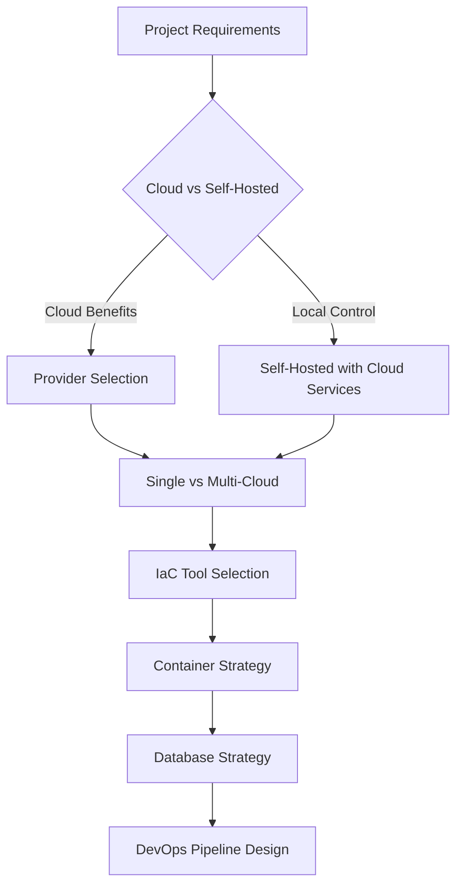

# ☁️ Cloud Infrastructure Guidelines (Level 1)

Comprehensive cloud infrastructure strategy, tools, and best practices for scalable, reliable, and cost-effective cloud-native development and operations.

## Purpose

Define cloud infrastructure strategies, tooling standards, and implementation patterns that enable teams to leverage cloud services effectively while maintaining control, security, and cost efficiency aligned with project constraints.

## Scope

**In Scope:**

- Cloud provider selection and multi-cloud strategies
- Infrastructure as Code (IaC) tools and practices
- Container orchestration and cloud-native deployment
- Cloud database services and data management
- Cloud-native DevOps and automation pipelines
- Cost optimization and resource management
- Cloud security and compliance patterns

**Out of Scope:**

- Local development environment setup (see [Technical Standards](../technical-standards/README.md))
- Application architecture patterns (see [Architecture](../architecture/README.md))
- Code organization and development practices (see [Code Design](../code-design/README.md))
- Application-level observability (see [Operations](../operations/README.md))

## Level 1 Implementation Areas

### Cloud Provider Strategy

- **[Cloud Providers](cloud-providers.md)** - Provider selection, service comparison, and multi-cloud patterns

### Infrastructure Management

- **[Infrastructure as Code](infrastructure-as-code.md)** - IaC tools, state management, and infrastructure automation

### Container and Orchestration

- **[Container Orchestration](container-orchestration.md)** - Docker, Kubernetes, and cloud-native container strategies

### Data and Storage

- **[Cloud Databases](cloud-databases.md)** - Managed databases, storage services, and data migration patterns

### DevOps and Automation

- **[Cloud DevOps](cloud-devops.md)** - CI/CD pipelines, monitoring, secrets management, and cost optimization

## 🎯 Strategic Principles

### 1. **Local Control over Cloud Benefits**

- Prefer self-hosted solutions while leveraging cloud scalability
- Maintain data sovereignty and vendor independence
- Use cloud for burst capacity and specialized services

### 2. **Cost-Conscious Architecture**

- Implement cost monitoring and optimization from day one
- Use managed services strategically to reduce operational overhead
- Design for cost elasticity and resource efficiency

### 3. **Multi-Cloud Resilience**

- Avoid vendor lock-in through abstraction layers
- Design portable infrastructure patterns
- Use cloud-agnostic tools where possible

### 4. **Security by Design**

- Implement zero-trust networking principles
- Use cloud-native security services while maintaining control
- Automate security scanning and compliance

## 🔗 Integration with Knowledge Base

### Architecture Integration

- **[Deployment Architectures](../architecture/deployment-architectures/)** → Cloud-specific implementation patterns
- **[Scaling Patterns](../architecture/scaling-patterns/)** → Cloud-native scaling strategies
- **[System Design](../architecture/system-design/)** → Cloud infrastructure considerations

### Technical Standards Integration

- **[Tech Stack](../technical-standards/tech-stack/)** → Cloud service selections
- **[Development Tools](../technical-standards/development-tools/)** → Cloud development tooling
- **[Deployment Workflow](../technical-standards/deployment-workflow/)** → Cloud CI/CD integration

### Operations Integration

- **[Infrastructure](../operations/infrastructure.md)** → Cloud infrastructure implementation
- **[Observability](../operations/observability/)** → Cloud monitoring and logging services

### Quality Integration

- **[Security](../quality/security/)** → Cloud security implementation
- **[Performance](../quality/performance/)** → Cloud performance optimization

## 🚀 Getting Started

1. **Cloud Strategy**: Start with [Cloud Providers](cloud-providers.md) to understand provider selection
2. **Infrastructure Automation**: Implement [Infrastructure as Code](infrastructure-as-code.md) practices
3. **Container Strategy**: Design [Container Orchestration](container-orchestration.md) approach
4. **Data Strategy**: Plan [Cloud Databases](cloud-databases.md) architecture
5. **DevOps Integration**: Establish [Cloud DevOps](cloud-devops.md) pipelines

## 📋 Decision Framework

---

_Strategic cloud infrastructure aligned with project constraints and team capabilities._
