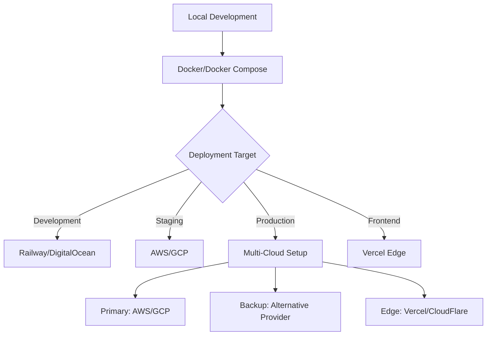

# ☁️ Cloud Providers Strategy

Strategic cloud provider selection, service comparison, and multi-cloud patterns aligned with project constraints and team capabilities.

## Purpose

Define cloud provider selection criteria, service comparison frameworks, and implementation patterns that balance cloud benefits with local control requirements.

## Scope

**In Scope:**

- Cloud provider evaluation and selection criteria
- Service mapping and capability comparison
- Multi-cloud strategy and vendor lock-in mitigation
- Cost analysis and optimization strategies
- Provider-specific implementation patterns
- Migration and portability considerations

**Out of Scope:**

- Detailed service configuration (see individual provider guides)
- Infrastructure as Code implementation (see [Infrastructure as Code](infrastructure-as-code.md))
- Container orchestration specifics (see [Container Orchestration](container-orchestration.md))

## Provider Strategy Framework

### Core Evaluation Criteria

1. **Alignment with Project Constraints**

   - Local control vs cloud convenience trade-offs
   - Data sovereignty and compliance requirements
   - Vendor independence and portability

2. **Service Ecosystem Assessment**

   - Compute, storage, and networking capabilities
   - Managed services availability and maturity
   - Developer tools and integration ecosystem

3. **Cost and Value Analysis**

   - Pricing models and cost predictability
   - Free tier and startup-friendly options
   - Total cost of ownership (TCO) considerations

4. **Team Capabilities and Learning Curve**
   - Existing team expertise and certifications
   - Documentation quality and community support
   - Learning resources and certification paths

## Provider Comparison Matrix

| Provider         | Strengths                                | Project Fit | Cost Model              | Self-Hosting Support       |
| ---------------- | ---------------------------------------- | ----------- | ----------------------- | -------------------------- |
| **AWS**          | Comprehensive services, mature ecosystem | ⭐⭐⭐      | Pay-as-you-go           | Excellent (EC2, EKS)       |
| **Azure**        | Enterprise integration, hybrid cloud     | ⭐⭐        | Committed discounts     | Good (VMs, AKS)            |
| **GCP**          | AI/ML services, developer experience     | ⭐⭐⭐      | Sustained use discounts | Good (Compute Engine, GKE) |
| **Vercel**       | Frontend deployment, edge functions      | ⭐⭐⭐⭐    | Usage-based             | Limited                    |
| **Railway**      | Simple deployment, developer-focused     | ⭐⭐⭐⭐    | Resource-based          | Good                       |
| **DigitalOcean** | Simple pricing, developer-friendly       | ⭐⭐⭐⭐    | Fixed pricing           | Excellent                  |

## Implementation Areas

### Provider-Specific Guides

- **[AWS Services](aws-services.md)** - Amazon Web Services implementation patterns
- **[Azure Services](azure-services.md)** - Microsoft Azure implementation patterns
- **[GCP Services](gcp-services.md)** - Google Cloud Platform implementation patterns
- **[Developer-Focused Providers](developer-providers.md)** - Vercel, Railway, DigitalOcean patterns

### Multi-Cloud Patterns

- **[Provider Agnostic](provider-agnostic.md)** - Multi-cloud and vendor-independent patterns
- **[Migration Strategies](migration-strategies.md)** - Cloud migration and provider switching

## Strategic Recommendations

### Primary Provider Selection

**For Current Project Constraints:**

1. **Development/Staging**: Railway or DigitalOcean

   - Simple pricing and deployment
   - Strong self-hosting capabilities
   - Developer-friendly experience

2. **Production Scale**: AWS or GCP

   - Comprehensive service ecosystem
   - Strong enterprise features
   - Excellent self-hosting options

3. **Frontend/Edge**: Vercel
   - Best-in-class frontend deployment
   - Excellent developer experience
   - Edge computing capabilities

### Multi-Cloud Strategy

## 🔗 Integration Points

### Architecture Integration

- **[Deployment Architectures](../../architecture/deployment-architectures/)** → Provider-specific deployment patterns
- **[Scaling Patterns](../../architecture/scaling-patterns/)** → Cloud-native scaling with provider services

### Technical Standards Integration

- **[Tech Stack](../../technical-standards/tech-stack/)** → Cloud service selections and technology alignment
- **[Deployment Workflow](../../technical-standards/deployment-workflow/)** → Provider-specific CI/CD integration

### Operations Integration

- **[Infrastructure](../../operations/infrastructure.md)** → Provider-specific infrastructure implementation
- **[Observability](../../operations/observability/)** → Provider monitoring and logging services

---

_Strategic cloud provider selection balancing innovation with control._
