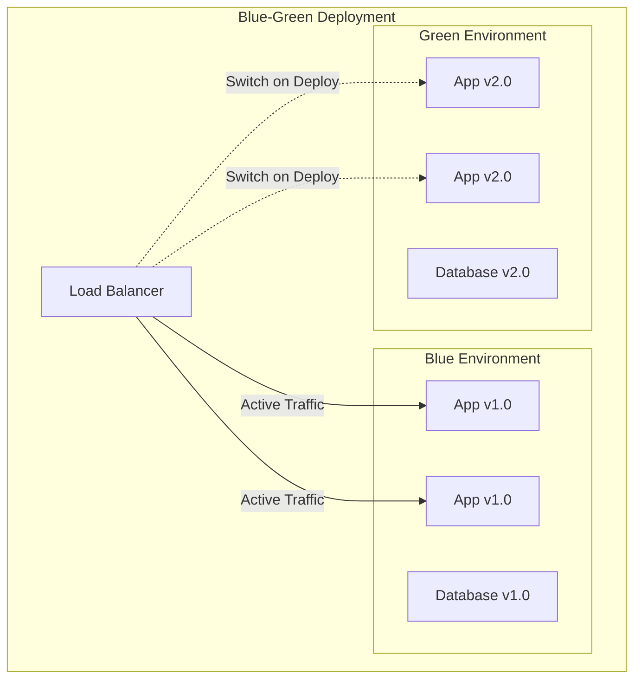
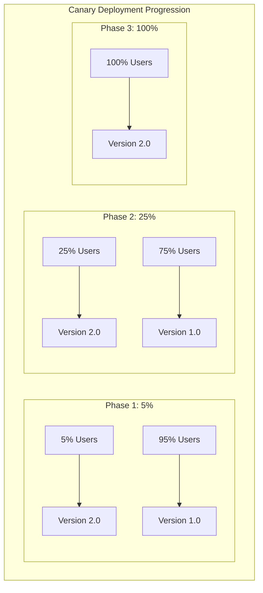
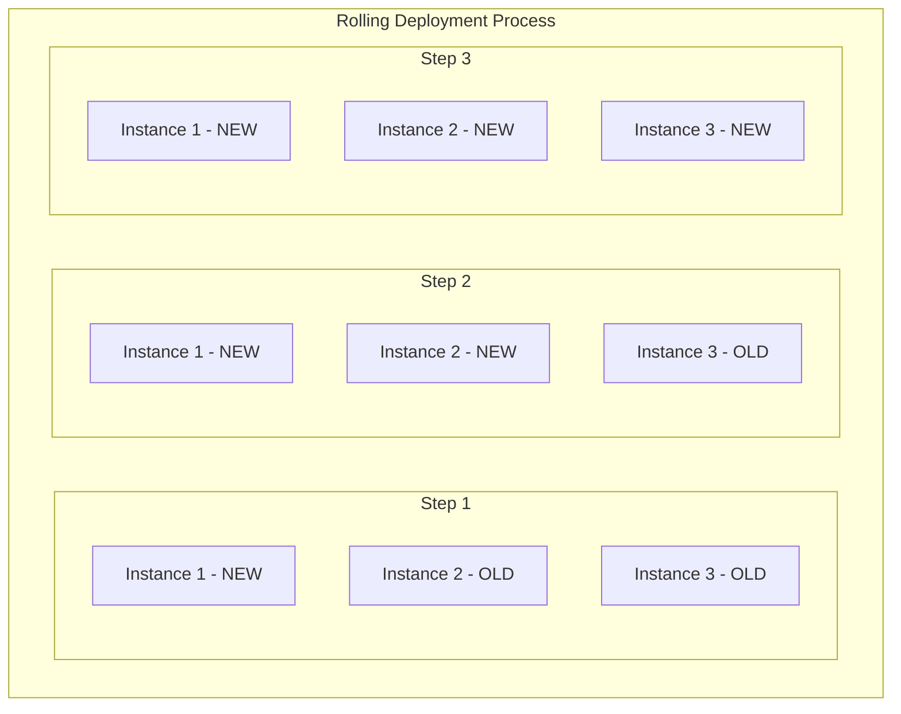
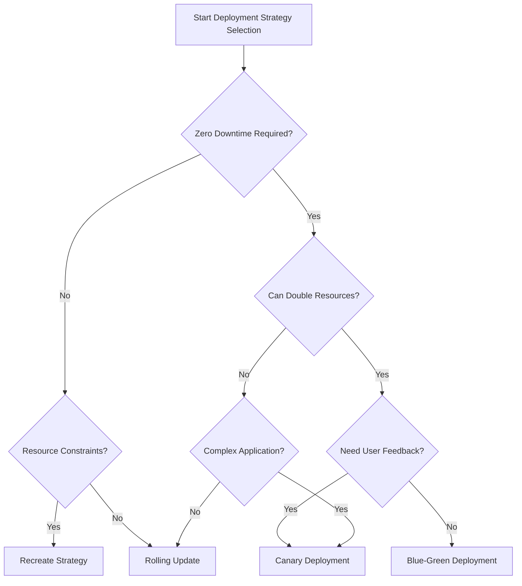

# Deployment Strategies

## Purpose

Define deployment strategies that minimize risk, reduce downtime, and enable reliable software releases across different environments and applications.

## Overview of Deployment Strategies

### 1. Blue-Green Deployment

**Concept**: Maintain two identical production environments (Blue and Green), switching traffic between them for deployments.



**Implementation Example**:

```yaml
# Kubernetes Blue-Green with Argo Rollouts
apiVersion: argoproj.io/v1alpha1
kind: Rollout
metadata:
  name: app-rollout
spec:
  replicas: 3
  strategy:
    blueGreen:
      activeService: app-active
      previewService: app-preview
      autoPromotionEnabled: false
      scaleDownDelaySeconds: 30
      prePromotionAnalysis:
        templates:
          - templateName: success-rate
        args:
          - name: service-name
            value: app-preview
      postPromotionAnalysis:
        templates:
          - templateName: success-rate
        args:
          - name: service-name
            value: app-active
  selector:
    matchLabels:
      app: demo-app
  template:
    metadata:
      labels:
        app: demo-app
    spec:
      containers:
        - name: demo-app
          image: argoproj/rollouts-demo:blue
          ports:
            - containerPort: 8080
```

**Advantages**:

- Zero-downtime deployments
- Instant rollback capability
- Full production testing before traffic switch
- Simple rollback process

**Disadvantages**:

- Requires double the infrastructure
- Database migration complexity
- Stateful service challenges
- Higher operational costs

**Best Use Cases**:

- Mission-critical applications
- E-commerce platforms
- Financial services
- Applications with strict uptime requirements

### 2. Canary Deployment

**Concept**: Gradually roll out new versions to a subset of users, monitoring metrics before full deployment.



**Implementation Example**:

```yaml
# Istio Canary Deployment
apiVersion: networking.istio.io/v1alpha3
kind: VirtualService
metadata:
  name: app-canary
spec:
  hosts:
    - app.example.com
  http:
    - match:
        - headers:
            canary:
              exact: 'true'
      route:
        - destination:
            host: app-service
            subset: canary
    - route:
        - destination:
            host: app-service
            subset: stable
          weight: 90
        - destination:
            host: app-service
            subset: canary
          weight: 10
```

**Traffic Management Script**:

```bash
#!/bin/bash
# Canary deployment automation

CANARY_WEIGHTS=(5 10 25 50 75 100)
CANARY_SERVICE="app-canary"
STABLE_SERVICE="app-stable"

for weight in "${CANARY_WEIGHTS[@]}"; do
    echo "Deploying to ${weight}% of traffic..."

    # Update traffic split
    kubectl patch virtualservice app-canary --type merge -p "{
        \"spec\": {
            \"http\": [{
                \"route\": [
                    {\"destination\": {\"host\": \"$STABLE_SERVICE\"}, \"weight\": $((100-weight))},
                    {\"destination\": {\"host\": \"$CANARY_SERVICE\"}, \"weight\": $weight}
                ]
            }]
        }
    }"

    # Monitor metrics for 10 minutes
    echo "Monitoring for 10 minutes..."
    sleep 600

    # Check metrics
    ERROR_RATE=$(curl -s "http://prometheus:9090/api/v1/query?query=rate(http_requests_total{job=\"$CANARY_SERVICE\",code=~\"5..\"}[5m])" | jq -r '.data.result[0].value[1]')

    if (( $(echo "$ERROR_RATE > 0.01" | bc -l) )); then
        echo "High error rate detected: $ERROR_RATE. Rolling back..."
        kubectl patch virtualservice app-canary --type merge -p "{
            \"spec\": {
                \"http\": [{
                    \"route\": [{\"destination\": {\"host\": \"$STABLE_SERVICE\"}, \"weight\": 100}]
                }]
            }
        }"
        exit 1
    fi

    echo "Metrics look good. Proceeding to next phase..."
done

echo "Canary deployment completed successfully!"
```

**Advantages**:

- Risk mitigation through gradual rollout
- Real user feedback
- Easy rollback if issues detected
- Performance validation under load

**Disadvantages**:

- Complex traffic management
- Requires sophisticated monitoring
- Longer deployment time
- Potential user experience inconsistency

**Best Use Cases**:

- User-facing applications
- Services with complex user interactions
- Applications requiring A/B testing
- High-traffic systems

### 3. Rolling Deployment

**Concept**: Incrementally replace instances of the application with new versions.



**Implementation Example**:

```yaml
# Kubernetes Rolling Update
apiVersion: apps/v1
kind: Deployment
metadata:
  name: app-deployment
spec:
  replicas: 6
  strategy:
    type: RollingUpdate
    rollingUpdate:
      maxSurge: 2 # Can exceed desired replicas by 2
      maxUnavailable: 1 # Max 1 replica can be unavailable
  selector:
    matchLabels:
      app: demo-app
  template:
    metadata:
      labels:
        app: demo-app
    spec:
      containers:
        - name: demo-app
          image: demo-app:v2.0
          ports:
            - containerPort: 8080
          readinessProbe:
            httpGet:
              path: /health
              port: 8080
            initialDelaySeconds: 10
            periodSeconds: 5
          livenessProbe:
            httpGet:
              path: /health
              port: 8080
            initialDelaySeconds: 30
            periodSeconds: 10
```

**Automated Rolling Deployment Script**:

```bash
#!/bin/bash
# Automated rolling deployment with health checks

APP_NAME="demo-app"
NEW_VERSION="v2.0"
NAMESPACE="production"

echo "Starting rolling deployment of $APP_NAME to $NEW_VERSION"

# Update deployment image
kubectl set image deployment/$APP_NAME \
  $APP_NAME=$APP_NAME:$NEW_VERSION \
  --namespace=$NAMESPACE

# Monitor rollout status
kubectl rollout status deployment/$APP_NAME \
  --namespace=$NAMESPACE \
  --timeout=600s

if [ $? -eq 0 ]; then
    echo "Rolling deployment completed successfully"

    # Verify deployment
    READY_REPLICAS=$(kubectl get deployment $APP_NAME -n $NAMESPACE -o jsonpath='{.status.readyReplicas}')
    DESIRED_REPLICAS=$(kubectl get deployment $APP_NAME -n $NAMESPACE -o jsonpath='{.spec.replicas}')

    if [ "$READY_REPLICAS" -eq "$DESIRED_REPLICAS" ]; then
        echo "All replicas are ready and healthy"
    else
        echo "Warning: Not all replicas are ready ($READY_REPLICAS/$DESIRED_REPLICAS)"
    fi
else
    echo "Rolling deployment failed. Rolling back..."
    kubectl rollout undo deployment/$APP_NAME --namespace=$NAMESPACE
    exit 1
fi
```

**Advantages**:

- Resource efficient
- Gradual deployment reduces risk
- Built into most orchestration platforms
- No additional infrastructure required

**Disadvantages**:

- Temporary mixed versions in production
- Potential compatibility issues
- Limited rollback speed
- Health check dependency

**Best Use Cases**:

- Standard web applications
- Microservices with backward compatibility
- Resource-constrained environments
- Development and staging environments

### 4. Recreate Deployment

**Concept**: Stop all instances of the current version, then deploy the new version.

**Implementation Example**:

```yaml
# Kubernetes Recreate Strategy
apiVersion: apps/v1
kind: Deployment
metadata:
  name: app-deployment
spec:
  replicas: 3
  strategy:
    type: Recreate
  selector:
    matchLabels:
      app: demo-app
  template:
    metadata:
      labels:
        app: demo-app
    spec:
      containers:
        - name: demo-app
          image: demo-app:v2.0
          ports:
            - containerPort: 8080
```

**Advantages**:

- Simple and straightforward
- No version compatibility concerns
- Clean state transition
- Minimal resource usage

**Disadvantages**:

- Service downtime during deployment
- All-or-nothing approach
- No gradual rollback
- Not suitable for production

**Best Use Cases**:

- Development environments
- Maintenance windows
- Single-instance applications
- Breaking changes requiring clean start

## Advanced Deployment Patterns

### Feature Flag-Driven Deployment

**Concept**: Deploy code with features disabled, then enable features gradually through configuration.

```typescript
// Feature flag implementation
class FeatureFlags {
  private flags: Map<string, boolean> = new Map()

  constructor(private configService: ConfigService) {
    this.loadFlags()
  }

  isEnabled(flagName: string, userId?: string): boolean {
    // Check user-specific flags first
    if (userId && this.isUserInCohort(flagName, userId)) {
      return true
    }

    // Check global flag
    return this.flags.get(flagName) || false
  }

  private isUserInCohort(flagName: string, userId: string): boolean {
    const cohortPercentage = this.configService.getCohortPercentage(flagName)
    const hash = this.hashUserId(userId)
    return hash % 100 < cohortPercentage
  }

  private loadFlags(): void {
    // Load from remote config service
    this.configService.getFeatureFlags().then(flags => {
      flags.forEach(flag => {
        this.flags.set(flag.name, flag.enabled)
      })
    })
  }
}

// Usage in application
class UserService {
  constructor(private featureFlags: FeatureFlags) {}

  async createUser(userData: UserData): Promise<User> {
    if (this.featureFlags.isEnabled('enhanced-validation', userData.id)) {
      return this.createUserWithEnhancedValidation(userData)
    }

    return this.createUserLegacy(userData)
  }
}
```

### Multi-Region Deployment

**Architecture for global deployments**:

```yaml
# Global deployment configuration
apiVersion: v1
kind: ConfigMap
metadata:
  name: deployment-regions
data:
  regions.yaml: |
    regions:
      - name: us-east-1
        primary: true
        weight: 50
        health_check: https://api-us-east.example.com/health
      - name: eu-west-1
        primary: false
        weight: 30
        health_check: https://api-eu-west.example.com/health
      - name: ap-southeast-1
        primary: false
        weight: 20
        health_check: https://api-ap-se.example.com/health

    deployment_strategy:
      type: region-by-region
      phases:
        - regions: ["us-east-1"]
          percentage: 100
          duration: "30m"
        - regions: ["eu-west-1"]
          percentage: 100
          duration: "30m"
        - regions: ["ap-southeast-1"]
          percentage: 100
          duration: "30m"
```

## Monitoring and Rollback Procedures

### Deployment Health Checks

```typescript
interface HealthCheck {
  name: string
  endpoint: string
  expectedStatus: number
  timeout: number
  retries: number
}

class DeploymentMonitor {
  private readonly checks: HealthCheck[] = [
    {
      name: 'api-health',
      endpoint: '/api/health',
      expectedStatus: 200,
      timeout: 5000,
      retries: 3,
    },
    {
      name: 'database-connectivity',
      endpoint: '/api/health/database',
      expectedStatus: 200,
      timeout: 10000,
      retries: 2,
    },
  ]

  async verifyDeployment(baseUrl: string): Promise<boolean> {
    const results = await Promise.all(this.checks.map(check => this.runHealthCheck(baseUrl, check)))

    return results.every(result => result.success)
  }

  private async runHealthCheck(
    baseUrl: string,
    check: HealthCheck,
  ): Promise<{ success: boolean; error?: string }> {
    for (let attempt = 1; attempt <= check.retries; attempt++) {
      try {
        const response = await fetch(`${baseUrl}${check.endpoint}`, {
          method: 'GET',
          timeout: check.timeout,
        })

        if (response.status === check.expectedStatus) {
          return { success: true }
        }

        if (attempt === check.retries) {
          return {
            success: false,
            error: `Health check failed: expected ${check.expectedStatus}, got ${response.status}`,
          }
        }

        // Wait before retry
        await new Promise(resolve => setTimeout(resolve, 2000))
      } catch (error) {
        if (attempt === check.retries) {
          return {
            success: false,
            error: `Health check failed: ${error.message}`,
          }
        }

        await new Promise(resolve => setTimeout(resolve, 2000))
      }
    }

    return { success: false, error: 'Max retries exceeded' }
  }
}
```

### Automated Rollback Triggers

```yaml
# Argo Rollouts Analysis Template
apiVersion: argoproj.io/v1alpha1
kind: AnalysisTemplate
metadata:
  name: success-rate
spec:
  args:
    - name: service-name
    - name: prometheus-url
      value: http://prometheus.monitoring.svc.cluster.local:9090
  metrics:
    - name: success-rate
      successCondition: result[0] >= 0.95
      failureCondition: result[0] < 0.95
      failureLimit: 3
      interval: 60s
      count: 5
      provider:
        prometheus:
          address: '{{args.prometheus-url}}'
          query: |
            sum(irate(
              istio_requests_total{reporter="destination",destination_service_name="{{args.service-name}}",response_code!~"5.*"}[5m]
            )) / 
            sum(irate(
              istio_requests_total{reporter="destination",destination_service_name="{{args.service-name}}"}[5m]
            ))
    - name: avg-response-time
      successCondition: result[0] <= 500
      failureCondition: result[0] > 1000
      failureLimit: 3
      interval: 60s
      count: 5
      provider:
        prometheus:
          address: '{{args.prometheus-url}}'
          query: |
            histogram_quantile(0.95,
              sum(irate(
                istio_request_duration_milliseconds_bucket{reporter="destination",destination_service_name="{{args.service-name}}"}[5m]
              )) by (le)
            )
```

## Deployment Strategy Selection Guide

### Decision Matrix

| Factor                    | Blue-Green  | Canary        | Rolling     | Recreate    |
| ------------------------- | ----------- | ------------- | ----------- | ----------- |
| **Downtime Tolerance**    | Zero        | Zero          | Minimal     | Acceptable  |
| **Resource Availability** | 2x Required | 1.5x Required | 1x Required | 1x Required |
| **Rollback Speed**        | Instant     | Fast          | Medium      | Slow        |
| **Risk Tolerance**        | Low         | Low           | Medium      | High        |
| **Complexity**            | Medium      | High          | Low         | Very Low    |
| **Cost**                  | High        | Medium        | Low         | Very Low    |

### Selection Flowchart



## Implementation Checklist

### Pre-Deployment

- [ ] Define rollback criteria and procedures
- [ ] Set up monitoring and alerting
- [ ] Prepare health check endpoints
- [ ] Configure feature flags if applicable
- [ ] Test deployment strategy in staging
- [ ] Prepare communication plan
- [ ] Verify backup and recovery procedures

### During Deployment

- [ ] Monitor key metrics continuously
- [ ] Validate health checks at each phase
- [ ] Check user feedback and error rates
- [ ] Document any issues encountered
- [ ] Be ready to execute rollback if needed

### Post-Deployment

- [ ] Verify all systems are functioning
- [ ] Clean up old resources (if applicable)
- [ ] Update monitoring dashboards
- [ ] Conduct post-deployment review
- [ ] Document lessons learned
- [ ] Update deployment procedures if needed
