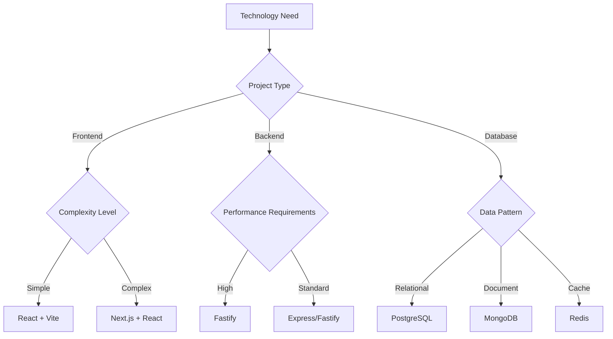

# Technical Standards

## 🎯 Scope

This section covers technical standards and technology decisions:

**In Scope:**

- Technology stack selection and standardization
- Development tools and environment setup
- Coding standards and conventions
- Integration standards and API design
- AI development tools and workflows
- Git workflows and version control standards
- Deployment workflows and release management
- Feature flag management strategies

**Out of Scope:**

- Implementation patterns (covered in Code Design)
- Infrastructure technologies (covered in Infrastructure)
- Testing tools selection (covered in Testing)

## 📋 Content Description

This folder provides comprehensive guidance for establishing technical standards across development teams. Each section includes selection criteria, configuration standards, and implementation guidelines.

### Available Standards:

1. **Technology Stack** (`technology-stack/`)

   - Framework selection and evaluation criteria
   - Technology decision documentation
   - Stack standardization approaches
   - Convention establishment

2. **Development Tools** (`development-tools/`)

   - Required and recommended tooling
   - Environment setup and configuration
   - Tool integration and workflow
   - Version management strategies

3. **Coding Standards** (`coding-standards/`)

   - Coding conventions and style guides
   - Error handling standards
   - Versioning strategies
   - Technical debt management
   - Internationalization approaches

4. **Integration Standards** (`integration-standards/`)

   - API design principles
   - Data management standards
   - External service integration
   - Integration pattern guidelines

5. **AI Development** (`ai-development/`)

   - Documentation standards for AI
   - AI-assisted development tools
   - MCP integration guidelines
   - AI workflow optimization

6. **Git Workflow** (`git-workflow/`)

   - Development process standards
   - Version control strategies
   - Quality assurance integration
   - Branch management approaches

7. **Deployment Workflow** (`deployment-workflow/`)

   - Release management processes
   - Deployment automation standards
   - Deployment strategy guidelines
   - Build standardization

8. **Feature Flags** (`feature-flags.md`)
   - Feature flag management
   - Deployment strategies
   - A/B testing integration
   - Progressive rollout approaches

## 🔄 Decision Support

### Technology Selection Decision Tree

### Tool Selection Matrix

| Category | Complexity | Team Size | Recommended Tools | Alternative |
| -------- | ---------- | --------- | ----------------- | ----------- |
| Frontend | Low        | 1-3       | React + Vite      | Plain JS    |
| Frontend | High       | 4+        | Next.js + React   | Remix       |
| Backend  | Low        | 1-3       | Express           | Fastify     |
| Backend  | High       | 4+        | Fastify           | Nest.js     |
| Database | Any        | Any       | PostgreSQL        | MySQL       |
| Cache    | Any        | Any       | Redis             | In-memory   |

### Standards Selection Criteria

**Choose Strict Standards when:**

- Large team coordination required
- Enterprise compliance needs
- Long-term maintenance critical
- Multi-team collaboration

**Choose Flexible Standards when:**

- Small team or startup environment
- Rapid prototyping requirements
- Innovation and experimentation priority
- Limited governance overhead

## 🛠️ Implementation Tools

### Selection Tools:

- **Technology Radar**: Emerging technology tracking
- **ADR Templates**: Architecture decision records
- **Evaluation Matrices**: Multi-criteria decision support
- **PoC Frameworks**: Proof of concept evaluation

### Configuration Tools:

- **Dotfiles Management**: Development environment setup
- **Configuration Templates**: Standardized tool configs
- **Setup Scripts**: Automated environment provisioning
- **Validation Tools**: Standards compliance checking

### Governance Tools:

- **Policy Engines**: Automated standards enforcement
- **Audit Tools**: Standards compliance monitoring
- **Migration Tools**: Technology upgrade automation
- **Documentation Generators**: Standards documentation

## 🔗 Related Guidelines

- **[Code Design](.pair/knowledge/guidelines/code-design/README.md)** - Implementation patterns for technical standards
- **[Testing](.pair/knowledge/guidelines/testing/README.md)** - Testing frameworks and tools supporting technical standards
- **[Architecture Guidelines](.pair/knowledge/guidelines/architecture/README.md)** - Architectural decisions that inform technical choices

## 🎯 Quick Start

1. **Foundation Setup**: Configure [Tech Stack](tech-stack/README.md) for your technology foundation
2. **Development Environment**: Set up [Development Tools](development-tools/README.md) for your team
3. **Integration Patterns**: Implement [Integration Standards](integration-standards/README.md) for system connections
4. **Release Management**: Establish [Deployment Workflow](deployment-workflow/README.md) for delivery processes

---

_Technical Standards focuses on the "what" and "with what" of software development - the technologies, tools, and configurations that enable effective development._
