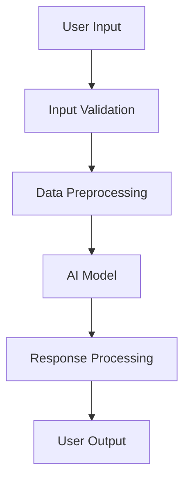

# AI Development Documentation Standards

## Overview

This document establishes comprehensive standards for documenting AI-powered features and integrations within our development ecosystem. These standards ensure consistency, maintainability, and effective collaboration when working with AI technologies.

## Documentation Framework

### 1. AI Feature Documentation Structure

#### Feature Overview

- **Purpose**: Clear description of the AI feature's objective
- **Use Cases**: Specific scenarios where the feature provides value
- **User Journey**: Step-by-step user interaction flow
- **Success Metrics**: Quantifiable outcomes and performance indicators

#### Technical Architecture

````markdown
## AI Architecture

### Model Integration

- **Model Type**: [LLM/ML/Computer Vision/etc.]
- **Provider**: [OpenAI/Anthropic/Local/etc.]
- **Model Version**: Specific model and version used
- **Input Format**: Expected data structure and format
- **Output Format**: Response structure and data types

### Data Flow


````

### Performance Characteristics

- **Latency**: Expected response times
- **Throughput**: Requests per second capacity
- **Accuracy**: Model performance metrics
- **Cost**: Per-request and monthly estimates

````

#### Implementation Details
```typescript
// Example AI service documentation
/**
 * Content Generation Service
 *
 * Provides AI-powered content generation capabilities using OpenAI's GPT models.
 * Handles text summarization, expansion, and rewriting tasks.
 *
 * @example
 * ```typescript
 * const service = new ContentGenerationService();
 * const result = await service.generateSummary({
 *   text: "Long article content...",
 *   maxLength: 200,
 *   style: "professional"
 * });
 * ```
 */
export class ContentGenerationService {
  /**
   * Generates a summary of the provided text
   *
   * @param options - Configuration for summary generation
   * @param options.text - The text to summarize (max 10,000 chars)
   * @param options.maxLength - Maximum summary length (50-500 chars)
   * @param options.style - Writing style: "professional" | "casual" | "technical"
   * @returns Promise resolving to generated summary and metadata
   *
   * @throws {ValidationError} When input text exceeds limits
   * @throws {AIServiceError} When the AI service is unavailable
   * @throws {RateLimitError} When rate limits are exceeded
   */
  async generateSummary(options: SummaryOptions): Promise<SummaryResult> {
    // Implementation details...
  }
}
````

### 2. Prompt Engineering Documentation

#### Prompt Templates

```markdown
## Prompt Templates

### Code Review Assistant

**Purpose**: Analyze code for potential issues and improvements

**Template**:
```

You are a senior software engineer reviewing code. Analyze the following code for:

1. Potential bugs or security issues
2. Performance optimizations
3. Code style and best practices
4. Maintainability improvements

Code to review:
{{code}}

Provide specific, actionable feedback with line numbers when applicable.

```

**Variables**:
- `{{code}}`: The source code to be reviewed (max 5000 chars)

**Expected Output**:
- Structured feedback with categories
- Specific line references
- Severity levels (critical, warning, suggestion)
- Suggested improvements with examples
```

#### Prompt Optimization Guidelines

- **Clarity**: Use specific, unambiguous instructions
- **Context**: Provide relevant background information
- **Examples**: Include input/output examples when beneficial
- **Constraints**: Specify format, length, and style requirements
- **Testing**: Document prompt variations and their performance

### 3. Model Selection Documentation

#### Decision Matrix

```markdown
## Model Selection Process

### Requirements Analysis

- **Task Type**: Classification, Generation, Embedding, etc.
- **Input Complexity**: Text length, multimodal requirements
- **Output Requirements**: Format, accuracy, speed
- **Cost Constraints**: Budget per request/month
- **Compliance**: Data privacy, regulatory requirements

### Evaluation Criteria

| Criterion   | Weight | Model A | Model B | Model C |
| ----------- | ------ | ------- | ------- | ------- |
| Accuracy    | 40%    | 8.5/10  | 9.0/10  | 7.5/10  |
| Latency     | 25%    | 9.0/10  | 7.0/10  | 9.5/10  |
| Cost        | 20%    | 6.0/10  | 8.0/10  | 9.0/10  |
| Reliability | 15%    | 9.0/10  | 8.5/10  | 8.0/10  |

### Selection Rationale

Document the final decision with:

- Quantitative comparison results
- Qualitative factors considered
- Trade-offs accepted
- Migration strategy if changing models
```

### 4. Error Handling Documentation

#### AI-Specific Error Patterns

```typescript
/**
 * AI Error Handling Strategies
 *
 * Documents common AI-related errors and their handling approaches
 */

// Rate limiting errors
export class RateLimitHandler {
  /**
   * Handles API rate limit exceeded errors
   *
   * Strategy:
   * 1. Exponential backoff with jitter
   * 2. Request queuing for non-critical operations
   * 3. Graceful degradation to cached responses
   * 4. User notification for critical failures
   */
  async handleRateLimit(error: RateLimitError): Promise<void> {
    // Implementation with detailed error recovery
  }
}

// Model response validation
export class ResponseValidator {
  /**
   * Validates AI model responses for expected format and content
   *
   * Common issues:
   * - Incomplete responses due to token limits
   * - Unexpected format variations
   * - Hallucinated information
   * - Biased or inappropriate content
   */
  validateResponse(response: AIResponse): ValidationResult {
    // Validation logic with specific checks
  }
}
```

### 5. Performance Monitoring Documentation

#### Metrics Collection

```typescript
/**
 * AI Performance Metrics
 *
 * Tracks key performance indicators for AI features
 */

interface AIMetrics {
  // Response time metrics
  latency: {
    p50: number
    p95: number
    p99: number
  }

  // Quality metrics
  accuracy: number
  userSatisfaction: number

  // Cost metrics
  requestCost: number
  monthlySpend: number

  // Usage metrics
  requestVolume: number
  activeUsers: number
  featureAdoption: number
}

/**
 * Monitoring Strategy:
 *
 * 1. Real-time dashboards for critical metrics
 * 2. Automated alerts for anomalies
 * 3. A/B testing for model comparisons
 * 4. User feedback collection and analysis
 */
```

## Documentation Standards

### 1. Code Comments and Annotations

#### AI-Specific Comment Standards

```typescript
// Use clear, descriptive comments for AI logic
export class AIService {
  /**
   * IMPORTANT: This function processes user data with AI
   *
   * Privacy considerations:
   * - User data is sent to external AI service
   * - Responses are cached for 1 hour
   * - No personal information should be logged
   *
   * Performance notes:
   * - Average response time: 2-3 seconds
   * - Implements retry logic with exponential backoff
   * - Falls back to rule-based system on failure
   */
  async processUserQuery(query: string): Promise<AIResponse> {
    // Validate input to prevent prompt injection
    const sanitizedQuery = this.sanitizeInput(query)

    // Add user context while respecting privacy
    const contextualQuery = this.addContext(sanitizedQuery)

    // Execute with monitoring and error handling
    return this.executeWithMonitoring(contextualQuery)
  }
}
```

### 2. API Documentation

#### AI Endpoint Documentation

```yaml
# OpenAPI specification for AI endpoints
/ai/content/generate:
  post:
    summary: Generate content using AI
    description: |
      Generates content based on user prompts using advanced language models.

      **Important Considerations:**
      - Responses may vary between requests due to AI randomness
      - Content should be reviewed before publication
      - Rate limited to 10 requests per minute per user

    requestBody:
      required: true
      content:
        application/json:
          schema:
            type: object
            properties:
              prompt:
                type: string
                description: The generation prompt
                maxLength: 2000
                example: 'Write a professional email about project updates'
              style:
                type: string
                enum: ['professional', 'casual', 'technical']
                description: Writing style preference
              maxTokens:
                type: integer
                minimum: 50
                maximum: 1000
                description: Maximum response length

    responses:
      200:
        description: Successfully generated content
        content:
          application/json:
            schema:
              type: object
              properties:
                content:
                  type: string
                  description: Generated content
                metadata:
                  type: object
                  properties:
                    model:
                      type: string
                      description: AI model used
                    tokens:
                      type: integer
                      description: Tokens consumed
                    confidence:
                      type: number
                      description: Generation confidence score

      429:
        description: Rate limit exceeded
        content:
          application/json:
            schema:
              $ref: '#/components/schemas/RateLimitError'
```

### 3. Testing Documentation

#### AI Testing Strategies

````markdown
## AI Feature Testing

### Unit Testing

- **Mocking Strategy**: Mock AI service responses for consistent tests
- **Input Validation**: Test edge cases and malformed inputs
- **Error Handling**: Verify proper handling of AI service failures

### Integration Testing

- **Response Validation**: Test actual AI service integration
- **Performance Testing**: Measure response times and throughput
- **Cost Monitoring**: Track API usage and costs during tests

### End-to-End Testing

- **User Journey Testing**: Complete workflow validation
- **A/B Testing**: Compare different models or prompts
- **Regression Testing**: Ensure consistent behavior across updates

### Example Test Cases

```typescript
describe('AI Content Generation', () => {
  describe('input validation', () => {
    test('should reject prompts exceeding length limit', async () => {
      const longPrompt = 'a'.repeat(3000)
      await expect(contentService.generate({ prompt: longPrompt })).rejects.toThrow(ValidationError)
    })
  })

  describe('AI service integration', () => {
    test('should handle AI service timeout gracefully', async () => {
      // Mock timeout scenario
      mockAIService.mockImplementation(
        () => new Promise((_, reject) => setTimeout(() => reject(new TimeoutError()), 100)),
      )

      const result = await contentService.generate({
        prompt: 'test prompt',
      })

      expect(result.fallbackUsed).toBe(true)
      expect(result.content).toBeDefined()
    })
  })
})
```
````

## Security and Privacy Documentation

### 1. Data Handling Guidelines

#### Privacy-First Documentation

````markdown
## AI Data Privacy Standards

### Data Classification

- **Public**: No restrictions, can be sent to external AI services
- **Internal**: Requires data anonymization before AI processing
- **Confidential**: Cannot be processed by external AI services
- **Restricted**: Requires explicit user consent and audit logging

### Processing Guidelines

1. **Data Minimization**: Send only necessary data to AI services
2. **Anonymization**: Remove or hash personal identifiers
3. **Retention**: Implement automatic deletion of AI service data
4. **Audit Trail**: Log all AI processing activities

### Implementation Example

```typescript
export class PrivacyAwareAIService {
  async processData(data: UserData): Promise<AIResult> {
    // Classify data sensitivity
    const classification = this.classifyData(data)

    if (classification === 'restricted') {
      throw new Error('Restricted data cannot be processed by AI')
    }

    // Anonymize if needed
    const processedData = classification === 'internal' ? this.anonymizeData(data) : data

    // Log processing activity
    this.auditLogger.log({
      action: 'ai_processing',
      dataClassification: classification,
      userId: data.userId,
      timestamp: new Date().toISOString(),
    })

    return this.aiService.process(processedData)
  }
}
```
````

### 2. Security Considerations

#### AI-Specific Security Documentation

```markdown
## AI Security Framework

### Prompt Injection Prevention

- **Input Sanitization**: Remove or escape special characters
- **Prompt Boundaries**: Use clear delimiters for user input
- **Content Filtering**: Block potentially malicious instructions

### Model Security

- **Access Control**: Restrict AI service access to authorized components
- **API Key Management**: Secure storage and rotation of AI service credentials
- **Request Monitoring**: Track unusual patterns or potential abuse

### Output Validation

- **Content Screening**: Filter inappropriate or harmful responses
- **Bias Detection**: Monitor for discriminatory or biased outputs
- **Fact Checking**: Implement verification for factual claims
```

## Related Documentation

- [AI Tools Integration](ai-tools.md)
- [MCP Integration Standards](mcp-integration.md)
- [Technical Guidelines](.pair/knowledge/guidelines/technical-standards/README.md)
- [Security Guidelines](.pair/knowledge/guidelines/quality-assurance/security/README.md)
- [Testing Strategy](.pair/knowledge/guidelines/testing/README.md)
