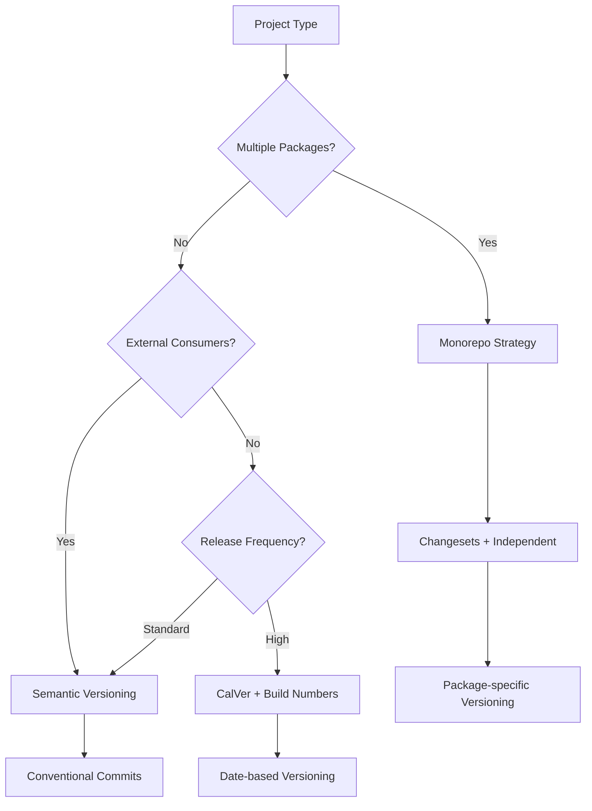

# Versioning Standards

## Purpose

Establish consistent versioning strategies across projects to enable reliable releases, clear communication of changes, and effective dependency management.

## Semantic Versioning (SemVer)

### Core Principles

**Version Format**: `MAJOR.MINOR.PATCH` (e.g., `2.1.4`)

```
MAJOR.MINOR.PATCH[-PRERELEASE][+BUILD]

Examples:
- 1.0.0          (Initial release)
- 1.2.3          (Standard release)
- 2.0.0-alpha.1  (Pre-release)
- 1.4.2+20241001 (Build metadata)
```

### Version Increment Rules

| Change Type          | Version Impact | Examples                                            |
| -------------------- | -------------- | --------------------------------------------------- |
| **Breaking Changes** | MAJOR          | API changes, removed features, incompatible updates |
| **New Features**     | MINOR          | New functionality, backward-compatible additions    |
| **Bug Fixes**        | PATCH          | Bug fixes, security patches, minor improvements     |
| **Pre-releases**     | PRERELEASE     | alpha, beta, rc versions                            |

### Detailed Guidelines

```typescript
// Version decision matrix
interface VersionChange {
  type: 'major' | 'minor' | 'patch' | 'prerelease'
  reason: string
  impact: 'breaking' | 'additive' | 'corrective' | 'experimental'
}

const versioningRules: Record<string, VersionChange> = {
  // MAJOR version changes
  'api-removal': {
    type: 'major',
    reason: 'Removed public API methods or properties',
    impact: 'breaking',
  },
  'signature-change': {
    type: 'major',
    reason: 'Changed function signatures or method parameters',
    impact: 'breaking',
  },
  'behavior-change': {
    type: 'major',
    reason: 'Modified existing functionality behavior',
    impact: 'breaking',
  },
  'dependency-major': {
    type: 'major',
    reason: 'Upgraded dependencies with breaking changes',
    impact: 'breaking',
  },

  // MINOR version changes
  'feature-addition': {
    type: 'minor',
    reason: 'Added new features or capabilities',
    impact: 'additive',
  },
  'api-extension': {
    type: 'minor',
    reason: 'Extended existing APIs with new options',
    impact: 'additive',
  },
  deprecation: {
    type: 'minor',
    reason: 'Deprecated existing functionality (with backward compatibility)',
    impact: 'additive',
  },

  // PATCH version changes
  'bug-fix': {
    type: 'patch',
    reason: 'Fixed bugs without changing API',
    impact: 'corrective',
  },
  'security-fix': {
    type: 'patch',
    reason: 'Security vulnerability fixes',
    impact: 'corrective',
  },
  performance: {
    type: 'patch',
    reason: 'Performance improvements without API changes',
    impact: 'corrective',
  },
  documentation: {
    type: 'patch',
    reason: 'Documentation updates and corrections',
    impact: 'corrective',
  },
}
```

## Pre-release Versioning

### Pre-release Identifiers

```bash
# Alpha: Early development, major features incomplete
1.0.0-alpha.1
1.0.0-alpha.2

# Beta: Feature complete, testing phase
1.0.0-beta.1
1.0.0-beta.2

# Release Candidate: Ready for release, final testing
1.0.0-rc.1
1.0.0-rc.2

# Development/Snapshot builds
1.0.0-dev.20241001
1.0.0-SNAPSHOT
```

### Pre-release Strategy

```typescript
interface PreReleaseStrategy {
  stage: 'alpha' | 'beta' | 'rc' | 'dev'
  criteria: string[]
  duration: string
  testingLevel: 'basic' | 'comprehensive' | 'production-ready'
}

const preReleaseFlow: PreReleaseStrategy[] = [
  {
    stage: 'alpha',
    criteria: [
      'Core features implemented',
      'Basic functionality working',
      'Internal testing passed',
    ],
    duration: '1-2 weeks',
    testingLevel: 'basic',
  },
  {
    stage: 'beta',
    criteria: ['All features implemented', 'API finalized', 'External beta testing initiated'],
    duration: '2-4 weeks',
    testingLevel: 'comprehensive',
  },
  {
    stage: 'rc',
    criteria: [
      'No known critical bugs',
      'Documentation complete',
      'Ready for production deployment',
    ],
    duration: '1 week',
    testingLevel: 'production-ready',
  },
]
```

## Branch-Based Versioning

### Git Flow Versioning

```mermaid
gitgraph
    commit id: "1.0.0"
    branch develop
    checkout develop
    commit id: "feat: new feature"
    commit id: "fix: bug fix"
    branch feature/auth
    checkout feature/auth
    commit id: "feat: authentication"
    checkout develop
    merge feature/auth
    branch release/1.1.0
    checkout release/1.1.0
    commit id: "1.1.0-rc.1"
    commit id: "fix: release bug"
    commit id: "1.1.0-rc.2"
    checkout main
    merge release/1.1.0
    commit id: "1.1.0"
    tag: "v1.1.0"
```

### Branch Naming Conventions

```bash
# Main branches
main              # Production-ready code
develop           # Integration branch

# Feature branches
feature/user-auth
feature/payment-system
feat/dashboard-redesign

# Release branches
release/1.2.0
release/v2.0.0-beta

# Hotfix branches
hotfix/1.1.1
hotfix/security-patch

# Version tags
v1.0.0
v1.2.3-beta.1
v2.0.0-rc.1
```

## Automated Versioning

### Conventional Commits

```bash
# Commit message format
<type>[optional scope]: <description>

[optional body]

[optional footer(s)]

# Examples
feat: add user authentication system
feat(auth): implement OAuth2 integration
fix: resolve memory leak in file processing
fix(api): handle null response from external service
docs: update API documentation
chore: upgrade dependencies
refactor: restructure user service
perf: optimize database queries
test: add integration tests for payment flow

# Breaking changes
feat!: remove deprecated payment methods
feat(auth)!: change authentication flow
```

### Automated Release Configuration

```json
{
  "name": "semantic-release-config",
  "plugins": [
    "@semantic-release/commit-analyzer",
    "@semantic-release/release-notes-generator",
    "@semantic-release/changelog",
    "@semantic-release/npm",
    "@semantic-release/git",
    "@semantic-release/github"
  ],
  "branches": [
    "main",
    {
      "name": "develop",
      "prerelease": "beta"
    }
  ],
  "preset": "conventionalcommits",
  "releaseRules": [
    { "type": "feat", "release": "minor" },
    { "type": "fix", "release": "patch" },
    { "type": "perf", "release": "patch" },
    { "type": "revert", "release": "patch" },
    { "type": "docs", "release": "patch" },
    { "type": "chore", "release": false },
    { "type": "refactor", "release": "patch" },
    { "type": "test", "release": false },
    { "breaking": true, "release": "major" }
  ]
}
```

### Changesets Configuration (Monorepo)

```json
{
  "$schema": "https://unpkg.com/@changesets/config@2.3.1/schema.json",
  "changelog": "@changesets/cli/changelog",
  "commit": false,
  "fixed": [],
  "linked": [
    ["@company/core", "@company/utils"],
    ["@company/ui", "@company/components"]
  ],
  "access": "public",
  "baseBranch": "main",
  "updateInternalDependencies": "patch",
  "ignore": ["@company/docs", "@company/examples"]
}
```

```bash
# Changesets workflow
npx changeset add     # Add a changeset
npx changeset version # Version packages
npx changeset publish # Publish packages
```

## API Versioning

### URL-Based Versioning

```typescript
// REST API versioning
const routes = {
  v1: {
    users: '/api/v1/users',
    orders: '/api/v1/orders',
  },
  v2: {
    users: '/api/v2/users',
    orders: '/api/v2/orders',
  },
}

// Express.js implementation
app.use('/api/v1', v1Router)
app.use('/api/v2', v2Router)

// Version-specific controllers
class UsersV1Controller {
  async getUser(req: Request, res: Response) {
    // V1 implementation
    const user = await userService.getUserV1(req.params.id)
    res.json(user)
  }
}

class UsersV2Controller {
  async getUser(req: Request, res: Response) {
    // V2 implementation with enhanced data
    const user = await userService.getUserV2(req.params.id)
    res.json({
      ...user,
      profile: user.extendedProfile,
      preferences: user.userPreferences,
    })
  }
}
```

### Header-Based Versioning

```typescript
// Version detection middleware
function versionMiddleware(req: Request, res: Response, next: NextFunction) {
  const acceptVersion = req.headers['accept-version'] as string
  const apiVersion = acceptVersion || 'v1'

  // Validate version
  const supportedVersions = ['v1', 'v2', 'v3']
  if (!supportedVersions.includes(apiVersion)) {
    return res.status(400).json({
      error: 'Unsupported API version',
      supportedVersions,
    })
  }

  req.apiVersion = apiVersion
  next()
}

// Version-aware service
class UserService {
  async getUser(id: string, version: string): Promise<any> {
    const baseUser = await this.repository.findById(id)

    switch (version) {
      case 'v1':
        return this.transformToV1(baseUser)
      case 'v2':
        return this.transformToV2(baseUser)
      case 'v3':
        return this.transformToV3(baseUser)
      default:
        throw new Error(`Unsupported version: ${version}`)
    }
  }

  private transformToV1(user: User): UserV1 {
    return {
      id: user.id,
      name: user.name,
      email: user.email,
    }
  }

  private transformToV2(user: User): UserV2 {
    return {
      id: user.id,
      fullName: user.name,
      emailAddress: user.email,
      profile: user.profile,
      createdAt: user.createdAt,
    }
  }
}
```

### GraphQL Versioning

```typescript
// Schema evolution approach
const typeDefs = gql`
  type User {
    id: ID!
    name: String!
    email: String!

    # V2 additions
    profile: UserProfile
    preferences: UserPreferences

    # Deprecated fields
    fullName: String @deprecated(reason: "Use 'name' instead")
    emailAddress: String @deprecated(reason: "Use 'email' instead")
  }

  type UserProfile {
    avatar: String
    bio: String
    location: String
  }
`

// Field-level versioning
const resolvers = {
  User: {
    fullName: (user: User) => user.name, // Backward compatibility
    emailAddress: (user: User) => user.email, // Backward compatibility
    profile: (user: User, args: any, context: any) => {
      // Only return profile for V2+ clients
      if (context.apiVersion >= 'v2') {
        return user.profile
      }
      return null
    },
  },
}
```

## Database Versioning

### Migration Versioning

```typescript
// Migration naming convention
// YYYYMMDD_HHMMSS_description.ts
// 20241001_143000_create_users_table.ts
// 20241001_150000_add_user_preferences.ts

interface Migration {
  version: string
  description: string
  up: () => Promise<void>
  down: () => Promise<void>
}

class Migration20241001143000CreateUsersTable implements Migration {
  version = '20241001143000'
  description = 'Create users table'

  async up(): Promise<void> {
    await sql`
      CREATE TABLE users (
        id UUID PRIMARY KEY DEFAULT gen_random_uuid(),
        name VARCHAR(255) NOT NULL,
        email VARCHAR(255) UNIQUE NOT NULL,
        created_at TIMESTAMP DEFAULT CURRENT_TIMESTAMP
      )
    `
  }

  async down(): Promise<void> {
    await sql`DROP TABLE users`
  }
}

// Schema versioning
interface SchemaVersion {
  version: number
  changes: string[]
  migration: Migration
}

const schemaVersions: SchemaVersion[] = [
  {
    version: 1,
    changes: ['Initial schema', 'Users table', 'Orders table'],
    migration: new Migration20241001143000CreateUsersTable(),
  },
  {
    version: 2,
    changes: ['Add user preferences', 'Add user profiles'],
    migration: new Migration20241001150000AddUserPreferences(),
  },
]
```

## Version Compatibility

### Backward Compatibility Strategy

```typescript
interface CompatibilityMatrix {
  version: string
  supportedClients: string[]
  deprecatedFeatures: string[]
  removedFeatures: string[]
}

const apiCompatibility: CompatibilityMatrix[] = [
  {
    version: 'v3.0.0',
    supportedClients: ['v2.x', 'v3.x'],
    deprecatedFeatures: ['legacy-auth', 'old-payment-flow'],
    removedFeatures: ['v1-endpoints'],
  },
  {
    version: 'v2.0.0',
    supportedClients: ['v1.x', 'v2.x'],
    deprecatedFeatures: ['basic-auth'],
    removedFeatures: [],
  },
]

// Compatibility checker
class CompatibilityChecker {
  static isCompatible(serverVersion: string, clientVersion: string): boolean {
    const serverMajor = this.getMajorVersion(serverVersion)
    const clientMajor = this.getMajorVersion(clientVersion)

    // Support same major version and one version back
    return Math.abs(serverMajor - clientMajor) <= 1
  }

  static getDeprecationWarnings(version: string): string[] {
    const compat = apiCompatibility.find(c => c.version === version)
    return compat?.deprecatedFeatures || []
  }
}
```

## Release Management

### Release Process

```yaml
# Release workflow (.github/workflows/release.yml)
name: Release
on:
  push:
    branches: [main]

jobs:
  release:
    runs-on: ubuntu-latest
    steps:
      - uses: actions/checkout@v3
        with:
          fetch-depth: 0

      - name: Setup Node.js
        uses: actions/setup-node@v3
        with:
          node-version: '18'

      - name: Install dependencies
        run: npm ci

      - name: Run tests
        run: npm test

      - name: Build
        run: npm run build

      - name: Semantic Release
        env:
          GITHUB_TOKEN: ${{ secrets.GITHUB_TOKEN }}
          NPM_TOKEN: ${{ secrets.NPM_TOKEN }}
        run: npx semantic-release
```

### Changelog Generation

```typescript
// Automated changelog configuration
const changelogConfig = {
  types: [
    { type: 'feat', section: '✨ Features' },
    { type: 'fix', section: '🐛 Bug Fixes' },
    { type: 'perf', section: '⚡ Performance' },
    { type: 'revert', section: '⏪ Reverts' },
    { type: 'docs', section: '📚 Documentation' },
    { type: 'style', section: '💎 Styles' },
    { type: 'refactor', section: '📦 Code Refactoring' },
    { type: 'test', section: '🚨 Tests' },
    { type: 'build', section: '🛠 Build System' },
    { type: 'ci', section: '⚙️ Continuous Integration' },
  ],
  renderChangelog: (commits: Commit[]) => {
    let changelog = ''

    for (const section of changelogConfig.types) {
      const sectionCommits = commits.filter(c => c.type === section.type)
      if (sectionCommits.length > 0) {
        changelog += `\n## ${section.section}\n\n`
        for (const commit of sectionCommits) {
          changelog += `- ${commit.description}`
          if (commit.scope) changelog += ` (${commit.scope})`
          changelog += `\n`
        }
      }
    }

    return changelog
  },
}
```

## Version Strategy Selection

### Decision Matrix

| Project Type        | Versioning Strategy     | Automation Level | Release Frequency |
| ------------------- | ----------------------- | ---------------- | ----------------- |
| **Library/Package** | Semantic Versioning     | Full             | On every merge    |
| **Web Application** | Date-based + SemVer     | Partial          | Weekly/Bi-weekly  |
| **API Service**     | SemVer + API Versioning | Full             | Continuous        |
| **Monorepo**        | Independent + Fixed     | Changeset-based  | Per package       |

### Selection Criteria



## Implementation Checklist

### Setup Checklist

- [ ] Choose versioning strategy (SemVer, CalVer, etc.)
- [ ] Configure automated versioning tools
- [ ] Set up conventional commit guidelines
- [ ] Create release automation workflows
- [ ] Define version compatibility matrix
- [ ] Set up changelog generation
- [ ] Configure branch protection rules

### Release Checklist

- [ ] All tests passing
- [ ] Documentation updated
- [ ] Breaking changes documented
- [ ] Migration guides prepared (if needed)
- [ ] Changelog generated and reviewed
- [ ] Version number determined correctly
- [ ] Release notes prepared
- [ ] Deployment strategy confirmed

### Monitoring Checklist

- [ ] Version adoption tracking
- [ ] Deprecation timeline monitoring
- [ ] Compatibility issue tracking
- [ ] Release performance metrics
- [ ] User feedback collection
- [ ] Security patch distribution
