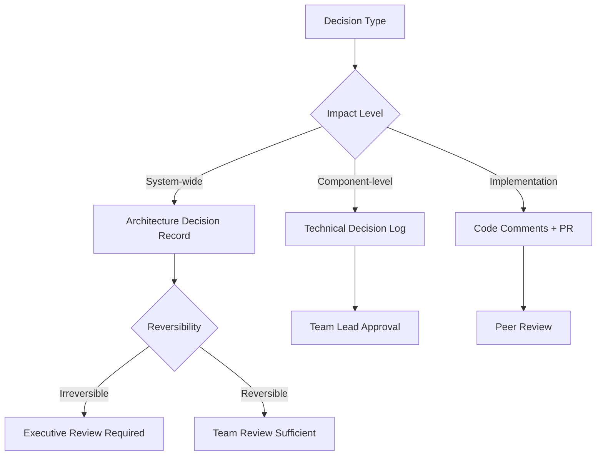

# Decision Frameworks

## 🎯 Scope

This section covers systematic approaches to architectural decision-making:

**In Scope:**

- Architecture Decision Record (ADR) processes and templates
- Decision tracking methodologies and tools
- Technology selection frameworks and criteria
- Evolution strategy planning and implementation
- Decision governance and review processes

**Out of Scope:**

- Implementation details of specific technologies
- Project management decision processes (covered in Collaboration)
- Business decision frameworks (covered in Product docs)

## 📋 Content Description

This folder provides structured frameworks for making and documenting architectural decisions. Each framework includes decision criteria, evaluation methods, and documentation templates to ensure consistent and traceable decision-making processes.

### Available Frameworks:

1. **ADR Process** (`adr-process.md`)

   - Architecture Decision Record templates
   - Decision documentation standards
   - Review and approval workflows

2. **Decision Tracking** (`decision-tracking.md`)

   - Decision lifecycle management
   - Impact assessment methods
   - Change request processes

3. **Technology Selection** (`technology-selection.md`)

   - Evaluation criteria frameworks
   - Proof of concept methodologies
   - Risk assessment templates

4. **Evolution Strategy** (`evolution-strategy.md`)
   - Architecture migration planning
   - Legacy system transition approaches
   - Continuous architecture improvement

## 🔄 Decision Support

### Decision Type Classification

### Decision Framework Matrix

| Decision Type    | Documentation Level | Review Process        | Tools Required             | Timeframe  |
| ---------------- | ------------------- | --------------------- | -------------------------- | ---------- |
| Architecture     | Formal ADR          | Executive + Technical | ADR tools, Impact analysis | Weeks      |
| Technology Stack | Formal ADR          | Technical team        | PoC, Evaluation matrix     | Days-Weeks |
| Component Design | Technical Log       | Team review           | Design docs, Code review   | Days       |
| Implementation   | Code comments       | Peer review           | Version control            | Hours-Days |

### Selection Criteria Framework

**For Technology Decisions:**

- **Technical Fit**: Alignment with requirements and constraints
- **Team Capability**: Learning curve and existing expertise
- **Ecosystem**: Community support, libraries, documentation
- **Longevity**: Vendor stability, roadmap, migration path
- **Cost**: Licensing, maintenance, operational overhead

**For Architecture Decisions:**

- **Business Alignment**: Support for business goals and constraints
- **Technical Quality**: Performance, scalability, maintainability
- **Risk Assessment**: Implementation risk, operational risk
- **Resource Impact**: Development effort, operational cost
- **Strategic Fit**: Long-term technology direction

## 🛠️ Implementation Tools

### Decision Documentation:

- **ADR Tools**: Automated ADR generation and management
- **Decision Trees**: Visual decision flow documentation
- **SWOT Analysis**: Strengths, Weaknesses, Opportunities, Threats
- **Trade-off Analysis**: Multi-criteria decision frameworks

### Evaluation Tools:

- **PoC Frameworks**: Proof of concept evaluation templates
- **Benchmarking**: Performance and capability comparison
- **Risk Matrices**: Risk assessment and mitigation planning
- **Cost-Benefit Analysis**: Financial impact evaluation

### Tracking Tools:

- **Decision Logs**: Centralized decision tracking
- **Impact Tracking**: Decision outcome monitoring
- **Review Schedules**: Periodic decision reassessment
- **Change Management**: Decision evolution processes

### Templates Available:

- ADR template with standard sections
- Technology evaluation scorecard
- Architecture review checklist
- Decision impact assessment form
